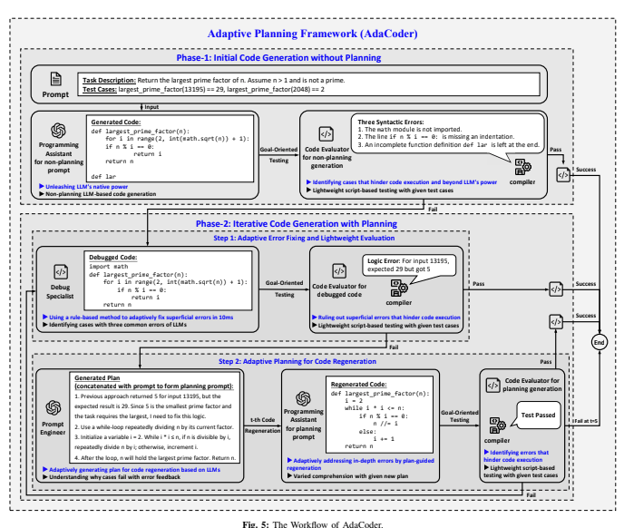

# AdaCoder: 一个更聪明、更高效的AI代码生成框架

## 论文大概
想象一下，现在有很多“AI程序员小队”在尝试写代码。但这篇论文的作者们发现，这些小队普遍存在两个大问题：
1.  **非常“挑食”**：很多小队只在搭配特定的大模型（比如GPT-4）时表现出色，一旦换个别的模型，立马“水土不服”，表现很不稳定。
2.  **又慢又贵**：为了写好代码，它们往往要反复思考、尝试，这个过程消耗大量的时间和计算资源（Token），就像请了一个庞大的顾问团来写一个简单的函数，成本极高。

为了解决这些问题，论文提出了一个全新的“AI程序员小队”——**AdaCoder**。

AdaCoder的核心思想非常务实：**“先简单试，不行再想”**。它设计了一套两步走的工作流程：
1.  **第一步**：先不制定任何计划，让AI凭直觉直接写代码。如果一次成功，那就完美收工。
2.  **第二步**：如果第一次写的代码有错，再根据具体的错误信息，有针对性地进行“规划”和修改。

这种方法旨在充分发挥AI的原始能力，同时只在必要时才引入复杂的规划，从而大大提高了写代码的成功率和效率，并且在各种大模型上都表现得很好。

## 论文提出的问题
现有的“AI程序员小队”主要有四个痛点：

1.  **通用性差，换个“大脑”就不灵**
    很多框架就像一辆只能在特定赛道上跑的赛车，虽然在GPT系列的模型上跑得飞快，但换成其他开源模型，性能就可能一落千丈，甚至还不如AI自己单独写得好。

2.  **成本太高，像“用大炮打蚊子”**
    为了追求更高的成功率，现有框架（尤其是表现最好的MapCoder）会进行大量的思考和尝试，导致计算成本飙升。研究发现，它们的Token消耗量是普通AI的**10到23倍**，推理时间是**4到15倍**。

3.  **反复修改，却收效甚微**
    虽然很多框架都支持“迭代优化”（即反复修改代码），但效果并不好。AI可能会陷入“改了等于没改”或者“越改越错”的怪圈，效率极低。

4.  **计划死板，缺乏多样性**
    有些框架虽然会先做计划再写代码，但这些计划往往大同小异，没什么新意。而且，评估计划好坏的工作也交给AI自己，这并不可靠。

## 论文解决办法
为了解决以上问题，论文提出了 **AdaCoder** 框架。它的核心是**自适应规划**——只在需要时才规划，并且用更轻量级的方法来降本增效。

**AdaCoder的“AI小队”成员：**

*   **主力程序员 (Programming Assistant)**: 基于大模型的AI，负责根据任务需求或后续的详细计划来写代码。
*   **代码测试员 (Code Evaluator)**: 一个自动化脚本。它不依赖AI，而是直接用任务自带的、标准的测试用例来检查代码是否正确，并能准确抓取错误日志。
*   **语法修复工 (Debug Specialist)**: 一个基于规则的机器人。它专门负责修复那些简单的“表面错误”，比如语法错误、忘写import、缩进不对等。它比让大模型来修复这些小问题要快得多，也便宜得多。
*   **资深规划师 (Prompt Engineer)**: 基于大模型的AI。**它只在最关键的时候出场**。当代码通过了语法检查，但仍然存在深层的逻辑错误时，它会根据“代码测试员”提供的详细错误报告，制定一个专门的、一步步的修复计划。

**AdaCoder的两阶段工作流程（我们用一个例子来说明）：**

**任务：** 写一个函数，判断一个字符串是否是回文（正读反读都一样），要求忽略大小写和空格。

---

**阶段一：无规划的初始代码生成（“先干了再说”）**

1.  **主力程序员** 接到任务，凭它的第一感觉直接写出了第一版代码：
    ```python
    def is_palindrome(s):
      # 只是简单地反转了字符串
      return s == s[::-1]
    ```
2.  **代码测试员** 立刻用测试用例来测试这段代码：
    *   `is_palindrome("madam")` -> `True` (通过)
    *   `is_palindrome("Racecar")` -> `False` (**失败**！因为大小写问题)
    *   `is_palindrome("A man a plan a canal Panama")` -> `False` (**失败**！因为空格问题)

    由于测试未通过，流程进入第二阶段。

---

**阶段二：带规划的迭代代码生成（“哪里不对改哪里”）**

1.  **自适应错误修复与评估**
    *   **语法修复工** 先上场。它检查了一下代码，发现没有语法错误。于是代码和“测试失败”的错误报告被直接交给了下一步。
    *   *(注：如果第一版代码有语法错误，比如 `return s = s[::-1]`，那么语法修复工会先把它修正为 `==`，然后再交给测试员。)*

2.  **自适应规划与代码再生**
    *   **资深规划师** 终于出场了。它看到了失败的测试用例（`"Racecar"` 和 `"A man a plan a canal Panama"`）和代码，立刻明白了问题所在。它生成了一个非常具体、清晰的修复计划：
        > **计划：**
        > 1.  创建一个新的空字符串，用于存放清理后的字符。
        > 2.  遍历输入字符串 `s` 中的每一个字符。
        > 3.  如果字符是字母或数字，就将其转换为小写并添加到新字符串中。
        > 4.  最后，检查清理后的新字符串是否等于它的反转。

    *   **主力程序员** 接收到这个完美的计划，茅塞顿开。它根据计划，重新生成了第二版代码：
        ```python
        def is_palindrome(s):
          cleaned_s = ''.join(char.lower() for char in s if char.isalnum())
          return cleaned_s == cleaned_s[::-1]
        ```
    *   **代码测试员** 再次运行所有测试。这一次，所有测试用例全部通过！

流程结束，返回最终的正确代码。

这种**自适应规划**的策略，即只在初步尝试失败后，才根据具体的错误来引入针对性的规划，正是AdaCoder高效且强大的核心秘诀。

<p align="center">
    
</p>

### 🔍 AdaCoder工作流程图详解

上图完整展示了AdaCoder自适应规划框架的工作机制，整个流程分为两个核心阶段：

#### **阶段一：Initial Code Generation without Planning（无规划的初始代码生成）**

这个阶段体现了"先试错"的核心理念：

1. **任务输入（Prompt）**：系统接收到编程任务描述，例如"返回n中最大的质因数"
2. **直接生成（Programming Assistant）**：AI程序员不进行任何复杂规划，直接根据任务描述生成代码
3. **自动测试（Goal-Oriented Testing）**：代码评估器使用预设的测试用例自动验证代码正确性
4. **结果判断**：
   - ✅ **如果测试通过**：直接返回成功的代码，流程结束
   - ❌ **如果测试失败**：进入第二阶段的规划修复流程

#### **阶段二：Iterative Code Generation with Planning（带规划的迭代代码生成）**

当初始尝试失败时，系统启动"后规划"的智能修复机制：

**步骤1：自适应错误修复与轻量级评估**
- **调试专家（Debug Specialist）**：首先处理简单的语法错误、导入缺失等表面问题
- **代码评估器（Code Evaluator for Debugged Code）**：对修复后的代码进行重新测试
- **逻辑错误检测**：如果仍有错误，识别这些是需要深度规划的逻辑问题

**步骤2：自适应规划与代码重生成**
- **生成计划（Generated Plan）**：规划工程师根据具体错误信息，制定详细的修复策略
- **LLM代码重生成（Programming Assistant with planning prompt）**：AI程序员基于具体计划重新编写代码
- **最终验证（Code Evaluator for Regenerated Code）**：对重生成的代码进行测试验证

#### **🎯 关键设计亮点**

1. **自适应触发**：只有在需要时才进行复杂规划，避免不必要的计算开销
2. **分层处理**：简单错误用规则修复，复杂错误用AI规划，各司其职
3. **闭环验证**：每个步骤都有明确的成功/失败判断，确保流程的可控性
4. **成本优化**：通过减少不必要的规划步骤，大幅降低Token消耗

这种"先简单试，不行再想"的设计哲学，让AdaCoder在保持高成功率的同时，实现了比传统多智能体框架低12倍的计算成本和16倍的速度提升。

## 实验
实验结果非常亮眼：

*   **性能更强**: 在所有10个测试的大模型上，AdaCoder的表现都超过了包括MapCoder在内的所有对手。与最强的对手相比，成功率（Pass@1）平均高出 **27.69%**。
*   **成本极低**: AdaCoder的计算成本远低于其他框架。平均来说，它的Token消耗量比MapCoder**少12倍**，推理速度**快16倍**！
*   **团队缺一不可（消融研究）**: 研究人员尝试“解雇”团队里的每个成员，发现：
    *   没有**资深规划师**，性能平均下降16.87%。
    *   没有**语法修复工**，性能平均下降9.60%。
    *   两个都不要，性能暴跌23.98%。
    这证明了AdaCoder的每个智能体都发挥了关键作用，团队设计非常高效。

## 总结
这篇论文首先指出了当前AI代码生成小队普遍存在的“挑食”和“昂贵”两大问题。

为此，论文提出了一个创新的**AdaCoder**框架。它通过“先试错，后规划”的自适应策略，并聪明地使用轻量级的机器人来处理简单错误，成功地在各种大模型上实现了**更高的代码生成成功率**和**更低的计算成本**。

AdaCoder证明了，一个设计巧妙、分工明确的AI团队，远比一个只会埋头苦干的“超级AI”更实用、更高效，为未来的AI编程助手发展指明了新的方向。