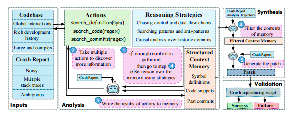

# Code Researcher: Deep Research Agent for Large Systems Code and Commit History

论文地址：[https://arxiv.org/abs/2506.11060](https://arxiv.org/abs/2506.11060)

## 核心要点

*   **目标**: 自动修复大型系统代码（如 Linux 内核）中的崩溃问题。
*   **核心创新**: 提出 **Code Researcher**，一个深度研究智能体，它模仿人类专家的研究过程，在编码前进行深入的上下文收集。
*   **关键能力**:
    *   **深度代码探索**: 使用 `search_definition`, `search_code` 等工具深入分析代码。
    *   **历史提交分析**: 独创性地引入 `search_commits` 工具，将 Git 提交历史作为关键信息源，进行因果分析。
    *   **三阶段工作流**: 通过“分析-综合-验证”的结构化流程解决问题。
*   **主要成果**: 在真实的 Linux 内核崩溃基准 **kBenchSyz** 上，实现了 **58%** 的崩溃解决率，显著优于 SWE-agent (31.5%)。
*   **重要启示**: 证明了在修复复杂系统级 bug 时，对代码演变历史的深度研究至关重要。

---

## 1. 论文概述

这篇论文介绍了一款名为 “Code Researcher” 的深度研究智能体（deep research agent）。它被设计用来自动为大型、复杂的系统级代码（如 Linux 内核）中的崩溃（crash）问题生成修复补丁。研究指出，尽管基于大语言模型（LLM）的编程智能体在标准编码基准测试上表现良好，但它们在处理规模庞大、交互复杂的系统代码时效果不佳。

Code Researcher 通过模仿人类专家的研究过程来解决这一问题。它能够对代码的语义、设计模式以及至关重要的项目提交历史（commit history）进行多步骤的推理，从而在动手修复前收集充分的上下文信息。论文在一个真实的 Linux 内核崩溃基准上对 Code Researcher 进行了评估，结果显示其性能显著优于如 SWE-agent 等先进的基线模型，崩溃解决率达到了 58%。

## 2. 面临的挑战

现有的基于大语言模型的编程智能体在应用于大型“系统代码”（如操作系统、网络协议栈、云基础设施等）时面临着独特的挑战。论文指出了以下几个核心问题：

*   **规模与复杂性**: 系统级代码库通常非常庞大，包含数千个文件和数百万行代码，其复杂性对自动化工具构成了巨大挑战。
*   **低级代码与全局交互**: 这类代码通常使用 C/C++ 等语言，涉及复杂的底层操作（如指针和位操作），并且在并发、内存管理等方面存在着跨越整个代码库的全局交互。
*   **丰富的开发历史**: 核心系统软件拥有长达数年甚至数十年的开发历史，其提交记录中包含了大量关于设计决策和历史变更的宝贵信息，这对于理解和修复深层次的 bug 至关重要。
*   **现有智能体的局限性**: 当前的编程智能体（如 SWE-agent）大多是为中小型代码库设计的，它们严重依赖人类编写的、信息丰富的 bug 报告（issue descriptions）。然而，在系统代码领域，bug 报告通常只是充满噪声的堆栈跟踪（stack traces），信息非常有限。因此，这些智能体缺乏深入探索整个代码库和进行全面上下文推理的能力，并且没有利用提交历史这一重要信息源。

## 3. 解决方案：Code Researcher

为了应对上述挑战，论文提出了第一个专为代码设计的深度研究智能体——Code Researcher。它的工作流程被划分为三个核心阶段，旨在系统性地研究和解决代码崩溃问题。

    

### 3.1. 分析阶段 (Analysis)

这是 Code Researcher 的研究核心。

*   **输入**: 该阶段从代码库和一份崩溃报告开始。
*   **行动 (Actions)**: 智能体配备了一套强大的工具来探索代码：
    *   `search_definition(sym)`: 查找函数、结构体等符号的定义。
    *   `search_code(regex)`: 使用正则表达式在代码库中搜索特定模式。
    *   `search_commits(regex)`: 在提交历史（包括提交信息和代码变更）中进行搜索，这是该智能体的一大特色。
*   **推理策略 (Reasoning Strategies)**: 智能体通过提示（prompting）被引导使用多种推理策略来指导其调查：
    *   **追溯控制流和数据流链**: 理解代码的执行路径和数据传递方式。
    *   **搜索模式和反模式**: 识别代码库中的常见行为和异常代码，以发现潜在的 bug。
    *   **基于历史提交的因果分析**: 分析代码的演变过程，理解过去的变更与当前崩溃之间的联系。
*   **结构化上下文记忆 (Structured Context Memory)**: 所有行动的结果都被存储在一个结构化的记忆库中。智能体通过多轮迭代，不断推理、行动和审视已收集的上下文，直到认为信息足够充分为止。

### 3.2. 综合阶段 (Synthesis)

*   当分析阶段收集到足够的上下文后，智能体进入此阶段。
*   它首先会过滤记忆库中的内容，筛选出与修复任务最相关的信息。
*   接着，基于这些精炼后的上下文，智能体对 bug 的根本原因提出一个假设，并生成相应的修复补丁。

### 3.3. 验证阶段 (Validation)

*   生成的补丁被自动应用到代码库中。
*   最后，系统会使用外部工具编译代码并运行一个复现脚本，以验证补丁是否成功解决了崩溃问题。

## 4. 实验评估

论文通过一系列详尽的实验来评估 Code Researcher 的性能和有效性。

*   **基准测试**:
    *   主要实验平台是 **kBenchSyz**，一个包含 200 个真实 Linux 内核崩溃案例的挑战性基准。
    *   为了验证其通用性，研究人员还在一个开源多媒体软件 **FFmpeg** 的 10 个崩溃案例上进行了测试。
*   **对比基线**: Code Researcher 与多个强大的基线进行了比较，包括：
    *   **SWE-agent**: 一个在 SWE-bench 基准上表现顶尖的开源编程智能体。
    *   **GPT-40 和 o1 模型**: 在两种简化场景下进行测试：（1）“辅助（assisted）”场景，即直接向模型提供包含 bug 的正确文件；（2）“堆栈上下文（stack context）”场景，即提供崩溃报告中提到的所有文件的内容。
*   **评估指标**:
    *   主要指标是**崩溃解决率 (Crash Resolution Rate, CRR)**，即成功修复的崩溃案例所占的百分比。
    *   其他指标包括**召回率**（编辑的文件与标准修复方案中文件的重合度）以及智能体在每个任务中探索的文件数量等。
*   **主要实验结果**:
    *   **卓越的性能**: 在无辅助的情况下，Code Researcher (GPT-40 + o1) 取得了 **58%** 的崩溃解决率，远超 SWE-agent (31.5%) 和其他基线模型。
    *   **深度探索能力**: Code Researcher 平均每个 bug 会读取 **29.1** 个独立文件，而 SWE-agent 仅读取 **1.9** 个，这有力地证明了其深度研究的能力。
    *   **历史提交的重要性**: 一项消融研究（ablation study）表明，如果禁用 `search_commits` 功能，Code Researcher 的崩溃解决率会下降 10%，这凸显了分析开发历史的巨大价值。
    *   **良好的通用性**: 在 FFmpeg 数据集上，Code Researcher 成功解决了 10 个崩溃中的 7 个，表明其设计理念和方法可以有效地推广到其他大型系统代码库。
    *   **补丁质量分析**: 论文还对生成的补丁进行了定性评估，将其分为四类：精确修复、过度特化、不完整修复和错误修复。

## 5. 结论

该论文成功地将智能体的应用从通用编码任务扩展到了更为复杂和专业的大型系统软件维护领域。通过设计 Code Researcher，论文提出了第一个能够进行深度代码研究的智能体，其核心创新在于：

1.  **引入深度研究策略**: 模仿人类专家，在修复前进行广泛的上下文收集和多步推理。
2.  **利用开发历史**: 首次将代码库的提交历史作为关键信息源，通过 `search_commits` 操作进行因果分析，这对于理解和修复在长期演进中产生的微妙 bug 至关重要。

实验结果有力地证明了 Code Researcher 在解决真实 Linux 内核崩溃问题上的先进性。作者们认为，尽管当前工作聚焦于崩溃修复，但这种深度研究的方法论有潜力推广到性能问题、资源泄漏等其他更广泛的软件工程挑战中。
