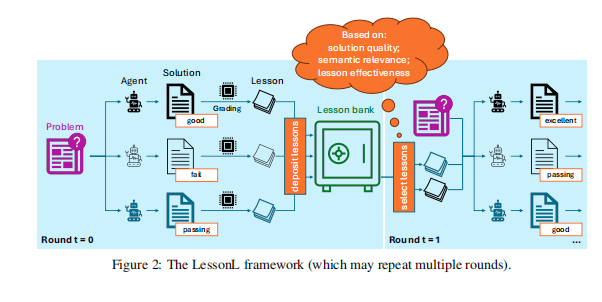

### 三个臭皮匠，赛过诸葛亮：揭秘让AI程序员组团学习的“武林秘籍”——LessonL框架

论文地址：https://www.arxiv.org/abs/2505.23946

想象一下，你是一个项目经理，手下有一群AI程序员。有的擅长“乾坤大挪移”（代码结构优化），有的精通“凌波微步”（并行计算加速），但也有的偶尔会“走火入魔”（写出bug）。你怎么才能让他们不各自为战，而是像一个顶尖团队一样，互相学习、取长补短，最终打造出最强的代码呢？

今天，我们要介绍的这篇论文就提出了这样一套“武林秘籍”—— **LessonL** 框架（发音像 "lesson-nell"）。它的核心思想，就是让一群AI程序员（大型语言模型，LLM）通过开“学习小组”的方式，共享成功经验和失败教训，从而共同成长，解决复杂的编程难题。

---

###  我们遇到了什么“痛点”？

在 LessonL 出现之前，AI编程领域主要有两个头疼的问题：

1.  **AI界的“偏科生”没人管**：研究者发现，没有哪个AI模型是全能冠军。比如，`GPT-4o` 就像是班里的全优生，总分第一，但在“几何”这门单科上，`Qwen7B` 这个“偏科生”的解题速度居然是它的2.5倍！可惜，以前的方法往往只看总分，直接请全优生来解决所有问题，白白浪费了那些“偏科天才”的特殊才能。**AI们的互补优势没有被发挥出来。**

2.  **团队协作效率低下**：怎么让这些AI组队呢？
    * **方法一：强行分配角色**。就像开会前，老板直接说：“小A你负责记录，小B你负责发言。” 但如果小A其实更擅长发言呢？这种方法太死板，不适用于我们还不清楚每个AI具体擅长什么的情况。
    * **方法二：各做各的，最后汇总**。这就像小组成员都回家自己做作业，最后一天才把所有东西堆在一起。结果可能是大家的思路互相冲突，乱作一团，沟通成本极高。

---

###  LessonL的“锦囊妙计”：一套神奇的学习流程

为了解决这些痛点，LessonL 框架应运而生。它设计的核心就是“**课程（Lesson）**”——任何能帮助AI更好地解决问题的信息，都可以是一条“课程”，比如一个绝妙的优化技巧、一个需要避开的编程陷阱，或者一次性能测试反馈。

整个流程就像一个高效的学习小组在进行迭代冲刺。我们用一个具体的例子——**“优化一个巨慢的矩阵乘法代码”**——来走一遍这个流程。

    

#### **第1步：摸底考试 & 写学习心得 (初始尝试与课程生成)**

* **流程**：首先，教头（系统）把同一个问题（“优化这段代码！”）发给团队里的每个AI程序员，比如 `Deepseek7B`、`Qwen7B` 和 `Qwen14B`。它们需要独立完成自己的第一版“答卷”。

* **赛场实况**：
    * **`Deepseek7B` 同学**：他想到了一个常见的招式——“循环重排”，把代码循环顺序改了一下，以提高CPU缓存的命中率。
    * **`Qwen7B` 同学**：他另辟蹊径，使出了一招“并行加速”，用 OpenMP 技术让代码在多个CPU核心上同时运行。
    * **`Qwen14B` 同学**：他想“秀操作”，用了一个很偏门的CPU指令，结果“走火入魔”，代码根本无法编译。

#### **第2步：批改作业 & 总结经验教训 (评估与课程征求)**

* **流程**：教头会批改所有“答卷”。标准很简单：代码能跑吗？结果对吗？比原来快了多少（加速比）？然后，教头会要求每个AI根据自己的“分数”，写一句精炼的“学习心得”（也就是“课程”）。

* **赛场实况**：
    * `Deepseek7B` 的方案：运行正确，**速度提升了5倍**！他总结道：
        > **【正面课程 ①】**：“*将循环顺序重排，可以改善缓存局部性，显著提升性能。*”
    * `Qwen7B` 的方案：运行正确，**速度提升了8倍**！他兴奋地写下：
        > **【正面课程 ②】**：“*使用OpenMP并行化，能利用多核CPU来大幅加速计算。*”
    * `Qwen14B` 的方案：编译失败。他垂头丧气地写下检讨：
        > **【负面课程 ③】**：“*尝试使用特殊的CPU内在函数会导致编译失败，因为环境不支持，此路不通。*”

#### **第3步：划重点！建立“精华笔记”与“错题本” (课程存入与筛选)**

* **流程**：所有AI的“学习心得”都会被收录到一个共享的“**课程银行**”里。在开始下一轮挑战前，教头会从银行里“划重点”，挑出几条最有价值的课程，准备分享给全队。筛选标准非常智能：
    * **优先选高分笔记**：像 `Qwen7B` 那个8倍加速的经验，必须是重点！
    * **也要看相关性**：确保课程是针对当前问题的，避免AI胡思乱想。
    * **错题本也很重要**：像 `Qwen14B` 的失败教训，能帮所有人避免踩坑。

* **赛场实况**：
    课程银行里现在有3条课程。教头决定，下一轮的“学习资料”是：**【正面课程 ②】** (8倍加速) + **【正面课程 ①】** (5倍加速)。 `Qwen14B` 的失败教训暂时放一放，先让大家学习成功的经验。

#### **第4步：开“补习班”，融合新知识再战 (迭代优化)**

* **流程**：教头把筛选出的“金牌课程”分发给所有AI。现在，大家不再是单打独斗，而是站在了前人（包括自己和队友）的肩膀上，带着新知识再次尝试解决同一个问题。

* **赛场实况**：
    所有AI都收到了“循环重排”和“OpenMP并行化”这两条“武功秘籍”。
    * `Deepseek7B` 在自己上一轮的基础上，吸收了并行化的思想，提交了一个**既重排了循环又并行化**的新版本。
    * `Qwen7B` 也做了同样的事情。
    * `Qwen14B` 这次学乖了，不再乱搞，而是直接将两条成功的经验融合在自己的新代码里。

#### **第5步：循环往复，决出“武林盟主” (迭代与最终选择)**

* **流程**：上面的“**尝试 -> 总结 -> 分享 -> 再尝试**”的过程会重复好几轮。在第二轮中，融合了两种策略的新方案可能会获得 **30倍** 的惊人加速！这又会成为一条全新的、更高质量的“课程”进入银行，供下一轮学习。
* **最终**：所有轮次结束后，教头会从大家提交的所有版本中，挑出那个功能正确且加速比最高的方案，作为最终的“冠军作品”交给你。

通过这个流程，LessonL 框架成功地将一群独立的AI组织成了一个能够自我进化的学习型战队，实现了 **“1 + 1 + 1 > 3”** 的惊人效果。

---

###  LessonL的“战绩”如何？

口说无凭，实验为证。研究结果表明，LessonL 框架确实是“学霸”级别的存在：

* **代码优化超强**：在两个主流的代码优化测试平台上，LessonL 团队的表现全面碾压了所有对手。它优化后的代码平均加速 **3.46倍**，显著超过了单打独斗的超级明星 `GPT-4o`（2.93倍）和其他团队协作方法。
* **写代码也一样行**：不仅能优化，在从零开始写代码的任务上，LessonL 在多个测试中也名列前茅，证明了这套方法通用性很强。
* **性价比之王**：最令人兴奋的是，由几个小模型组成的 LessonL 团队，在花费和 `GPT-4o` 差不多的计算资源和金钱成本下，性能却远超后者。这证明了**一个好的协作机制，比单纯堆砌一个超大模型更有效、更经济**！
* **真的能学到精髓**：案例分析发现，通过这种学习模式，AI团队甚至能自发“领悟”到像“分治法”这样的高级算法思想，而不仅仅是简单的技巧叠加。

---

### 总结

LessonL 框架的提出，就像是为AI世界引入了“团队合作”和“复盘总结”的先进理念。它雄辩地证明了：

> **一个通过高效框架协作的小型AI团队，完全有能力在性能和成本上，双重超越一个体量远大于它们的“超级AI单体”。**

这不仅为我们提供了一种更强大、更经济、也更可解释的AI编程工具，也为未来人工智能的发展指明了一个新方向：与其无止境地追求更大的模型，不如设计更智能的协作方式。