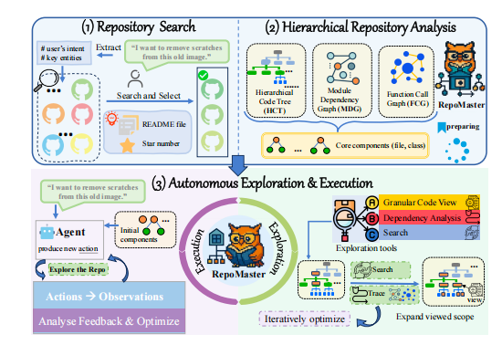
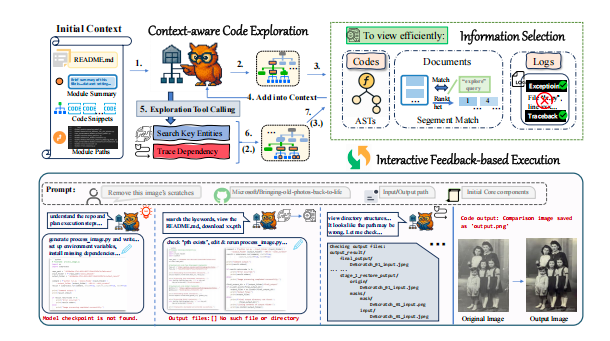
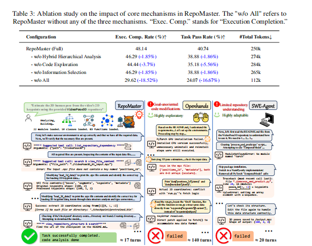

# RepoMaster: 让AI学会“抄”代码，高效解决复杂任务

论文地址：[https://arxiv.org/abs/2505.21577](https://arxiv.org/abs/2505.21577)

### 这篇论文讲了啥？

这篇论文介绍了一个名叫 **RepoMaster** 的AI助手。它的特长是能自己去GitHub上找现成的代码库，然后利用这些代码库来解决复杂的编程任务。

我们知道，现在的人工智能（比如GPT）写一小段代码很厉害，但让它从零开始写一个完整的、能直接用的软件，就有点力不从心了。所以，这篇论文提出了一个新思路：**别老想着从头写代码，不如学学人类程序员，多利用GitHub上已有的海量代码，把它们当作一个个“零件”，拿来组装和改造**。

RepoMaster 就是为了自动完成这个“拿来主义”的过程。它会模仿一个聪明的程序员，快速熟悉一个完全陌生的代码项目。实验结果表明，RepoMaster 不仅完成任务的成功率更高，而且比其他方法更“省钱”（消耗的计算资源更少）。

### AI编程现在有啥难题？

现在的AI编程工具想利用GitHub上的代码库来干活，但总是磕磕绊绊。主要有几个大难题：

*   **看不懂说明书**：光看项目的 README（使用说明）文件根本不够，因为说明书经常写得不清不楚，甚至可能是错的。
*   **代码太多，记不住**：一个真实的项目代码量太大了，AI的“短期记忆”有限，一下子看不过来，也记不住那么多东西。
*   **代码绕来绕去，看不懂**：代码文件之间、函数之间互相调用，关系像蜘蛛网一样复杂，AI很容易在里面“迷路”。
*   **抓不住重点**：现有的工具没法从宏观上把握整个代码的结构，也搞不清谁依赖谁，不知道哪些信息重要、哪些可以忽略，结果就是干活又慢又贵。

### RepoMaster是怎么解决的？

    

为了解决这些难题，RepoMaster 被设计成一个**三步走**的工作流程：

1.  **第一步：找对代码库**
    你用大白话告诉 RepoMaster 你想干什么，它就会自动去 GitHub 上搜索，然后根据说明书、项目火爆程度（比如 Star 数）等信息，挑出最可能用得上的代码库。

2.  **第二步：给代码库“画地图”**
    在动手改代码之前，RepoMaster 不会急着一头扎进去。它会先对整个项目进行一次“CT扫描”，搞清楚代码的内部结构。我们用一个生活化的比喻来解释它是怎么画出这些“地图”的。

    想象一下，你接手了一个非常庞大且复杂的乐高模型项目，但是没有说明书。这个项目就是一个GitHub代码库。RepoMaster就像一个聪明的项目助理，它的目标是在不动手拼装（运行代码）之前，先把所有零件和结构都搞清楚。

    它是这么做的：首先，助理会把箱子里所有的乐高零件倒出来，识别出每一块积木的形状、大小、颜色等信息。基于这份详细的零件清单，助理开始绘制三张不同的蓝图：

    *   **代码结构图 (HCT) - “收纳盒地图”**: 这张图告诉你“什么东西放在哪个盒子里”。它就像一个公司的组织架构图，从项目（CEO）到模块（部门），再到类（团队），最后到函数（员工），让你一目了然地知道谁属于谁，层级关系是怎样的。

    *   **文件关系图 (MDG) - “朋友关系网”**: 这张图告诉你“哪个文件需要依赖另一个文件才能工作”。如果文件A需要文件B的帮助（`import`），就在地图上从A向B画一条线。这就像一张社交网络图，被很多箭头指向的文件就是项目里的“网红”或“核心人物”。

    *   **函数调用链 (FCG) - “工作流程图”**: 这张图告诉你“一个任务具体是怎么一步步完成的”。它会深入到每个函数内部，看这个函数为了完成自己的工作，都“喊”了（调用了）哪些其他函数来帮忙。这就像一张电话通话记录图，揭示了代码内部实际的执行流程和协作方式。

    通过绘制这三张图，RepoMaster在真正开始解决用户问题之前，就已经对整个代码库的宏观结构、核心模块以及微观工作流程了如指掌了。有了这些地图，RepoMaster 就能快速定位出项目的“核心代码”，然后把这些最重要的信息喂给 AI，让 AI 先有个整体概念，而不是一开始就被细节淹没。

3.  **第三步：拿着地图去探索**
    现在，AI 就像有了一个 GPS 导航，可以开始在代码库里探索和工作了。它有一套工具箱，可以：
    *   **精确查看**：随时查看任何一个文件、类或函数的具体代码。
    *   **顺藤摸瓜**：利用刚才画的地图，轻松追踪一个功能到底涉及了哪些代码。
    *   **快速搜索**：像用 Google 一样在代码库里搜索关键词。
    为了不让 AI 的“短期记忆”过载，RepoMaster 还会很聪明地进行**信息筛选**，只把当前任务最相关的信息（代码、文档、运行结果等）挑出来给 AI 看。整个过程就是不断地探索、动手修改、看结果、再调整，直到任务完成。

    

### 效果怎么样？

为了证明自己不是“纸上谈兵”，RepoMaster 和另外两个有名的 AI 编程工具（OpenHands 和 SWE-Agent）进行了两场大比武：

*   **Kaggle 机器学习任务 (MLE-R)**：在这场比赛中，RepoMaster 的有效提交率高达 **95.5%**，还有 **27.3%** 的概率能拿奖牌。这个成绩远超对手，比如 OpenHands 的有效提交率只有 45.5%，拿奖牌的概率更是低至 4.5%。
*   **真实世界任务 (GitTaskBench)**：在这场比试中，RepoMaster 的任务成功率高达 **62.96%**，把 OpenHands (24.07%) 和 SWE-Agent (14.81%) 远远甩在身后。更牛的是，RepoMaster 完成任务花的“钱”（计算资源）比 OpenHands 少了足足 **95%**！

研究人员还做了一个实验，他们把 RepoMaster 的一些核心功能（比如“画地图”、“智能探索”）拿掉，发现它的表现果然变差了。这证明了这些设计确实是 RepoMaster 成功的关键。

    

### 总结一下

总而言之，这篇论文给我们展示了一个叫 RepoMaster 的 AI 框架，它能像一个经验丰富的程序员一样，通过“借用”和修改 GitHub 上的代码来解决棘手的编程任务。

RepoMaster 的成功秘诀在于“**先理解，再动手**”。它通过深入分析代码结构，然后聪明地进行探索，最终在解决问题的效率和效果上都完胜了现有的其他工具。这项研究告诉我们，让 AI 学会把海量的开源代码当作一个巨大的“工具箱”来使用，是一条非常强大而且可行的路。

作者认为，这种方法不仅能让 AI 更好地融入程序员的生态，未来还有望在更复杂的场景大显身手，比如自动管理超大型软件项目，或者自动修复代码里的 Bug。