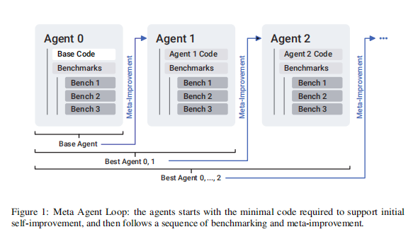
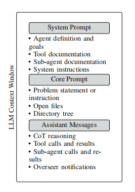

# SICA：一个会自我进化，不断变强的AI程序员

论文地址：[https://arxiv.org/abs/2504.15228](https://arxiv.org/abs/2504.15228)

## 核心思想：AI如何打破天花板？

想象一下，你雇佣了一位顶尖程序员。他不仅能完成你交代的任务，还有一个惊人的超能力：每完成一个项目，他都会坐下来复盘，反思自己的工作流程和工具链，然后**直接动手修改自己的代码编辑器、甚至重写自己的工作方法**，让自己在下一次任务中变得更强、更高效。

这，就是 **SICA（Self-Improving Coding Agent）** 的核心思想。它是一个能实现“自我进化”的AI编程代理，旨在解决当前AI系统发展中的一个核心难题：大多数AI的成长依赖于人类工程师的外部调整，这个过程不仅慢，而且有天花板。SICA的出现，就是为了打破这些局限，创造一个能够**在通用编程任务中，通过改造自身来实现能力复利式增长**的全新范式。

---

## SICA的自我进化秘籍：四步炼成更强的自己

SICA的魔法在于其**统一的自我改进循环（Meta-Improvement Loop）**。这套流程让它能够“自己研究自己，自己改造自己”。我们可以把它想象成一场AI铁人三项比赛的迭代过程：

#### 第1步：选拔卫冕冠军 (Select Best Agent)

SICA有一个“名人堂”（Archive），里面记录了它所有历史版本以及每个版本的“战绩”（得分、成本、耗时）。每次新一轮进化开始，系统会像裁判一样，从名人堂里选出上一轮综合表现最强的那个代理版本，让它作为“卫冕冠军”来领导下一轮的自我改进。

> **例子**：第10号代理虽然解决问题得分很高，但API调用成本太高，最终综合评分最高的可能是第9号代理。那么，第9号代理就成为本轮的“元代理”。

#### 第2步：复盘与构思 (Analyze & Plan)

这位“卫冕冠军”会深入分析名人堂里的历史数据，找出自己的短板。它会反思：“我在哪些任务上失败了？为什么失败？是我缺少工具，还是我的工作流程有问题？”

> **例子**：它在复盘时发现，处理“修改大文件”这类任务时总是很慢，成本很高。它意识到：“我现在的‘编辑’工具太笨了，只会全量覆盖。我需要一个更智能的工具，能只修改变化的部分。”

#### 第3步：动手改造自己 (Code Editing)

这是最关键的一步。代理不仅仅是“想”，它会真的**动手编辑自己的源代码**，为自己添加新功能或优化旧工具。它会调用内部的“软件开发者”子代理，打开自己的代码库，编写新代码、测试用例，然后进行调试，直到新工具能完美运行。

#### 第4步：评估与存档 (Evaluate & Archive)

一个携带了新工具的新版代理诞生了。它需要在一整套基准测试中证明自己。如果结果显示它的性能相比旧版本有了显著提升，并且没有引入新的bug，那么这次进化就被认为是成功的。这个更强大的新版本连同它优异的成绩，会被郑重地存入名人堂，成为下一轮选拔的有力竞争者。

通过这个“选拔 → 复盘 → 改造 → 验证”的闭环，SICA的能力得以持续、自主地迭代增强。

    

---

## 揭秘SICA的梦之队：分工明确的AI天团

SICA不是一个人在战斗，它是一个分工明确、性格各异的AI团队。它的成功很大程度上归功于其绝妙的提示词工程，为每个代理量身打造了独特的“人格”和“工作手册”。

    

### 总指挥：项目经理 (Main Agent) 👨‍💼

*   **角色定位**：团队的大脑和协调者，负责理解任务、拆分需求，然后将任务委派给最合适的专家子代理。
*   **性格塑造 (Prompt)**：它的提示词被严格限制，强调“协调”和“委派”，并**明确禁止**它“亲自从事实质性工作”。这就像告诉一位项目经理：“你的工作是分配任务，而不是自己写代码。这是你的团队名单和他们的技能表，请明智地使用他们。” 这种权力的限制是塑造其行为的关键。

### 王牌主力：资深程序员 (Coding Agent) 🧑‍💻

*   **角色定位**：团队里的核心执行者，负责编写、调试和测试代码。
*   **性格塑造 (Prompt)**：它的提示词是一本厚厚的《程序员工作手册》，规定了极其严谨的作业流程：“1. 不要急，先慢下来。2. 彻底理解上下文，阅读所有相关文档。3. 编写最精简、有效的代码。4. 进行端到端的测试。5. 如果遇到棘手的算法，去咨询‘推理专家’（另一个代理）。” 这套流程强制它养成了良好的编程习惯。

### 质量总监：异步监察者 (Overseer) 🕵️‍♂️

*   **角色定位**：一个在后台默默运行的“上帝视角”AI，像一个质量总监，持续监控整个团队的工作状态，防止“翻车”。
*   **性格塑造 (Prompt)**：它的提示词不像对话，更像一个配置文件。它被赋予了严格的规则和机器友好的输出格式。例如：“如果一个代理在循环，那么就发送警告。如果警告被忽略，那么就取消该代理并通知其上级。” 并且，它的所有判断都必须以`<OVERSEER_JUDGEMENT>`这样的XML格式输出，确保系统能准确无误地执行它的指令。

---

## 实验结果：真金不怕火炼

答案是**非常有效**。

论文中的实验数据显示，SICA在15次迭代中实现了惊人的性能飞跃。在著名的软件工程基准测试 **SWE-Bench** 的一个子集上，它的**准确率从最初的17%一路飙升到了53%**。

| 迭代次数 (Iter) | SWE-Bench 准确率 | 关键进化节点 |
| :--- | :--- | :--- |
| **0** | **17%** | 初始代理 |
| **3** | **22%** | 实现了初步的工具优化 |
| **6** | **37%** | 引入了更智能的文件编辑工具 |
| **9** | **47%** | **实现了基于AST的符号定位器，代码导航能力大增** |
| **14**| **53%** | 进一步优化了调试和测试流程 |

性能的提升不是凭空而来的，而是与代理**自主实施**的具体代码改进直接相关。例如，在第9次迭代中，代理通过自我改造，学会了使用**AST（抽象语法树）**来精确定位代码中的函数和变量，这使得它在复杂代码库中的导航和编辑能力产生了质的飞跃。

---

## 总结与展望：AI进化的新篇章

SICA成功地证明了，一个AI编程代理完全有能力通过**编辑自身代码**来实现**持续的、可量化的自我改进**。这是一种不依赖于模型权重更新的、数据高效的全新学习方式。

当然，SICA也存在局限，比如它很难凭空产生革命性的创新想法。但它所开辟的“自我进化”道路，为未来AI的发展提供了激动人心的可能性：或许有一天，AI不仅是我们的工具，更是能够与我们一同学习、一同进化的“伙伴”。