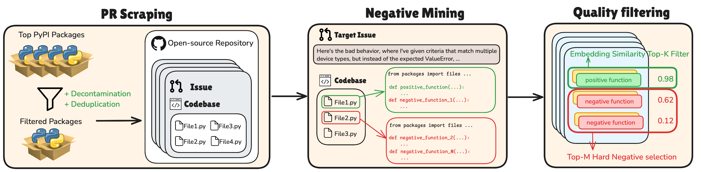
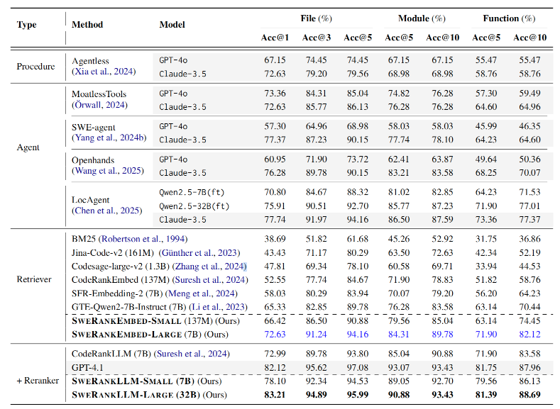
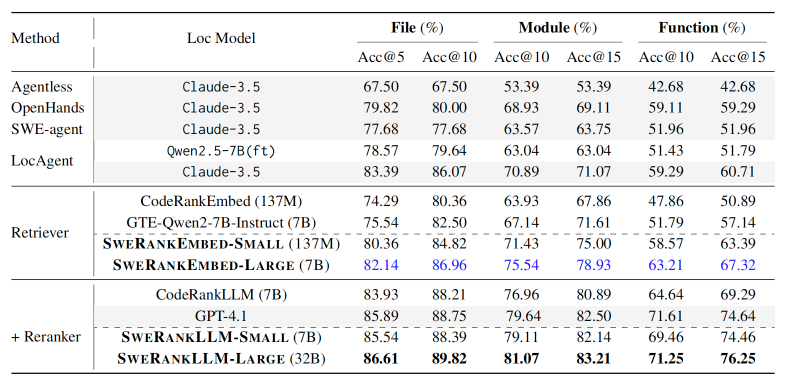
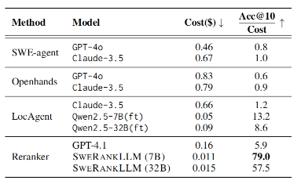

# SWERANK: Software Issue Localization with Code Ranking

论文地址:[https://arxiv.org/abs/2505.07849](https://arxiv.org/abs/2505.07849)  
项目仓库:[https://github.com/gangiswag/SweRank](https://github.com/gangiswag/SweRank)

---

## 论文大概

本文介绍了一个名为 **SWERANK** 的框架，用于解决软件开发中的**问题定位（issue localization）**任务，即根据自然语言描述（如错误报告或功能请求）快速准确地找到相关代码位置（文件、类或函数）。该框架通过构建一个大规模数据集 SWELOC 并结合高效的**检索-重排（retrieve-and-rerank）**架构，实现了高效率和低成本的问题定位。

---

## 论文提出的问题

软件问题定位是软件开发中的一个关键但耗时的任务。现有的基于大型语言模型（LLM）的代理（agent）方法虽然表现出了潜力，但存在以下问题：

1. **高延迟和高成本**：这些方法依赖于复杂的多步推理和闭源的LLM（如Claude-3.5），导致每次定位的API成本高达约0.66美元，且响应时间长。
2. **模型脆弱性**：代理方法依赖于温度采样和复杂的工具编排，容易因中间步骤的失败而导致整个定位过程失败。
3. **传统代码排名模型的局限性**：这些模型通常针对查询到代码或代码到代码的检索任务优化，难以处理问题定位中复杂且冗长的自然语言描述。

---

## 论文解决办法

为弥补这些差距，论文提出了 **SWERANK**，一个高效的检索-重排框架，包含两个核心组件：

- **SWERANKEMBED**：一个用于代码检索的双编码器嵌入模型，能够快速从大型代码库中筛选出候选代码片段。
- **SWERANKLLM**：一个用于重排的指令微调的LLM，能够进一步优化检索结果的排名。

为了训练这些模型，作者构建了一个名为 **SWELOC** 的大规模数据集，包含从 GitHub 仓库中提取的真实问题描述和对应的代码修改。通过对比学习目标和硬负样本挖掘，SWERANK 能够将冗长的问题描述与有问题的代码片段对齐，从而提高定位精度。

### 数据构造

在论文中，SWELOC数据集的构造过程是为了解决软件问题定位任务中数据的不足，尤其是针对冗长且描述错误行为的自然语言问题描述与对应代码修改之间的对齐问题。



**数据构造具体步骤：**

#### 1. 选择相关仓库

- **数据来源**：从GitHub上选择与PyPI（Python Package Index）包相关的仓库。选择的仓库数量为前11,000个最受欢迎的Python仓库。
- **过滤条件：**
    - 仓库中至少80%的代码是Python。
    - 排除已经包含在现有基准数据集（如SWE-Bench和LocBench）中的仓库。
    - 基于代码重叠进行去重，移除几乎相同的仓库。
- **结果**：最终得到3,387个高质量的Python仓库。

#### 2. 提取问题和代码修改

- **筛选Pull Request(PR)：**
    - PR明确链接到同一个仓库中的GitHub问题（issue）。
    - PR包含对测试文件的修改（作为问题解决是否经过验证的代理指标）。
- **对于每个符合条件的PR，提取以下内容：**
    - 与PR关联的问题描述（issue description）。
    - PR基础提交（base commit）对应的代码库快照。
- **结果**：得到67,341个初始的（PR，代码库）对。

#### 3. 构建对比学习数据

- **数据格式**：将数据组织成对比学习所需的格式，即 `<查询，正样本，负样本>` 三元组。
    - **查询（Query）**：问题描述。
    - **正样本（Positive）**：PR中修改的Python函数。
    - **负样本（Negatives）**：同一代码库快照中未被修改的Python函数。
- **数据增强：**
    - **一致性过滤（Consistency Filtering）：**
        - 使用预训练的嵌入模型（如`CodeRankEmbed`）计算问题描述与代码片段之间的相似度。
        - 仅保留正样本在代码库中的相似度排名在前K（论文中K=20）的实例。
    - **硬负样本挖掘（Hard Negative Mining）：**
        - 从负样本中选择与问题描述最相似的M个函数（论文中M=15）作为"硬负样本"。

#### 4. 数据质量控制

- 过滤噪声：通过一致性过滤和硬负样本挖掘，减少数据中的噪声，确保训练数据的质量。
- 数据规模：最终的数据集规模较大，包含大量的真实世界问题描述和对应的代码修改，适合用于训练和优化问题定位模型。

#### 5. 数据集特点

- **问题描述的冗长性**：SWELOC中的问题描述通常包含详细的错误行为描述，平均长度为382.56个token，远长于传统代码检索数据集中的查询（如CodeSearchNet的12个token）。
- **多样性和复杂性**：通过对10,000个随机样本的分析，SWELOC涵盖了多种问题主题，如错误修复、功能增强、性能优化等，反映了真实世界软件开发中的多样性。

---

### 模型训练

SWERANK 框架的两个核心组件——嵌入模型（SWERANKEMBED）和重排模型（SWERANKLLM）——分别采用了不同的微调方法，以适应软件问题定位任务的特定需求。

#### 1. 嵌入模型（SWERANKEMBED）的微调

嵌入模型的作用是将问题描述和代码片段映射到一个共享的嵌入空间中，以便通过相似度计算来快速检索出与问题描述最相关的代码片段。

**模型架构**

- **SWERANKEMBED-SMALL**：
    - 基于 `CodeRankEmbed`（137M参数）初始化，这是一个专门用于代码检索的双编码器模型。
    - 使用 Arctic-Embed-M 作为基础编码器，支持扩展上下文长度（8,192 tokens），并预训练于大规模的网页查询-文档对。
- **SWERANKEMBED-LARGE**：
    - 基于 `GTE-Qwen2-7B-Instruct`（7B参数）初始化，这是一个预训练于大规模文本检索数据的模型。
    - 使用自定义的查询前缀：

      ```text
      Instruct:Given a github issue,identify the code that needs to be changed to fix the issue.Query:
      ```

**微调方法**

- **对比学习目标**：
    - 使用 InfoNCE 对比损失函数进行训练，目标是让问题描述的嵌入向量与对应的正样本代码片段的嵌入向量更接近，而与负样本的嵌入向量更远。
    - 对于每个问题描述，正样本是PR中修改的函数，负样本是从同一代码库中随机选择的未修改函数。
- **训练参数：**
    - **SWERANKEMBED-SMALL**：
        - 使用8个GH200 GPU进行训练。
        - 学习率：2e-5。
        - 批量大小：64。
        - 每个样本的硬负样本数量：15。
        - 训练周期：2个epoch。
    - **SWERANKEMBED-LARGE**：
        - 使用8个GH200 GPU进行训练。
        - 学习率：8e-6。
        - 批量大小：64。
        - 每个样本的硬负样本数量：7。
        - 训练周期：1个epoch。

#### 2. 重排模型（SWERANKLLM）的微调

重排模型的作用是对嵌入模型检索到的候选代码片段进行进一步的排序优化，以提高问题定位的准确性。

**模型架构**

- **SWERANKLLM-SMALL**：
    - 基于 `CodeRankLLM`（7B参数）初始化，这是一个预训练于代码检索任务的列表式重排模型。
- **SWERANKLLM-LARGE**：
    - 基于 `Qwen-2.5-32B-Instruct`（32B参数）初始化，这是一个预训练于文本列表重排任务的模型。

**微调方法**

- **训练数据：**
    - 对于每个 `<查询，正样本，负样本>` 三元组，从SWELOC数据集中随机选择9个负样本，与正样本一起形成一个大小为10的候选列表。
    - 为了避免位置偏差影响模型，对每个训练样本的候选代码片段顺序进行随机打乱。
    - 由于问题描述和候选代码片段的总长度可能超过模型的最大嵌入大小，因此将每个候选代码片段的最大长度限制为1024 tokens，总长度限制为16348 tokens。如果超过限制，则截断问题描述以适应最大总长度。
- **训练目标：**
    - 由于SWELOC数据集没有提供负样本之间的相对排名，因此训练目标是让模型正确生成正样本的标识符（即预测正样本为最相关的候选）。
    - 使用列表式重排的训练目标，但只对第一个生成的标识符（即最相关的候选）应用损失函数。
- **训练参数：**
    - 使用16个GH200 GPU进行训练。
    - 学习率：5e-6。
    - 批量大小：128。
    - 训练周期：1个epoch。
    - 使用余弦学习率调度器。
    - 使用bfloat16精度。
    - 使用DeepSpeed ZeRO stage 3进行高效长上下文多GPU训练。
    - 使用噪声嵌入（noisy embeddings），噪声比例α=5，以提高模型的鲁棒性。

**总结**

- **SWERANKEMBED** 通过对比学习目标进行微调，利用问题描述和代码片段之间的相似度来优化嵌入空间，从而实现高效的代码检索。
- **SWERANKLLM** 通过列表式重排目标进行微调，专注于优化候选代码片段的排序，以提高问题定位的准确性。
- 两种模型的微调方法都充分利用了SWELOC数据集的特点，通过一致性过滤和硬负样本挖掘来提升模型的性能。

---

## 实验

实验部分主要评估了 SWERANK 在两个基准数据集（SWE-Bench-Lite 和 LocBench）上的表现，并与其他基于代理的方法和排名模型进行了比较。

### 实验设置

- **模型训练**：SWERANKEMBED 和 SWERANKLLM 分别有小尺寸（137M 参数）和大尺寸（7B 参数）版本，均在 SWELOC 数据集上进行微调。
- **评估数据集**：SWE-Bench-Lite 包含 274 个经过筛选的实例，LocBench 包含 560 个实例，涵盖安全和性能问题。
- **评估指标**：使用准确率（Accuracy at k，Acc@k）作为评估指标，分别在文件、模块（类）和函数三个粒度上评估定位精度。

### 实验结果

- **SWE-Bench-Lite**：SWERANK 在所有粒度上均优于现有的基于代理的方法和其他排名模型。

- **LocBench**：SWERANK 同样在该数据集上取得了最佳性能

- **成本分析**：SWERANK 在性能和成本之间取得了显著的平衡。例如，SWERANKLLM（7B）的平均推理成本仅为 **0.011 美元**，远低于基于代理的方法（如 LocAgent 使用 Claude-3.5 的成本为 0.66 美元）。

---

## 总结

SWERANK 通过将问题定位任务重新定义为一个专门的排名问题，提供了一种高效、低成本且有效的解决方案。该框架不仅在性能上超越了现有的基于代理的方法，还通过 SWELOC 数据集为研究社区提供了一个宝贵的资源。
