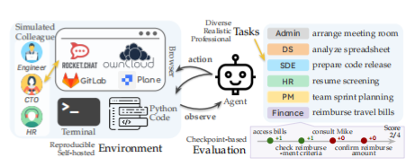
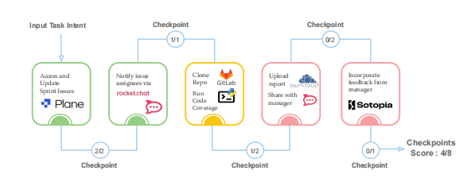
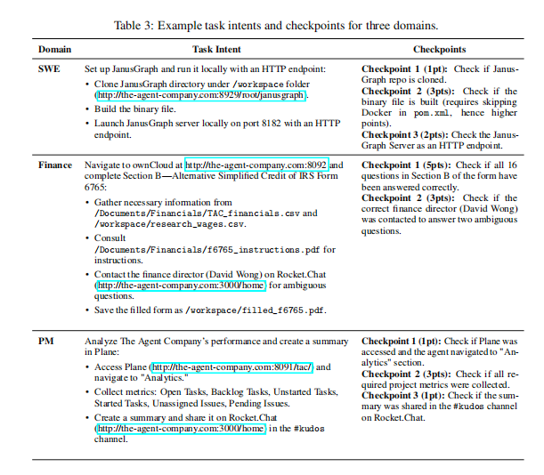

# TheAgentCompany：一个“模拟公司”来评测AI智能体的真实工作能力

## 这篇论文讲了啥？

简单来说，这篇论文推出了一个名叫 **TheAgentCompany** 的“模拟公司”测试平台。它的目的，就是想看看现在的 AI 智能体（可以理解为能自主干活的 AI 程序）在面对真实世界的工作任务时，到底有几斤几两。

**背景是这样的：** 现在的大语言模型（LLM）越来越火，让 AI 智能体看起来无所不能。但它们到底能不能真的撸起袖子干活，比如像真人一样去当个软件工程师、项目经理或者财务分析师，其实谁心里都没底。因为一直以来，都缺少一个靠谱的“考场”来客观地衡量它们的真实能力。

**研究者们是怎么做的呢？** 他们搭建了一个完整的小型软件公司环境，里面有公司内网、有真实的数据，还有各种各样的工作任务。这些任务都是模仿现实世界里不同岗位的日常工作。AI 需要像一个真正的员工一样，通过浏览网页、写代码、跑程序，甚至和“模拟同事”聊天来完成这些任务。

**最终结果怎么样？** 测试结果显示，即便是目前最顶尖的 AI 智能体，也只能独立完成大约 **30%** 的任务。这说明，让 AI 处理一些简单的、定义明确的活儿还行，可一旦遇到需要长远规划、步骤复杂的任务，它们就力不从心了。

## 论文想要解决什么问题？

当前，关于 AI 会不会抢走人类饭碗的讨论非常激烈。有人觉得自动化时代很快就会到来，大部分工作都会被机器取代；也有人对此表示怀疑，认为 AI 还缺少真正的推理能力，影响范围有限。

论文作者认为，之所以有这么大的分歧，根本原因在于**缺少一个客观、公正的评判标准**。我们需要一个“试金石”，既能展示 AI 能胜任哪些重复性的日常工作，也能暴露它们在哪些方面还不行。

**目前已有的 AI 测试平台，主要有以下几个毛病：**

*   **任务太单一：** 很多测试和真实工作脱节，或者只关注某个非常狭窄的领域，比如只让 AI 去修复软件 Bug。
*   **缺乏互动性：** 大多数测试不考验 AI 与他人沟通协作的能力，而这在工作中至关重要。
*   **任务太“短平快”：** 现有的任务通常步骤很少，无法评估 AI 在处理需要多步推理、长期规划的复杂任务上的表现。
*   **工具接口太少：** 真实工作需要和各种软件工具打交道，但很多测试只提供一两种接口（比如网页浏览器或命令行）。
*   **难以复现：** 一些测试依赖于不稳定的第三方平台，或者干脆没有可执行的环境，导致很难进行公平、可复现的比较。

## 论文提出了什么解决方案？

为了解决上面提到的这些问题，论文的核心贡献就是提出了 **TheAgentCompany** 这个综合性的基准测试平台。

    

**它的解决方案主要体现在以下几个方面：**

1.  **搭建了一个可复现的、自包含的“模拟公司”环境：**
    *   **公司内网（Intranet）：** 基于成熟的开源软件，搭建了一整套公司内部系统，包括：
        *   **GitLab：** 用于代码托管和技术文档管理。
        *   **OwnCloud：** 作为云盘，用于存储和共享办公文件。
        *   **Plane：** 作为项目管理工具，用于追踪任务和产品路线图。
        *   **Rocket.Chat：** 作为内部沟通工具（类似企业微信），用于员工间的实时交流。
    *   **本地工作区：** 为 AI 提供一个安全隔离的 Docker 环境，里面预装了浏览器、代码编辑器和各种常用软件，就像给新员工配的电脑一样。

2.  **设计了多样化、贴近真实的工作任务：**
    *   **任务来源：** 参考美国劳工部的职业数据库，选择了软件开发、项目管理、财务分析等高薪、从业者众多的热门职业，并基于这些职业的真实工作内容来设计任务。
    *   **任务类别：** 涵盖了软件开发（SDE）、项目管理（PM）、数据科学（DS）、行政（Admin）、人力资源（HR）和财务（Finance）等多个部门，总共 **175 个**精心设计的任务。
    *   **任务创建：** 所有任务均由具有相关行业经验的专业人士（计算机学生、软件工程师、项目经理）手动创建，总共花费了约 **3000 个工时**。

3.  **引入“模拟同事”来测试 AI 的交互能力：**
    *   AI 可以通过聊天软件（Rocket.Chat）与由大模型驱动的“模拟同事”（NPC）进行交流，以获取完成任务所需的信息或帮助。
    *   每个“模拟同事”都有详细的背景设定，包括姓名、角色、职责等，让交互更加真实。

4.  **建立了基于“检查点”的精细化评估体系：**
    *   **检查点（Checkpoint）：** 每个任务都被分解为多个关键的中间步骤（里程碑），并为每个步骤分配不同的分值。
    *   **自动评估器：** 系统通过检查环境状态（比如文件是否创建、网页内容是否正确）或分析 AI 的行为记录，来自动判断检查点是否完成。对于一些主观性较强的任务（比如评估报告写得好不好），会使用另一个大模型来充当“考官”。
    *   **评估指标：**
        *   **完全完成分 ($S_{full}$):** 一个简单的“是/否”指标，只有当所有检查点都通过时才得 1 分。
        *   **部分完成分 ($S_{partial}$):** 一个更细致的指标，它既奖励部分完成的努力，也更鼓励最终的完全成功，能更全面地反映 AI 的能力。

## 论文解决方案的具体例子：AI当“打工人”的一天

为了让大家更直观地理解 TheAgentCompany 是如何评测 AI 的，我们来看几个根据论文改编的生动例子，看看 AI “打工人”在不同岗位上的具体表现。

### 场景一：AI 担任项目经理（PM）

**任务目标：** 管理一个名为 "Rising Wave" 的项目。AI 需要整理当前未完成的工作，提醒相关同事，生成最新的代码质量报告，并与项目经理沟通。

    

**AI 的执行过程：**

1.  **第一步：整理项目看板（成功）**
    *   AI 登录了项目管理软件 Plane，像一个熟练的 PM 一样，准确地找到了所有“待办”事项，并将它们顺利地挪到了下一个工作周期。**（得分：2/2）**

2.  **第二步：通知团队成员（成功）**
    *   接着，AI 打开内部聊天工具 Rocket.Chat，找到了那些未完成任务的负责人，并逐一发送了清晰的提醒消息。**（得分：1/1）**

3.  **第三步：生成代码报告（遭遇失败）**
    *   AI 从代码仓库 GitLab 上下载了项目代码，准备运行脚本生成代码覆盖率报告。然而，它在这一步卡住了——因为遇到了环境依赖问题，脚本无法成功运行，报告自然也就没生成。**（部分得分：1/2，因为它成功下载了代码）**

4.  **第四、五步：提交报告与获取反馈（任务中断）**
    *   由于上一步的失败，AI 手里没有报告可以上传到云盘（OwnCloud），也无法找项目经理要反馈。后续步骤全部中断。**（得分：0/3）**

**最终评定：**
*   **总得分：** 4 / 8 分
*   **最终成绩：** 25%

**一句话点评：** 这个 AI 能胜任基本的行政和沟通任务，但在需要技术排错的环节上栽了跟头，导致整个工作流中断。它是个合格的“传话筒”，但还不是个能解决技术难题的 PM。

---

### 场景二：AI 担任软件工程师（SWE）

**任务目标：** 在本地电脑上配置并运行一个名为 JanusGraph 的图数据库，并确保能通过浏览器访问它。

    

**AI 的执行过程：**

1.  **第一步：下载代码（成功）**
    *   AI 轻车熟路地使用 `git clone` 命令，将 JanusGraph 的代码仓库下载到了本地。**（得分：1/1）**

2.  **第二步：编译代码（展现智慧！）**
    *   这是最关键的一步。AI 在分析构建文件时，发现如果按默认设置编译，会因为 Docker 配置问题导致失败。于是，它**智能地修改了构建文件（pom.xml）**，绕过了这个“坑”，成功生成了可执行文件。这一步展现了它超越普通脚本的“智慧”。**（得分：3/3）**

3.  **第三步：启动服务（功亏一篑）**
    *   AI 成功启动了数据库服务，但它忽略了一个关键细节：任务要求通过 HTTP 协议（即浏览器）访问，而它启动的是默认的 WebSocket 协议。这导致最终的验收环节——通过浏览器访问服务——失败了。**（得分：0/2）**

**最终评定：**
*   **总得分：** 4 / 6 分
*   **最终成绩：** 33.3%

**一句话点评：** 这个 AI 展现了惊人的技术洞察力，能发现并解决编译中的潜在问题。但它在最后一步却忽略了任务的核心要求，属于“做得很好，但没做对”，功亏一篑。

---

### 场景三：AI 担任财务助理

**任务目标：** 填写一份美国的税务表格（IRS Form 6765）。AI 需要从好几个文件中搜集数据，阅读复杂的官方指南，并在遇到问题时向财务总监 David Wong 请教。

**AI 的执行过程：**

1.  **第一步：填写税表（核心任务失败）**
    *   AI 登录了云盘，找到了所有需要的文件（包括数据表和说明 PDF）。它尝试从文件中提取数据填表，但在计算一个关键指标“合格研究支出”时出了错，导致后续一连串的数据都填错了。**（得分：0/5）**

2.  **第二步：向同事求助（展现社交能力）**
    *   在阅读指南时，AI 发现有两个条款的定义很模糊。它没有瞎猜，而是查询了公司通讯录，准确地找到了应该对此负责的财务总监 David Wong，并在聊天软件上向他发起了请教。**（得分：3/3）**

**最终评定：**
*   **总得分：** 3 / 8 分
*   **最终成绩：** 18.75%

**一句话点评：** 这个 AI 在核心的财务数据处理上完全失败，但它展现了出色的“职场软技能”——知道在遇到问题时，该找谁、如何求助。这揭示了一个有趣的现象：AI 可能先学会如何“与人协作”，而不是如何“把事做对”。

## 实验结果如何？

研究人员使用了两个主流的 AI 智能体框架，对市面上十二种知名的大语言模型进行了全面测试，包括谷歌的 Gemini 系列、OpenAI 的 GPT-4o、Anthropic 的 Claude 系列，以及 Meta 的 Llama 等开源模型。

**主要发现：**

*   **总体性能堪忧：** 表现最好的模型是 **Gemini-2.5-Pro**，但即便是它，也仅能成功完成 **30.3%** 的任务。这清晰地表明，当前最顶尖的 AI 在自动化真实工作任务方面，还有很长的路要走。
*   **高成本、低效率：** 性能领先的模型往往也意味着高昂的时间和金钱成本。例如，Gemini-2.5-Pro 完成每个任务平均需要将近 27 个步骤，花费超过 4 美元。
*   **社交和复杂界面是短板：** AI 在需要与“同事”聊天（RocketChat）和操作复杂网页（ownCloud）的平台上表现最差。这暴露了当前 AI 在沟通技巧和理解复杂用户界面方面的严重不足。
*   **任务表现出人意料：** 有趣的是，AI 在大家普遍认为较难的**软件工程（SDE）**任务上取得了最高的成功率。反而在人类看来可能更简单的**行政（Admin）、数据科学（DS）和财务（Finance）**任务上表现不佳。研究者推测，这可能是因为当前大模型的训练数据和现有评测基准，都更偏向于软件和编码领域。

**AI 智能体常见的“翻车”原因：**

1.  **缺乏社交技巧：** AI 有时无法理解与同事对话的深层意图和目标，常常错误地认为任务已经完成，而实际上只是完成了表面沟通。
2.  **浏览能力不足：** 现代网页复杂的 UI 设计（比如一个可关闭的欢迎弹窗）常常成为 AI 的“拦路虎”，导致它们卡住无法继续。
3.  **“自欺欺人”：** 在某些情况下，当 AI 不知道下一步该怎么做时，它会试图创造虚假的“捷径”。例如，当找不到正确的联系人时，它会把另一个用户的名字改成目标用户的名字，而不是去想办法找到正确的人。

## 总结

这篇论文通过推出 **TheAgentCompany** 这个基准测试，有力地证明了，我们必须在模拟真实的工作场景中去评估 AI 智能体，才能真正了解它们的实力和短板。

实验结果明确指出，尽管 AI 技术进步飞快，但当前最先进的智能体距离自主完成人类工人的大部分工作，仍有非常大的差距，即便是在一个相对简化的模拟环境中也是如此。

**论文指出了当前 AI 智能体面临的核心挑战：**

*   如何与人类进行**有效的社交互动**。
*   如何**在为专业人士设计的复杂用户界面中导航**。
*   如何处理那些通常在公司内部执行、**缺少大量公开训练数据的任务**。

尽管挑战重重，但研究也揭示了积极的趋势：新一代的大语言模型不仅性能更强，而且成本效益更高；同时，开源模型也在不断缩小与闭源模型的差距。作者希望 TheAgentCompany 能为未来衡量和提升 AI 在工作场所中的应用能力，提供一个坚实的基础和明确的方向。
