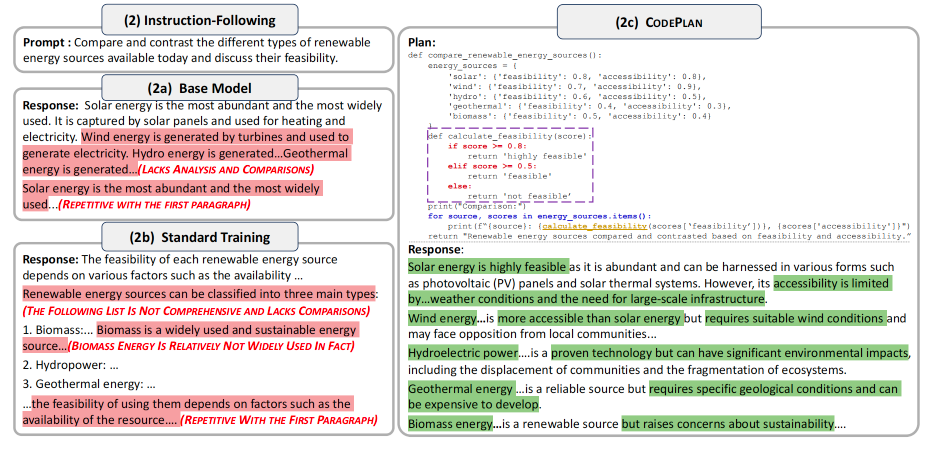

# UNLOCKING REASONING POTENTIAL IN LARGE LANGUAGE MODELS BY SCALING CODE-FORM PLANNING

论文地址：[https://arxiv.org/abs/2409.12452](https://arxiv.org/abs/2409.12452)

**ICRL 2025**

---

## 论文大概

本文提出了一个名为 **CODEPLAN** 的框架，旨在通过引入代码形式的计划（code-form plans）来提升大型语言模型（LLMs）在复杂多步推理任务中的表现。

- 代码形式的计划是一种伪代码，用于概述推理过程中的高级结构和逻辑。
- 该框架通过利用代码的结构化和多功能性，能够有效捕捉复杂推理任务中的语义和控制流。
- 可以从大规模文本语料库中自动提取代码形式的计划，无需依赖特定任务的数据集。

---

## 论文提出的问题

虽然大语言模型（LLMs）在很多常见的自然语言处理任务上表现很好，但在需要多步推理的复杂问题上，它们的“计划能力”还是有很大不足。

目前常用方法：

- 设计提示词（prompting）
- 针对某个任务专门训练（fine-tuning）

这些方法的问题：

- 不够稳定
- 难以适应不同类型的问题
- 在解数学题、多步问答或复杂决策时，常出现：
  - 步骤重复
  - 逻辑混乱
  - 注意力分散
  - 太早给出答案

---

## 论文解决办法

为了解决上述问题，论文提出了一个叫做 **CODEPLAN** 的新方法。

其核心思路是将复杂问题的推理过程分成两个阶段：

1. **规划阶段**：模型先用类似代码（如 Python 伪代码）的方式，写出解决问题的大致思路和步骤。
2. **实现阶段**：模型再根据“代码计划”，生成最终的自然语言答案。

### 主要做法包括：

- **用代码来做计划**：用像 Python 这样的伪代码来表示解决问题的步骤，因为代码本身就很适合表达“如果…就…”、“重复做某事”、“调用工具”等复杂逻辑。
- **自动构建数据集**：无需人工标注，直接从大量文本中自动提取“代码计划”。作者还专门做了一个包含 200 万个例子的超大数据集来训练模型。
- **优化训练目标**：通过优化方法，让模型学会先写出高质量的“代码计划”，再根据计划写出准确的答案。

#### 这种方法的优点：

- 可以灵活地根据中间结果调整推理步骤（如用 `if` 语句）；
- 能处理需要多次重复的任务（如用 `for` 循环）；
- 可以把复杂问题拆成小模块（如用函数），还可以让模型像“调用工具”一样解决子任务，甚至有潜力让模型和外部环境互动；
- 整体上，让模型更容易把复杂问题拆解成小部分，提升了解决复杂推理问题的能力。




---

## 数据构造

### 数据集构建目标

- 数据集需要包含大量的自然语言问题（prompt）及其对应的代码形式计划（code-form plan）和最终回答（response）。
- 数据集应能够从大规模的通用文本语料库中自动提取，无需依赖人工标注或特定任务的数据集。
- 数据集应涵盖多种类型的推理任务，以支持模型在不同场景下的泛化能力。

### 数据集构建的具体步骤

1. **选择基础语料库**
   - 作者选择了 WebInstruct 数据集作为基础语料库。WebInstruct 是从原始网页数据中自动构建的，包含多样化的提示（prompt）和回答（response）对。
   - 这些提示和回答对涵盖了多种自然语言处理任务，包括数学推理、符号推理、指令遵循、多跳问答和决策制定等。

2. **生成代码形式计划（Code-form Plan）**
   - 使用一个预训练的模型（如 Llama-3-8B-Instruct）来生成代码形式的计划。
   - 作者设计了一个特定的提示模板（prompt template），用于指导模型生成代码形式的计划。提示模板要求模型根据给定的提示和回答，生成一个伪代码，概述回答的高级逻辑。
   - 示例提示模板：

```shell
Prompt: {{Prompt}}
Response: {{Response}}
Given a prompt-response pair, your task is to describe the high-level logic of the response using a pseudo Python code. Such that following this code, models can easily generate the response.
The code should balance conciseness and informativeness. The code should be high-level, instead of replicating low-level details in the response. The code should be less than 200 words (adjust its length based on response lengths).
```

   - 生成的代码形式计划是伪代码，而不是可执行代码。这样可以避免对模型生成可执行代码的高要求，同时专注于推理逻辑的表示。

3. **过滤和验证**
   - 为了确保生成的代码形式计划的质量，作者对生成的计划进行了过滤，移除那些没有有效终止的计划（即逻辑不完整的计划）。
   - 作者还尝试了更细粒度的过滤机制，例如通过比较生成回答时的困惑度（perplexity）来评估计划的信息增益，但最终发现这些额外的过滤步骤对模型性能的提升有限，因此在最终的数据集构建过程中没有采用。

4. **构建最终数据集**
   - 最终的数据集包含 2,335,072 个示例，每个示例包含三个部分：
     - 提示（Prompt）
     - 代码形式计划（Code-form Plan）
     - 回答（Response）
   - 数据集的统计信息如下：

        | 指标         | 平均长度 |
        | ------------ | -------- |
        | 提示         | 36.2     |
        | 计划         | 45.7     |
        | 回答         | 134.7    |

### 数据集的用途

- 该数据集用于训练 CODEPLAN 模型，使其能够学习如何生成高质量的代码形式计划，并根据这些计划生成准确的自然语言回答。
- 数据集的多样性和规模使得模型能够在多种推理任务中进行有效的训练，从而提高其泛化能力和推理能力。

通过这种方式，作者成功构建了一个大规模的数据集，用于支持 CODEPLAN 框架的训练和验证。

---

## 实验

实验部分验证了 CODEPLAN 在多个模型（如 Mistral-7B 和 Llama-2-7B/13B）上的有效性。

- 作者选择了 13 个具有挑战性的多步推理基准测试，涵盖：
  - 数学推理
  - 符号推理
  - 指令遵循
  - 多跳问答
  - 决策制定等任务

### 主要结果

- **平均性能提升**：与直接生成回答的方法相比，CODEPLAN 在所有基准测试中平均相对性能提升了 25.1%。
- **复杂任务的优势**：随着任务复杂性的增加，CODEPLAN 的性能提升更为显著。例如，在需要 4 步推理的 MuSiQue 任务中，性能提升达到了 43.8%。
- **数据效率**：CODEPLAN 在训练过程中表现出更高的数据效率，能够在更少的训练数据上达到更好的性能。
- **与自然语言计划的对比**：CODEPLAN 在所有基准测试中均优于基于自然语言计划的方法，特别是在数学推理和符号推理任务中，性能提升更为明显。

---

## 总结

本文提出的 **CODEPLAN** 框架通过引入代码形式的计划，有效提升了 LLMs 在复杂多步推理任务中的表现。

- 该框架不仅能够自动从大规模文本语料库中提取计划，还能在多种任务中实现显著的性能提升。
- 在复杂任务上的优势更为明显，表明其在处理复杂推理问题时具有更强的泛化能力和数据效率。

本质上就是用提示词去构造了伪代码计划输出，然后用这些数据集去训练模型，让模型学会生成伪代码计划，然后根据伪代码计划生成回答。
