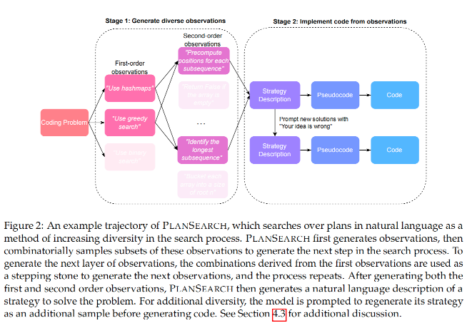

# Planning In Natural Language Improves LLM Search For Code Generation

论文地址：https://arxiv.org/abs/2409.03733
项目地址：https://github.com/scaleapi/plansearch
ICRL 2025

## 论文大概
论文探讨了如何通过自然语言规划来改进大型语言模型（LLM）在代码生成任务中的搜索性能。作者认为，这是因为现有的LLM输出缺乏多样性，导致模型在推理时反复生成高度相似但错误的结果。为了解决这一问题，作者提出了PLANSEARCH算法，通过在自然语言中搜索解决问题的计划，而不是直接搜索代码解决方案，从而显著提高了代码生成的多样性和性能。其实就是通过提示词的方式，先让模型观察这个问题，然后让模型生成一个解决问题的计划，然后根据这个计划去生成代码解决方案。


## 论文提出的问题
LLM推理阶段的搜索效率问题：尽管LLM在训练阶段通过大规模计算取得了显著进展，但在推理阶段的计算扩展并未带来类似的性能提升。作者认为，这是由于LLM输出缺乏多样性，导致在搜索过程中反复生成相似但错误的结果。这种缺乏多样性部分可能是因为通常用于训练作为聊天机器人的LLM的具体后训练目标，在这些目标中，模型经常被优化以产生单一正确的答案。

代码生成任务中的多样性不足：在代码生成任务中，LLM通常被优化为生成单一正确答案，这限制了其在推理阶段的搜索能力。这种多样性不足在多样本生成时尤为明显，导致性能提升有限。


## 论文解决办法

为了更好地解决问题，作者提出了一种新的方法——计划搜索。与传统的搜索方法不同，传统方法通常是逐个搜索标记、代码行甚至整个程序，而计划搜索则是直接寻找解决问题的方案。这些方案由一组高层次的观察和草图组成，能够帮助作者解决特定问题（如图所示）。

计划搜索的过程是这样的：首先，它会生成一系列关于问题的观察结果，然后将这些观察结果组合成一个候选方案来解决问题。通过处理所有可能的观察子集，计划搜索能够最大限度地探索各种想法，最终将这些想法转化为实际的代码解决方案。作者发现，这种方法在利用计算资源进行推理时，比标准的重复采样和直接搜索想法更有效。





作者还尝试了一种“反向翻译”的方法，将代码解决方案翻译回概念层面。具体来说，作者用 GPT-4 生成了 1000 次尝试来解决一个问题，并过滤掉那些没有通过的解决方案。由于作者没有现成的解决方案草图数据集，作者通过反向翻译生成了一个候选的正确想法。作者向语言模型（LLM）提供问题和代码解决方案，并要求它将解决方案转换为自然语言描述。此外，作者还可以通过在提示中指定要求（比如“用[w]个词”）来调整描述的详细程度。具体的提示词如下：


```python
你是一位专业的 Python 程序员。你会收到一个算法问题（问题规范）。你需要用自然语言、以高层次的方式回答这个问题，就像写一篇编辑文章一样，不要返回任何代码。尽可能发挥创意，不要局限于直观的方法。

你是一位专业的 Python 程序员。你会收到一个问题（问题描述）和一个自然语言的解决方案/教程，该教程描述了解决问题的方法。你需要生成一个符合所述规范和教程的正确 Python 程序，并通过所有测试。除了 Markdown 代码块中的程序外，你不会返回任何其他内容。
```


作者还采用了基本提示方法作为基线。在这种方法中，作者在要求大语言模型解决问题之前，先提供一系列问题-答案对作为少量提示。在代码生成中，最常用的搜索变体是重复采样，即模型会不断尝试生成代码，直到生成的输出通过测试或达到最大样本数。具体的提示词如下：


```python
你是一位专业的 Python 程序员。你会收到一个问题（问题规范），并生成一个符合规范且通过所有测试的正确 Python 程序。除了 Markdown 代码块中的程序外，你不会返回任何其他内容。
```


在创意搜索中，语言模型会先收到一个问题，然后输出该问题的自然语言解决方案。接着，另一个独立的语言模型实例会收到问题和解决方案，并被要求按照解决方案来解决问题。这种方法的目的是区分“想法/草图”在解决问题中的有效性。研究表明，明确要求搜索算法提出解决问题的想法可以增加解决方案的多样性。具体的提示词如下：


```python
你将获得一个具有挑战性的编程问题，请用自然语言输出如何解决该问题的高层次描述。

示例输入：问题描述在此

示例输出：示例输出在此

这是一个具有挑战性的编程问题：请构思一个高层次的、自然语言的解决方案来应对上述问题。

请注意，你的直觉可能会误导你，因此要提出简单而富有创意的想法，这些想法不仅超出你通常会想到的范围，还要超越你的狭隘直觉。提出看似不直观正确的解决方案至关重要。
```


作者还通过假设某个想法是错误的，并让大语言模型给出批评或反馈，从而增加提议想法的数量。这些自然语言解决方案随后被翻译成伪代码，再进一步转化为实际的 Python 代码。为了避免翻译错误（这可能导致模型回归到原始模式，忽略经过深思熟虑的观察结果），作者采取了更细致的方法。具体的提示词如下：


```python
Prompt for Observation Part 1
你是一位专业的 Python 程序员。你会收到一个具有挑战性的编程问题（问题描述）。你需要返回几个有用、不显而易见且正确的观察结果，就像解决问题的提示一样。你不会返回任何代码。尽可能发挥创意，不要局限于直观的方法。

Prompt for Observation Part 2
你是一位专业的 Python 程序员。你会收到一个具有挑战性的编程问题（问题描述）以及几个关于该问题的正确观察。你需要从给定的观察中，提出几个新的、有用的且正确的观察。你不会返回任何代码。尽可能发挥创意，不要局限于直观的地方。

Combining Observations
以下是函数中带有占位符的示例提示：
这里有一个竞争性编程问题：
问题陈述占位符
以下是帮助解决问题的智能观察：
观察1占位符
观察2占位符
观察3占位符
利用上述观察结果，为上述问题集思广益一个自然语言解决方案。
请注意，你的直觉可能会误导你，因此要提出简单、有创意的想法，超越你通常会想到的范畴，突破你的狭隘直觉。在解决方案的每一步之前，准确引用观察结果的相关部分。引用至关重要。
```

## 实验
 实验设置：作者在三个基准测试（HumanEval+、MBPP+和LiveCodeBench）上进行了实验，这些基准测试涵盖了不同的编程问题类型和难度级别。实验中使用了多种LLM，包括GPT-4o-mini、GPT-4o、DeepSeek-Coder-V2和Claude-Sonnet-3.5。

 实验结果：
 PLANSEARCH在所有模型和基准测试中均优于重复采样和IDEASEARCH。例如，在LiveCodeBench上，PLANSEARCH的pass@200达到了77.0%，而重复采样的pass@200仅为60.6%。

 在HumanEval+和MBPP+上，PLANSEARCH也表现出显著的性能提升，分别达到了98.2%和93.7%的pass@200。

 作者还通过公共测试过滤（Public Test Filtering）进一步优化了性能，该方法通过仅保留通过公共测试的代码样本来减少需要评估的样本数量。例如，在LiveCodeBench上，PLANSEARCH在仅提交20个样本时就达到了77.1%的准确率，而无需过滤时需要200个样本。

 多样性分析：作者通过LLM作为判断器来衡量生成代码的多样性，并发现PLANSEARCH的多样性得分与性能提升之间存在强正相关关系。这表明，通过在自然语言中搜索计划，PLANSEARCH能够更有效地探索解空间，从而提高代码生成的性能。


## 总结

论文通过实验证明了在自然语言中搜索计划可以显著提高代码生成的性能。通过在自然语言中搜索计划，PLANSEARCH能够更有效地探索解空间，从而提高代码生成的性能。但是不太建议用到实际项目中，毕竟用户需要等待的时间太长了。