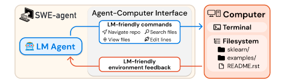
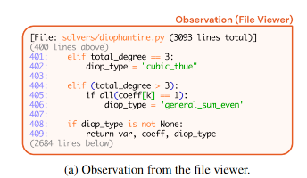
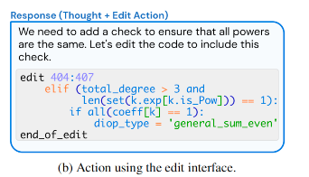
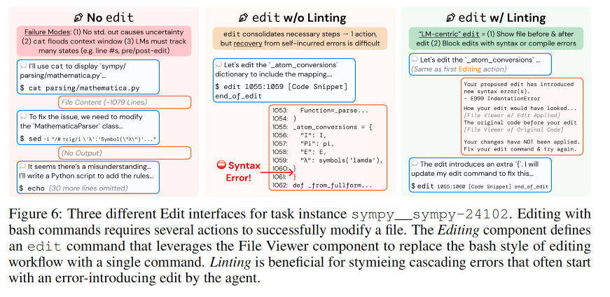

# SWE-agent: Agent-Computer Interfaces Enable Automated Software Engineering

论文地址：[https://arxiv.org/abs/2405.15793](https://arxiv.org/abs/2405.15793)

项目地址：[https://swe-agent.com/latest/](https://swe-agent.com/latest/)

---

## 论文大概

本文介绍了 SWE-agent，这是一个通过专门设计的代理-计算机接口（Agent-Computer Interface, ACI）来自动化解决软件工程任务的系统。SWE-agent 通过与计算机的交互，利用语言模型（LM）的能力来完成复杂的软件工程任务，例如代码生成、调试和测试。研究的核心在于探索如何通过设计优化的接口来提升语言模型在软件工程任务中的表现。

  

## 论文提出的问题

传统的语言模型（LM）在处理复杂软件工程任务时面临挑战，例如：

- 在与计算机交互时效率低下
- 难以有效执行代码编辑和调试任务
- 现有的工具（如 Linux Shell）对于语言模型来说过于复杂，缺乏对语言模型友好的交互方式

因此，论文提出的问题是：**如何设计一个专门的接口，使得语言模型能够更高效地完成软件工程任务？**

## 论文解决办法

为了解决上述问题，论文提出了 SWE-agent 系统，它包含以下几个关键组件：

1. **Agent-Computer Interface (ACI)：** SWE-agent 的核心是 ACI，它为语言模型提供了一组简化的命令和反馈机制，使得语言模型能够更高效地与计算机交互。ACI 包括文件查看器、编辑器、搜索工具等功能，帮助语言模型进行代码导航、编辑和测试。
2. **定制化命令和反馈机制：** SWE-agent 提供了一系列简单、高效的命令，例如 `open`、`edit`、`search_file` 等，这些命令的输出格式简洁明了，避免了不必要的信息干扰。同时，ACI 还通过语法检查等"护栏"机制来防止语言模型引入错误。
3. **上下文管理：** SWE-agent 通过上下文管理器来优化语言模型的输入，确保语言模型在每一步都能接收到最相关的信息，避免信息过载或过时。
4. **实验验证：** 通过在 SWE-bench 和 HumanEvalFix 数据集上的实验，SWE-agent 展示了其在解决软件工程任务上的显著性能提升。例如，在 SWE-bench 的 2,294 个任务实例中，SWE-agent 的通过率达到了 12.5%，远高于非交互式语言模型的 3.8%。

### 设计AGI工具

1. 查找和导航：命令find_file、search_file和search_dir，它们在搜索文件名和文件或目录中的字符串时输出搜索结果的摘要。find_file命令用于在仓库中搜索文件名，而search_file和search_dir则用于在子目录中的文件(s)中查找字符串。每次查询最多返回50个结果。
2. 文件浏览器：找到要查看的文件后，代理使用交互式文件查看器，通过在相关文件路径上调用命令open来查看。文件查看器每次最多显示文件的100行。代理可以使用scroll_down和scroll_up命令移动该窗口，也可以使用goto命令访问特定行。

  

3. 代码编辑：允许代理替换打开文件中的特定范围的行。此命令需要3个必需参数：起始行、结束行和替换文本。在单个步骤中，代理可以将起始行和结束行之间的所有行替换为替换文本.应用编辑后，文件查看器自动显示更新的内容，帮助代理立即观察其编辑的效果，而无需调用其他命令。同时也在编辑功能中集成了代码检查器，以提醒代理可能在编辑文件时引入的错误。选择检查器中的错误后，会向代理显示该错误以及错误发生前后的文件片段。无效的编辑会被丢弃，并要求代理重新尝试编辑文件。

  

4. 上下文管理：代理会收到关于正确使用bash和ACI命令的指令、文档和演示。在每一步中，系统都会指示他们生成一个想法和一个行动。如果没有生成输出，则会包含一条特定的消息（“您的命令成功运行且未产生任何输出”）以增强清晰度。为了进一步提高上下文的相关性，最后5条之前的观察结果每条都被合并成一行，通过移除大部分先前观察的内容，我们保留了关于计划和行动历史的重要信息，同时减少了不必要的上下文，这使得更多的交互周期成为可能，并避免显示过时的文件信息。

### 文件修改优化
重定向涉及复制和重写整个文件，即使只是进行微小的更改，这既低效又容易出错。虽然sed可以方便特定的编辑，但执行多行编辑非常麻烦，并且可能导致难以检测的意外后果。所以要加上语法检测等"护栏"机制来防止语言模型引入错误。同时要让模型看到修改前后文件的对比，这样模型可以更好地理解修改的效果。

  

## 实验

论文通过以下实验验证了 SWE-agent 的有效性：

- **SWE-bench 数据集：** SWE-agent 在 SWE-bench 数据集上进行了广泛的测试，该数据集包含来自 12 个不同 Python 包的 2,294 个任务实例。SWE-agent 在完整测试集上的通过率达到 12.5%，在 Lite 子集上的通过率达到 18.00%，显著优于之前的非交互式语言模型方法。
- **HumanEvalFix 数据集：** SWE-agent 在 HumanEvalFix 数据集上也表现出色，其通过率达到了 87.7%，表明其在代码编辑和调试任务上具有很强的能力。
- **消融实验：** 通过对比不同 ACI 设计（如搜索工具、编辑工具、上下文管理等）对性能的影响，论文进一步验证了 SWE-agent 的各个组件对提升性能的贡献。

## 总结

SWE-agent 通过设计专门的代理-计算机接口（ACI），显著提升了语言模型在软件工程任务中的表现。

其核心贡献在于：

- 提出了 ACI 的概念，并展示了如何通过优化接口设计来提升语言模型的性能。
- 通过实验验证了 SWE-agent 在多个基准数据集上的优越性能，特别是在代码生成、编辑和调试任务上。
- 提供了一个可扩展的框架，未来可以进一步扩展工具集，例如加入静态分析、Web 浏览等功能，以进一步提升性能。

论文的附录有很多具体的细节，包括提示词，设计细节，实验结果，以及一些其他内容。很值得细细品味。
