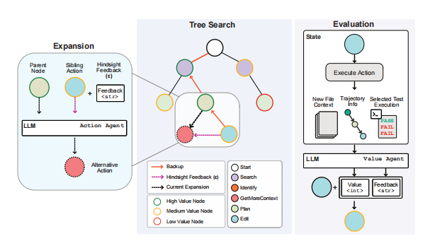
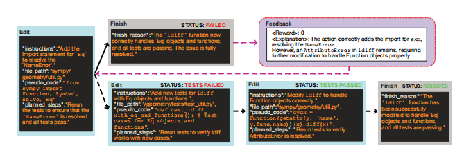

# SWE-SEARCH: 通过蒙特卡洛树搜索和迭代优化来增强软件智能体

论文地址：[https://arxiv.org/abs/2507.06900](https://arxiv.org/abs/2507.06900)

项目地址：[https://github.com/XingYu-Zhong/moatless-tree-search](https://github.com/XingYu-Zhong/moatless-tree-search)

## 论文大概
想象一下，一个程序员在修复一个复杂bug时，如果一条路走不通，他会回过头试试别的方法，甚至会找同事讨论。然而，很多AI代码助手就像一个只会按食谱做菜的新手，一步错，满盘输，不知道回头。

这篇论文介绍了一个名为 **SWE-Search** 的“AI程序员团队”框架。它不再让一个AI单打独独斗，而是引入了一套更聪明的协作机制，核心是**蒙特卡洛树搜索（MCTS）**和**自我改进**。

这个AI团队里有三个关键角色：
- **执行者 (Action Agent)**：负责探索和编写代码，是主要的“干活的”。
- **评论家 (Value Agent)**：负责评估“执行者”的工作，不仅打分，还会给出具体的文字反馈，比如“这个方向不错，但可能忽略了某个边界情况”。
- **辩论团 (Discriminator Agent)**：当有多个解决方案时，这个团队会组织一场辩论，最终选出最优的方案。

通过这种方式，SWE-Search 让AI能够像人类一样，在遇到困难时回溯、探索不同的可能性，并从错误中学习。实验证明，这种方法效果显著，在五个不同的AI模型上，解决问题的成功率平均提升了 **23%**。这说明，让AI“多思考一会儿”（增加搜索深度），比单纯给它换一个更大的“大脑”（更大的模型）更有效。

## 论文提出的问题
软件开发是一个充满不确定性的探索过程，需要不断尝试、回溯和调整。目前的AI代码智能体在这方面有几个核心的痛点：

- **只会“一条道走到黑”**：很多AI遵循线性的工作流程，就像导航只会规划一条路线。如果这条路堵死了，它就束手无策，无法掉头或寻找其他出路。
- **缺乏变通能力**：面对复杂的、需要长时间思考的任务，这些AI往往显得很死板。它们可能会反复尝试同一种无效的方法，陷入死循环。
- **容易“钻牛角尖”**：因为无法评估自己当前方案的优劣，AI可能会在一个明显错误的方向上浪费大量时间，效率低下。

简单来说，现有的AI缺少了人类工程师那种非线性的、迭代试错的宝贵能力。

## 论文解决办法
为了解决以上问题，SWE-Search框架模仿了人类工程师的思考与协作模式，主要由四个部分组成：

1.  **灵活的工作台 (SWE-Search框架)**
    这套框架给了AI一个像Git一样的版本控制系统。AI的每一次尝试都会被记录下来，形成一个“提交树”。如果发现当前的路走不通，**执行者 (Action Agent)** 可以随时回退到之前的任何一个“好版本”，然后从那里开辟一条新的解决路径。这彻底改变了传统AI“搜索→规划→编辑”的僵化流程，让解决问题的方式变得更加灵活和动态。

2.  **带反馈的评论家 (Value Agent)**
    这个AI评论家非常关键。每当执行者完成一个步骤，它都会进行评估，并给出两样东西：
    *   **一个数值评分 (value)**：直观地告诉执行者当前状态的好坏，例如“75分”。
    *   **一段文字反馈 (explanation)**：解释为什么给这个分数，比如：“你成功修改了文件A，但似乎导致了测试B的失败，建议检查一下相关依赖。”
    这种“事后诸葛亮”式的反馈，能有效帮助执行者在下一步行动中修正错误，避免重蹈覆辙。

3.  **聪明的决策大脑 (搜索算法)**
    SWE-Search的核心是一个为软件工程定制的**蒙特卡洛树搜索 (MCTS)** 算法。你可以把它想象成一个棋艺高超的AI棋手。它在决定下一步该怎么走时，会精妙地平衡两个策略：
    *   **探索 (Exploration)**：尝试一些全新的、看起来有风险但可能有奇效的冷门招数。
    *   **利用 (Exploitation)**：在当前看起来最有希望的路径上继续深挖，扩大优势。
    这种算法能高效地探索各种可能性，而不是盲目地让AI去试错，大大提高了找到解决方案的效率。

4.  **最终方案辩论会 (Discriminator Agent)**
    当搜索过程结束，可能会有好几个看起来都不错的候选方案。怎么选出最好的一个？SWE-Search会组织一场“多智能体辩论会”。让不同的AI分别为每个方案辩护，摆出优劣，最后由一个“裁判”AI综合评判，做出最可靠的最终选择。这比单个AI自己决定要严谨得多。

### 整体工作流程：从问题到解决

论文的整个解决方案可以清晰地分解为两个主要阶段：**MCTS探索与评估循环** 和 **最终决策**。下面我们详细拆解这个流程，看看每个智能体（Agent）如何协同工作。

**阶段一：MCTS探索与评估循环**

这是解决问题的核心引擎，通过不断的迭代来探索最佳解决方案。每一次迭代都包含“扩展-评估-反馈”的关键步骤，如同一个完整的“思考-行动-反思”周期。

1.  **扩展 (Expansion) - Action Agent执行动作**:
    MCTS算法从代表初始问题状态的根节点开始，根据其UCT选择函数（一个平衡探索与利用的公式）来决定最有潜力的探索方向。**Action Agent** (也叫SWE-Agent) 会在这个被选中的节点上执行一个动作，例如修改代码、搜索文件或制定计划。这个动作会产生一个新的代码状态，从而在搜索树中创建一个新的子节点。

2.  **评估 (Evaluation) - Value Agent打分并提供反馈**:
    新产生的状态（子节点）会立刻被 **Value Agent** 进行评估。它会分析所有相关信息，包括到目前为止的操作轨迹、文件上下文和测试执行结果，然后输出两样东西：
    *   一个量化的数值（Value）：-100到100之间，表示当前状态的好坏。
    *   一段定性的自然语言解释（Feedback）：说明为什么给出这个分数，指出现有方法的优点和潜在问题。例如，它可能会指出“代码修改正确，但缺少对边界情况的测试”。

3.  **反馈与回溯 (Backup & Hindsight) - 从错误中学习**:
    Value Agent给出的分数和反馈会被“备份”（Backup）回溯，更新路径上所有父节点的统计数据。这是整个流程的关键创新点，被称为**“事后反馈” (Hindsight Feedback)**。
    当Action Agent下一次回到同一个父节点，准备扩展出另一个新的分支时，它会接收到之前子节点评估后产生的反馈。这个反馈会指导Action Agent采取不同于上一次的、可能更好的行动，从而避免陷入重复的错误。

    

**这个循环是如何实现“回溯”的？**

“回溯”并不是简单地跳回上一个节点，**更不是推倒重来**。实际上，每一次MCTS迭代都**重新从树的根节点开始**，在**持久且不断增长的搜索树**上进行新一轮的决策。由于之前那条“坏”路径上的节点因为获得了低分，其价值（V）降低，导致它们的UCT分数也相应变低。因此，当算法再次从根节点开始决策时，会**自然地避开这些低分路径**，转而探索其他更有希望的分支。这便是回溯的本质：**通过历史经验动态调整未来的探索方向**。整个解决方案的“计划”，是MCTS在多次迭代后最终选出的最优路径，它是一步步动态构建和修正的，而非一次性生成。

**阶段二：最终决策**

**整个流程在什么情况下结束？**

1.  **达到计算资源上限（强制结束）**: 这是最主要的结束条件。为了控制成本和时间，系统为搜索过程设定了硬性限制，例如总迭代次数上限（默认为100次）、最大搜索深度等。
2.  **智能体认为任务已完成（自然结束路径）**: Action Agent可以主动执行一个`Finish`动作。然而，这不一定意味着流程结束。这个“完成”的结论仍然会受到Value Agent的严格评估，如果评估不通过，负面反馈依然会促使系统继续探索其他可能性。

**如何选出最终的解决方案？**

1.  **筛选候选方案**: MCTS循环结束后，系统会从所有完成的轨迹中选出最多五个最终的候选解决方案。
2.  **辩论与最终选择 - Discriminator Agent做出裁决**: 这五个候选方案会被提交给 **Discriminator Agent**。它会启动一个多智能体辩论过程，让不同的智能体为每个候选方案的优劣进行辩护和攻击。最后，一个“裁判”智能体会综合所有论点，做出最终决定，选出最有可能解决问题的那个方案。

**补充：决策串行，测试并行**

值得注意的是，MCTS的决策和探索逻辑是**串行**的，即算法在同一时间只扩展树中的一个节点。但是，为了提高效率，耗时的验证工作（如运行测试）是**并行化**的。系统通过Docker和Kubernetes集群，可以同时对多个不同的代码修改方案进行测试，极大地缩短了等待时间。

#### 工作流程实例：一步步修复Bug

为了更具体地理解这个流程，我们来看一个简化的例子。问题背景：一个函数存在bug，初步排查发现有`NameError`，但深层原因其实还有一个`AttributeError`。

    

*   **第1次迭代：一个不完整的“修复”**
    1.  **扩展**：`Action Agent`分析问题，发现`NameError`，于是执行`Edit`动作添加了缺失的导入语句。然后它运行测试，发现通过了，便错误地执行`Finish`动作，认为问题已解决。
    2.  **评估**：`Value Agent`评估后认为，虽然`NameError`解决了，但没有新的测试用例来覆盖更复杂的情况，这很可能隐藏了更深的问题。因此，它给出**很低的分数**和负面反馈：“...一个`AttributeError`仍然存在，需要进一步修改...”
    3.  **备份**：这个低分和负面反馈被传回给父节点。

*   **第2次迭代：利用“事后反馈”进行修正**
    1.  **选择**：算法从根节点开始，当再次来到上一步的节点时，它发现其子节点（Finish动作）分数极低，于是决定扩展一个新分支。
    2.  **扩展**：`Action Agent`在当前节点收到了来自上一次的**“事后反馈”**。它现在知道了可能存在`AttributeError`，于是采取了新行动：执行`Edit`动作，**添加一个新的测试用例**来专门暴露这个隐藏的bug。
    3.  **评估**：运行所有测试，新测试如期失败了。`Value Agent`对此非常“满意”，因为它成功地暴露了核心问题，这是一个巨大进步。于是它给出**较高的分数**和正面反馈：“很好，你成功地暴露了`AttributeError`，现在去修复它。”
    4.  **备份**：这个高分被传回，表明“添加测试”这条路比“直接结束”要好得多。

*   **第3次及后续迭代：找到并应用正确修复**
    1.  **选择**：由于“添加测试”这条路径分数很高，算法在后续迭代中会毫不犹豫地选择它。
    2.  **扩展**：在暴露了失败测试的状态下，`Action Agent`知道了要修复的确切问题，于是执行`Edit`动作，修改代码，彻底解决了`AttributeError`。
    3.  **评估**：在新状态下，所有测试都通过了。`Value Agent`评估后给出最高分。

*   **最终决策**
    当迭代次数达到上限后，循环结束。包含最终正确修复方案的路径，由于其分数最高，会被提交给`Discriminator Agent`。通过多智能体辩论，这个不仅修复了表面问题，还增加了测试覆盖、解决了深层问题的方案，会被一致认为是最佳方案并最终被采纳。

这个例子清晰地展示了系统如何从一个错误的、浅显的解决方案开始，通过评估反馈和回溯探索，一步步深入，最终找到根本原因并完美解决问题的过程。

## 实验

### 基准和指标
- **考题**: 实验用了一个名为 **SWE-bench Lite** 的数据集，里面包含了300个真实的软件bug修复任务。
- **评分标准**: 主要看两个指标，**Pass@1** (一次尝试就成功的概率) 和 **Pass@5** (五次尝试内能成功的概率)。

### 基线和模型
- **对比选手**: 为了公平，实验将SWE-Search与一个强大的开源AI智能体 **Moatless** 进行了对比。
- **测试模型**: 实验覆盖了五个主流模型，包括闭源的GPT-4o、GPT-4o-mini，以及开源的Qwen2.5-72B、Llama-3.1-70B和DeepSeek-V2.5。

### 主要结果
- **性能大幅提升**: SWE-Search在所有模型上都取得了胜利，平均成功率相对提升了 **23%**。一个亮点是：**使用开源模型Qwen-2.5的SWE-Search，其表现甚至超过了使用更强模型GPT-4o的普通Moatless框架**。这证明了“好方法比大模型更重要”。
- **反馈至关重要**: 实验发现，“评论家”的反馈作用巨大。它能有效纠正“执行者”的错误判断（比如在问题没解决时就以为完成了），并激发它去尝试更多样化的解决方案。
- **算力换性能**: 数据显示，给AI的“思考时间”（搜索迭代次数）越多，它能解决的问题就越多。这意味着，我们可以在不升级模型的情况下，通过增加计算资源来提升性能。
- **决策的准确性**: 在多数情况下，“评论家”能准确地引导AI找到正确方向（73%的准确率），而最后的“辩论会”则能将最终选择的正确率提升到 **84%**。

## 总结
这篇论文证明了，通过引入蒙特卡洛树搜索和反馈机制，SWE-Search框架可以显著提升AI智能体解决复杂软件工程任务的能力。它让AI不再是死板的工具，而更像一个懂得探索、反思和协作的“程序员”。

该方法最大的优势在于，它提供了一种“用时间换效果”的策略，即通过增加计算时间来解决更复杂的问题，这在未来处理如发现软件漏洞等高难度任务时将非常有用。

作者相信，像MCTS这样模仿人类解决问题思路的搜索技术，将成为未来AI智能体系统的标配。随着软件任务变得越来越复杂，AI的系统架构也需要变得更加灵活和智能，才能充分释放其潜力。
