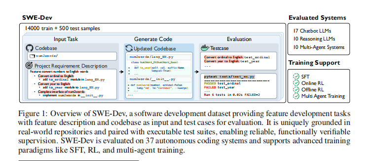
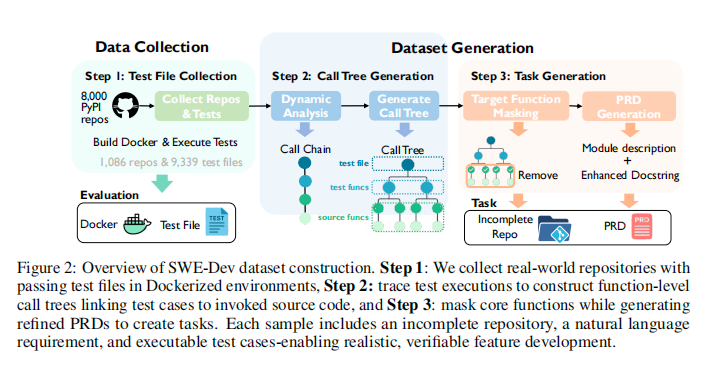
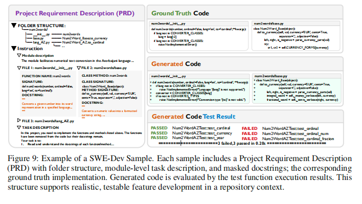

# SWE-Dev: Evaluating and Training Autonomous Feature-Driven Software Development

论文地址：[https://arxiv.org/abs/2505.16975](https://arxiv.org/abs/2505.16975)

项目地址：[https://github.com/justLittleWhite/SWE-Dev](https://github.com/justLittleWhite/SWE-Dev)


## 论文大概
SWE-Dev是首个针对特征驱动开发（Feature-Driven Development, FDD）任务设计的评估与训练数据集，旨在模拟真实软件工程场景下的仓库级代码开发需求。其包含14,000个训练样本和500个测试样本，每个样本均配备可执行测试环境、开发者编写的单元测试及项目需求文档（PRD），支持监督学习（SFT）、强化学习（RL）和多智能体系统（MAS）等训练范式。该数据集通过动态函数调用树（Call Tree）量化任务复杂度，并验证模型在复杂代码库中的长上下文推理和协作能力。

<p align="center">
    
</p>

## 论文提出的问题

### 背景：AI写代码遇到的真实挑战

想象一下，你是一个程序员，老板给你一个需求："给我们的系统加个新功能"。你需要：
- 理解现有的代码库（可能有几万行代码）
- 设计新功能如何与现有系统配合
- 编写代码并确保不破坏原有功能
- 通过所有测试

这就是**特征驱动开发（FDD）**，占据了程序员40%的工作时间。然而，现在的AI模型在这方面表现如何呢？

### 核心问题：AI还不够"聪明"

1. **真实场景表现差**：最先进的AI模型（如GPT-4o）在处理复杂开发任务时，成功率只有22.45%。就像让一个只会做选择题的学生去完成一个完整的工程项目。

2. **现有评测不够真实**：传统的代码评测（如HumanEval）就像考试只考填空题，而真实编程更像是写一篇完整的论文——需要理解上下文、处理多个文件、考虑系统集成。

3. **效率与成本的矛盾**：一些复杂的AI系统（如ChatDev）虽然能提高成功率，但就像用大炮打蚊子——成本太高，不实用。

### 与SWE-Bench的对比：从"修bug"到"造功能"

为了更好理解SWE-Dev的创新，我们来对比一下它与现有基准SWE-Bench的区别：

#### 1. **任务难度：从修补到创造**
- **SWE-Bench**：像是给你一辆坏了的自行车，告诉你"刹车有问题"，你只需要修好它（平均改32行代码）
- **SWE-Dev**：像是给你一个自行车工厂，要求你"设计并安装一个新的变速系统"（平均改190行代码，难度提升6倍）

#### 2. **评测方式：从看代码到跑测试**
- **SWE-Bench**：像老师批改作业，看你写的代码"长得像不像"标准答案
- **SWE-Dev**：像实际测试产品，你的代码必须真正能运行，通过所有功能测试

#### 3. **训练能力：从看例子到真练习**
- **SWE-Bench**：只能提供500个训练样本，像是只有几道例题的习题集
- **SWE-Dev**：提供14,500个可运行的训练样本，像是一个完整的实训基地

#### 4. **代码复杂度：从单文件到多模块**
- **SWE-Bench**：只需要修改一个文件，像是在一张纸上做题
- **SWE-Dev**：平均涉及3个文件、6个函数的协作，像是协调多个部门完成一个项目

#### 5. **需求质量：从模糊到清晰**
- **SWE-Bench**：需求描述往往模糊，像是"这里有bug，你看着办"
- **SWE-Dev**：提供专业的产品需求文档（PRD），清晰度提升2.3分（满分5分），通过率达87%

### 一个直观的对比
在相同的AI模型上测试：
- 处理SWE-Bench的任务：成功率32.8%（相当于10道题对3道）
- 处理SWE-Dev的任务：成功率21.91%（相当于10道题对2道）

这个差距恰恰说明了SWE-Dev更接近真实的开发挑战。

## 论文解决办法
为了解决这些问题，论文提出了 SWE-Dev 数据集，其主要特点包括：1. 真实规模和复杂性：SWE-Dev 要求模型对跨多个文件的代码进行大量修改（平均每个任务涉及 190 行代码，分布在 3 个文件中），模拟现实世界中开发新功能的复杂性。2. 可靠的评估机制：每个样本都基于真实的开源代码库，通过可执行的单元测试来验证模型生成的代码是否满足功能需求。3. 可验证的训练集：所有训练样本都提供可运行的环境和单元测试，支持监督式微调（SFT）、强化学习（RL）和多智能体系统（MAS）训练。此外，论文还通过广泛的实验验证了 SWE-Dev 的有效性，包括对 17 个聊天机器人 LLM、10 个推理模型和 10 个多智能体系统的评估，以及对 SFT、RL 和多智能体训练方法的探索。


<p align="center">
    
</p>

### 数据构造

#### 核心思路：让测试用例"反向工程"

想象你是一个侦探，看到了犯罪现场（测试用例），需要推理出犯罪过程（实现代码）。SWE-Dev的数据构造就是基于这个巧妙的想法：

**基本原理**：在真实的软件项目中，开发者会为每个功能编写测试用例。比如在NumPy库中，`test_random.py`专门测试随机数生成功能。这些测试用例就像"答案验证器"——它们知道正确的功能应该是什么样的。

#### 三步构建流程

**第一步：收集高质量的代码库**

就像挑选食材一样，我们需要：
1. 从PyPI（Python包管理平台）选择8,000个热门项目
2. 严格筛选：
   - ✅ 必须有完整的测试套件（pytest或unittest）
   - ✅ 测试必须能在Docker环境中全部通过
   - ❌ 排除安装复杂、测试不完整的项目

最终筛选结果：1,086个高质量代码库，包含9,339个可执行测试文件。

**第二步：生成调用关系图**

这一步像是给代码做"X光扫描"：
1. **动态追踪**：运行测试时，记录每个被调用的函数
   - 就像GPS追踪快递路线，我们追踪代码执行路径
   - 使用Python的trace模块，捕获所有函数调用

2. **构建调用树**：
   - 把线性的调用链组装成树状结构
   - 树根是测试函数，枝叶是被测试的源代码函数
   - 树的深度和宽度反映了功能的复杂程度

举个例子：
```
test_random_array()  [测试函数]
    ├── random.generate()  [主功能]
    │   ├── validate_params()  [参数验证]
    │   └── core_algorithm()   [核心算法]
    └── array.reshape()    [辅助功能]
```

**第三步：生成开发任务**

这一步将"侦探游戏"准备就绪：

1. **代码遮蔽**：
   - 根据调用树的结构特征（深度、节点数）选择核心函数
   - 删除这些函数的实现，留下"空白"让AI填充
   - 就像拼图游戏中故意拿走几块关键拼图

2. **生成需求文档（PRD）**：
   - 使用GPT-4o分析测试文件，理解功能需求
   - 结合原始函数的文档字符串，生成详细的开发要求
   - 最终形成一份"产品需求文档"作为任务描述

<p align="center">
    
</p>

#### 具体提示词

```
目标：你需要协助我完成一个Python包的功能开发任务。 

 我将提供一份产品需求文档（PRD），详细说明功能需求，并列出需要实现的不同文件路径中的空函数。我还将提供PRD中提到的所有文件的完整"代码上下文"。

你的任务是仅实现PRD中描述的空函数，同时保持所提供文件中所有其他代码完全不变。这一点至关重要——你必须保留所有未被PRD明确要求实现的导入语句、类定义、函数、注释及其他代码。 

 在实现函数时： 
1. 仔细识别PRD中需要实现的函数，并根据PRD中的文档字符串和规范进行实现 
2. 除非绝对必要，否则不要添加新的"import"语句 
3. 不要修改任何现有代码结构，仅实现空函数  对于PRD中提到的每个文件，你必须输出完整的文件代码，并将你的实现插入其中。输出格式必须严格遵循以下模式： 
 每个文件的输出格式： 
 @ [相对路径/文件名] 
''''python 
[完整的文件代码，包括所有原始代码及你的实现] 
'''' 
@ [相对路径/文件名] 
''''python 
[完整的文件代码，包括所有原始代码及你的实现] 
'''' 

 重要提示：确保你的输出包含原始代码中的所有函数、类、导入语句和注释。唯一的区别是PRD中指定的空函数现在已被实现。 
 产品需求文档（PRD）： 
 {PRD} 
 代码上下文： 
 {code_snippet}
```

#### 数据特征

SWE-Dev数据集有三个独特的技术特征，让它成为训练和评估AI编程能力的理想选择：

##### 1. 可控的复杂度：调用树就像"难度调节器"

想象你在玩游戏，可以自由调节难度等级。SWE-Dev通过**调用树分析**实现了类似的功能：

- **浅层任务**（新手模式）：只涉及1-2层函数调用
  ```
  主函数() → 辅助函数() → 完成
  ```
  
- **深层任务**（专家模式）：涉及5层以上的函数调用
  ```
  主函数() → 模块A() → 模块B() → 工具函数() → 底层API() → 完成
  ```

通过调整调用树的深度和宽度，研究者可以：
- 精确控制任务难度
- 系统评估模型在不同复杂度下的表现
- 逐步训练模型处理更复杂的任务

##### 2. 可靠的测试评估：让代码"说真话"

传统评估方法就像老师看作文，主观性较强。而SWE-Dev的评估方式更像：

**体育比赛计时**：
- ✅ 通过测试 = 成功完成比赛
- ❌ 测试失败 = 未达到标准
- 🔄 可重复验证 = 每次都是相同标准

这种方式的优势：
- **客观性**：代码要么能运行通过测试，要么不能，没有模糊地带
- **真实性**：使用开发者原创的单元测试，反映真实世界的质量标准
- **可重现**：在Docker环境中运行，确保结果一致

##### 3. 可执行的训练环境：从"看书"到"实践"

传统的代码训练就像看编程书，而SWE-Dev提供了完整的"编程实验室"：

**每个训练样本都包含**：
- 🏗️ **完整环境**：预配置的Docker容器，所有依赖都已安装
- 🧪 **测试用例**：可以立即运行，验证代码是否正确
- 📊 **即时反馈**：代码运行结果实时返回

这使得多种高级训练方法成为可能：
- **监督学习（SFT）**：像老师手把手教学
- **强化学习（RL）**：通过试错不断改进
- **执行反馈**：每次尝试都能获得真实的运行结果

#### 为什么这些特征很重要？

1. **科学性**：可以像做实验一样，精确控制变量，研究AI的编程能力
2. **实用性**：训练出的模型更接近真实开发需求
3. **创新性**：支持最新的AI训练方法，推动技术进步

这就像是给AI准备了一个设备齐全的"编程健身房"，有不同重量的器械（难度控制），有精确的测量仪器（测试评估），还有专业的训练指导（执行环境）。

## 实验

### 实验设计：全方位测试AI的编程能力

论文设计了一个"编程奥运会"，从三个维度全面评估AI的编程能力：

#### 1. 单打独斗：单个AI模型的表现

**参赛选手**：17个聊天机器人模型 + 10个推理模型

**比赛规则**：
- Pass@1：一次机会，看能否完成任务（像考试只有一次机会）
- Pass@3：三次机会，取最好成绩（像投篮可以投三次）

**关键发现**：
- 🏆 **冠军表现**：GPT-4o和Claude-3.7-Sonnet在简单任务上Pass@3达到68.70%
- 😰 **困难挑战**：即使是最强模型，在困难任务上成功率仅22.45%
- 🎯 **黑马逆袭**：Qwen2.5-7B（一个较小的模型）经过专门训练后，几乎追平GPT-4o

这就像让不同水平的程序员做同一套编程题，结果发现：即使是"高手"，面对复杂任务也会感到吃力。

#### 2. 团队协作：多智能体系统的表现

**核心理念**：多个AI协作，就像一个开发团队

**有趣发现**：
- 📈 **团队优势**：多智能体系统普遍比单打独斗表现更好
- 💡 **简单有效**：简单的协作方式（如Self-Refine）反而比复杂系统更实用
- 💰 **性价比高**：简单方法不仅效果好，成本还更低

**明星团队 - EvoMAC**：
- 通过不断测试和改进（像运动员看录像回放）
- 联合训练后，简单任务Pass@1达到31.65%
- 证明了"1+1>2"的团队效应

#### 3. 训练方法大比拼：如何让AI变得更强

##### 监督学习（SFT）：老师手把手教学
- **效果**：7B小模型在困难任务上进步43%
- **特点**：稳定可靠，像传统教育方式

##### 强化学习（RL）：通过试错自我提升
- **优势**：Pass@1（一次成功率）表现更好
- **劣势**：Pass@3提升有限，可能过于"保守"
- **原因**：就像学生为了确保及格，选择了更安全但缺乏创新的解法

##### 角色专业化训练：术业有专攻
- **方法**：只训练团队中的"程序员"角色
- **效果**：困难任务Pass@1提升55.48%
- **启示**：专业分工确实能提高效率

### 实验结果的启示

1. **AI编程还有很大提升空间**
   - 最好的模型在困难任务上也只有约20%的成功率
   - 相当于5道难题只能做对1道

2. **团队协作是关键**
   - 多个AI协作明显优于单个AI
   - 但不需要过度复杂的系统

3. **训练方法各有千秋**
   - SFT：基础扎实，适合打基础
   - RL：精准高效，适合优化
   - 专业化：分工明确，适合复杂任务

4. **小模型也有春天**
   - 经过专门训练的小模型可以接近大模型水平
   - 说明"因材施教"的重要性

这些实验结果告诉我们：让AI学会编程，就像培养程序员一样，需要合适的教材（数据集）、科学的训练方法，以及团队协作精神。

## 总结
论文通过引入 SWE-Dev 数据集，为评估和训练自主特征驱动软件开发任务提供了一个全新的视角。实验结果表明，FDD 对当前的 LLMs 和多智能体系统来说是一个极具挑战性的领域，但通过在 SWE-Dev 上进行训练，模型性能可以得到显著提升。
