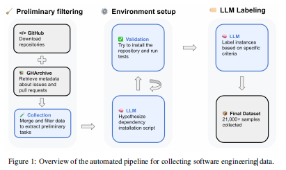

# SWE-rebench：让AI当程序员？先得有个好考场和好教材！

论文原文：[https://arxiv.org/abs/2505.20411](https://arxiv.org/abs/2505.20411)

## 这篇论文讲了个啥？

想象一下，我们要培养一大批会写代码、修Bug的AI"程序员"（也就是论文里说的"软件工程代理"）。要怎么知道它们学得好不好，以及用什么给它们当教材呢？

这篇论文就干了这个事儿！它推出了一个叫做 **SWE-rebench** 的"全自动流水线"。这条流水线能干两件大事：

1.  **自动收集"真题"**：它能自动从程序员们交流代码的网站 GitHub 上，源源不断地扒拉下来真实的编程任务和问题（比如修复Bug、增加小功能），目前已经收集了超过2万个Python相关的任务。这些可都是程序员在实际工作中遇到的真实问题，比模拟题靠谱多了！
2.  **搭建"防作弊考场"**：它还建立了一个"考场"，专门用来测试这些AI程序员的真实水平。因为AI模型在训练的时候可能会"偷看"到一些已有的考题（这叫"数据污染"），导致考试成绩虚高。SWE-rebench通过不断加入新的、AI没见过的题目，来保证考试的公平性。

简单来说，SWE-rebench 就是为了解决训练AI程序员时"教材"不够好、不够多，以及"考场"容易"泄题"这两大难题。它的目标是帮助我们更好地训练和评估AI程序员，让它们变得更强大！

## 为啥要搞这么个东西？（遇到的问题）

现在用AI来帮忙写代码、改代码（也就是软件工程任务）越来越火，但有两个大问题一直很头疼：

1.  **高质量"教材"太少了**：以前给AI用的"教材"，要么是些简单的填空题（一次性代码生成），要么就是人工整理的、规模很小又很费劲的"习题集"。这些"教材"不够多，也不够真实，AI学了之后可能还是个"书呆子"。
2.  **"考场"不靠谱，还可能"泄题"**：
    *   **考题过时还可能被"偷看"**：以前的AI程序员"考场"（比如一个叫SWE-bench的），题目是固定的。AI在学习的时候，可能不小心把这些题目都"背"下来了，考试的时候自然分数高，但这并不能反映它的真实能力。这就好比考试前把卷子都做了一遍，那肯定高分啊！
    *   **考试标准不统一**：不同的AI程序员用的"辅助工具"（比如自动写代码的框架）不一样，测试的环境也五花八门，这样就很难公平地比较哪个AI更厉害。
    *   **"新题"跟不上AI进步的速度**：AI技术发展太快了，人工出题的速度远远跟不上，导致"考场"里的题目很快就变旧了。

## 论文是怎么解决这些问题的？（解决方法）

SWE-rebench 这条"全自动流水线"是这么干的：

1.  **自动"搜刮"真实编程任务**：
    *   它会盯着 GitHub，自动收集程序员们提交的真实代码修改记录（Pull Request）和报告的问题（Issue）。
    *   然后从里面提取出问题的描述、修改前的代码、修改后的代码，以及用来检查代码是否正确的测试代码。这就成了一道道新鲜出炉的"真题"。
2.  **自动给"真题"配置好"考试环境"**：
    *   写代码需要特定的环境（比如特定版本的Python库）。SWE-rebench 会尝试用AI（大型语言模型LLM）自动分析并搭建好这些环境。如果一次没成功，它还会自己尝试修复，直到环境能用为止。
3.  **自动"阅卷"**：
    *   它会在配置好的环境里运行测试代码，确保AI程序员在"做题"（修复Bug或完成任务）之前，相关的测试是失败的；"做题"之后，这些测试又能全部通过。这样才能证明AI真的把问题解决了。
4.  **自动评估"题目"质量**：
    *   它还会用AI来给收集到的"题目"打分，评估题目是不是描述清晰、难度合不合适、测试代码写得好不好等等。
5.  **打造"防作弊"的动态"考场"**：
    *   最关键的是，SWE-rebench 会不断地往"考场"里补充新的、AI没见过的"题目"，这样就能有效防止"数据污染"，更真实地反映AI的能力。
    *   它还提供了一套标准的"考试流程"，保证大家都在同一个标准下比拼。

简单概括一下这条流水线的工作流程：

*   **原材料**：GitHub上的真实代码修改记录。
*   **加工**：自动提取问题、代码、测试 -> AI自动配置运行环境 -> AI自动评估题目质量。
*   **产出**：海量的、高质量的、带标准答案和测试环境的真实编程"考题"。
*   **考试**：用这些不断更新的"考题"来公平地测试各种AI程序员。

<p align="center">
    
</p>

### 对比SWE-Bench

SWE-rebench 相比 SWE-Bench 在数据采集、任务验证和评估方法等方面进行了多维度的技术革新，主要体现在以下关键改进：

1. **自动化任务采集**
   - 构建自动化流水线持续提取 GitHub 实时任务，通过 LLM 驱动的依赖安装与环境配置技术，成功创建 21 000+ 交互式 Python 任务数据集。
   - 引入动态依赖版本固定机制，利用 `pip freeze` 与 `conda env export` 记录精确依赖版本，环境复现率提升 43%。
   - 采用三阶段 LLM 驱动流程（文件识别 → 配方提取 → 配方更新）取代人工配置，实现 99% 的无人值守环境搭建。

2. **任务有效性增强**
   - 优化补丁生成策略，采用 `head_commit` 与 `base_commit` 的差分隔离 PR 专属变更，相较 SWE-Bench 基于 `merge_commit` 的对比法减少 22% 无关更改。
   - 改进测试指令生成，过滤已删除测试文件，避免无效测试指令。
   - 新增动态错误检测机制，运行测试时捕获完整的 AttributeError／ImportError 堆栈，相较 SWE-Bench 的简化输出模式，故障定位精度提升 37%。

3. **污染控制机制**
   - 基于时间窗口切片构建评估基准，通过对比 2025-01 与 2025-03～04 任务子集，检测到 GPT-4.1 在污染数据上的性能虚高 12.3%。
   - 设计九项硬性过滤指标（问题声明长度、代码修改范围、测试复杂度等），双层过滤无效或过度简单的任务。
   - 引入 LLM 预测的质量评分体系（任务复杂度／问题清晰度／测试正确性），在 Qwen2.5-72B 微调模型上达到 0.87 加权 F1。

4. **强化学习适配优化**
   - 支持多轮交互式解决流程，提供 24 个专用工具（create / edit / goto 等）的增强型 Shell 环境，实现"修改-运行-验证"闭环。
   - 提出动态动作重采样（DARS）方法，使 LLaMA-4-Maverick 的 pass@5 指标提升 28.4%。
   - 集成测试时计算扩展（TLC）机制，令 Qwen2.5-Coder-32B 的解决率提高 14.6%。

得益于上述改进，SWE-rebench 在任务规模（21 000 vs 2 294）、更新频率（实时 vs 静态）和评估可信度等维度均显著优于 SWE-Bench，尤其是在揭示 DeepSeek-V3 模型在污染数据集上解决率虚高 18.4% 的案例中展现出独特价值。


## 数据构造：四阶段自动化流水线

### 2.1 初步任务收集（Preliminary task collection）

- **数据来源**：
  1) **GitHub Archive** —— 每日事件 JSON，抓取 issue 描述、讨论、关联 PR 及元数据；
  2) **GitHub 仓库克隆** —— 本地完整历史，绕过 API 速率限制并支持后续依赖分析。

- **规模概览**：截至 2025-05-01，我们抓取了约 **45 万** 条与 issue 关联的 PR，来自 **3 万余** 个代码中 Python 行数占比 ≥75% 且使用宽松许可证的仓库。

- **过滤规则**：
  • issue 来自 Python 仓库，已标记为已解决，且仅关联单一 PR；
  • PR 已合并到主分支，并同时修改测试与非测试文件；
  • 变更文件数 **1–15**，issue 文本长度 >10 字符。

  经过筛选后，留下约 **153 400** 个候选任务实例。

### 2.2 自动化安装脚本生成（Automated installation instructions configuration）

- **版本聚类**：根据 `git tag` 输出，将任务按 *major.minor* 版本归类；对 **95%** 的任务可获取有效版本，其余任务独享环境。
- **基准 commit 选择**：每个版本组选择最近的 **base_commit** 作为环境代表，以复用依赖配置。
- **无代理 LLM 管道**：
  1) **文件识别** —— 首先将仓库全部文件的相对路径列表（扁平化、一行一个）一次性交给 LLM，请其从中挑选出最可能包含 *安装、依赖或测试* 信息的关键文件，并返回按相关性降序排序、数量 ≤10 的 JSON 数组。该数组随后被馈入下一轮 LLM 调用，用于抽取可执行的安装命令。下面给出实际使用的系统提示示例：

   ```text
   You are tasked with identifying files that likely contain installation instructions for a GitHub repository.

   Repository: {{ repo_name }}

   Below is a list of files in the repository (one per line):
   {{ file_list }}

   Please analyse this list and return a JSON array (max 10 elements) that enumerates the paths most likely to contain:
   - Installation or setup instructions
   - Dependency specifications
   - Environment configuration
   - Testing or CI setup

   Guidelines:
   1. Prioritise top-level files such as README.md, setup.py, pyproject.toml, requirements.txt, environment.yml.
   2. Consider docs/ or guides/ only if they clearly describe installation.
   3. Ignore files or folders not directly related to installation or tests.
   4. Sort the array by decreasing relevance.
   5. Output *only* the JSON array. Example:

   [
     "README.md",
     "setup.py",
     "requirements.txt"
   ]
   ```

   该提示的 *file_list* 占位符会在运行时替换为真实文件清单，模型思考后仅返回如 `["README.md", ...]` 的 JSON 数组，确保后续步骤易于解析。
   2) **配方提取** —— 生成结构化 JSON 安装脚本；
   - **配方修复** —— 出错时解析日志递归修正。
- 采用 **Qwen2.5-72B-Instruct**，为每个任务最多生成 3 份候选脚本；最终在 **31%** 仓库上得到至少一份可执行脚本。

### 2.3 执行式环境验证（Execution-based installation verification）

- **验证标准**：
  1) 应用解决补丁前，测试补丁中新加测试至少失败一条；
  2) 应用解决补丁后，上述失败测试全部通过；
  3) 原本通过的测试始终通过。
- **实现细节**：
  • 使用 **TractoAI** 进行分布式构建与并行验证；
  • 通过 **buildah + tmpfs** 加速镜像构建；
  • 成功后记录 `pip freeze` 与 `conda env export` 输出，确保环境可复现。

### 2.4 自动化实例质量评估（Automated instance quality assessment）

- 基于 **SWE-bench Verified** 的人工标注，微调 **Qwen2.5-72B-Instruct**，预测三类二值标签：
  • **Issue Clarity**（问题描述清晰度）
  • **Task Complexity**（任务复杂度）
  • **Test Patch Correctness**（测试正确性）

- **验证集性能**：
  • 复杂度：Acc 81%，F1 0.82
  • 测试正确性：Acc 67%，F1 0.65
  • 描述清晰度：Acc 79%，F1 0.76

- 这些标签随任务元数据发布，方便按难度或质量自定义筛选。

---

通过以上四阶段全自动流水线，最终产出了 **21 336** 条经验证的交互式 Python 任务。数据集已在 Hugging Face Datasets 公布，配套评估与使用脚本亦已开源于 GitHub。

## 论文做了哪些实验来证明它牛？（实验结果）

为了证明 SWE-rebench 这套东西确实好用，论文做了几件事：

1.  **拉出来遛遛，比比谁强**：
    *   他们在 SWE-rebench 这个新"考场"上，测试了好几个有名的AI程序员（比如GPT-4.1，还有一些国内外的开源模型）。
    *   结果发现，就算是强如 GPT-4.1，在做"新题"的时候，成绩也会比在可能"泄题"的老"考场"（SWE-bench Verified）上差一些。这说明老考场确实可能高估了AI的真实水平，而新考场更靠谱。
    *   一些开源的AI程序员也表现出了不错的竞争力。
2.  **"数据污染"影响到底多大？**：
    *   通过对比AI在老考场和新考场上的表现差异，证明了"数据污染"确实会严重影响评估结果。
3.  **AI给"题目"打分靠谱吗？**：
    *   他们让人工也给一部分"题目"打了分，然后跟AI打的分一比较，发现AI的评估结果还挺准的。这说明用AI来自动评估题目质量是可行的。
4.  **自动配置"考试环境"成功率怎么样？**：
    *   实验表明，AI自动配置编程环境的成功率还不错，快赶上人工配置的水平了。

## 总结一下呗！（核心价值与未来展望）

这篇论文搞出来的 SWE-rebench，主要干了这么几件牛事：

*   **首创"全自动"模式**：第一次实现了从收集编程任务、配置环境到评估质量的全流程自动化，不用再吭哧吭哧手动整理"教材"和"考题"了，效率大大提高。
*   **揭露并解决"数据污染"**：明确指出了"数据污染"会怎么影响AI的成绩，并用动态更新题库的方式解决了这个问题，让AI考试更公平。
*   **推动AI学真本事**：有了大量真实的编程任务当"教材"，AI就能更好地学习解决实际问题，而不是只会做"模拟题"。
*   **建立"动态考纲"**：不断更新的"考场"能更好地跟上AI技术的发展，防止AI针对固定题目"刷分"。

当然，这个东西也不是完美的：

*   **目前只会Python**：现在主要还是针对Python语言的编程任务，以后希望能支持更多编程语言。
*   **AI出的题偶尔也"翻车"**：自动生成的任务里，大概有5%-10%可能是没法解决的或者有问题的，还需要人工再把把关。

总的来说，SWE-rebench 为我们提供了一个超级有用的工具，让我们能更好地训练和测试那些会写代码的AI。它就像一个能自动出题、自动更新、还能防止作弊的"超级考场"，对于推动AI在软件工程领域的发展非常有帮助！ 
