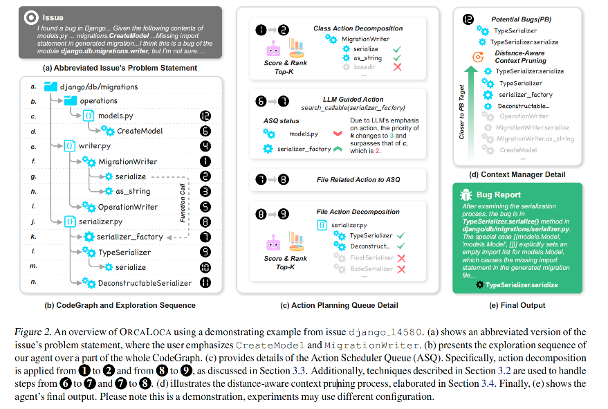
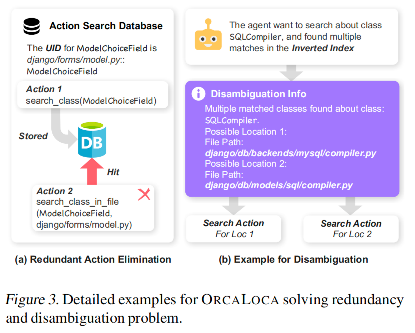

# OrcaLoca: An LLM Agent Framework for Software Issue Localization

论文地址：[https://arxiv.org/abs/2502.00350](https://arxiv.org/abs/2502.00350)

项目地址：[https://anonymous.4open.science/r/OrcaLoca-84B1/README.md](https://anonymous.4open.science/r/OrcaLoca-84B1/README.md)

## 论文大概

本文介绍了一个名为 **OrcaLoca** 的框架，旨在通过结合大型语言模型（LLM）代理和代码搜索机制来提高软件问题定位（localization）的准确性。OrcaLoca 通过优先级调度、动作分解与相关性评分以及距离感知的上下文修剪等技术，显著提升了软件问题定位的效率和准确性，并在 SWE-bench Lite 数据集上取得了新的开源最佳性能。

## 论文提出的问题

尽管大型语言模型（LLM）在软件工程领域取得了显著进展，但软件问题定位仍然是一个关键挑战。具体问题包括：

1. **如何通过战略性动作规划和精确导航来探索代码库？**
   基于代理的软件定位先前工作遇到两个关键限制：
   - **动作规划效率低下**：某些方法仅依赖LLM进行指导，导致搜索行为不稳定且冗余；
   - **基于图的调度限制灵活性**：预处理的遍历路线强制将搜索限制在相邻节点，降低了探索的灵活性。

2. **如何同时实现上下文简洁性和搜索空间完整性？**
   这是一个根本性的平衡问题：
   - **简洁上下文的局限性**：代码骨架等简洁上下文虽然减少了噪声并保持上下文可管理，但存在遗漏精确定位所需关键细节的风险；
   - **完整搜索空间的问题**：完全详细的搜索空间确保了完整性，但会引入压倒性的噪声、冗余和无关的探索路径；
   - **优化冲突**：现有方法往往以牺牲一个目标为代价来优化另一个目标，在有效定位方面留下了空白。

3. **如何在探索过程中有效管理上下文？**
   大型代码仓库中的上下文管理面临严峻挑战：
   - **歧义性噪声**：函数重写和继承类等歧义性问题经常引入噪声；
   - **无关信息累积**：随着探索过程的进行，无关信息会不断累积，误导LLM并导致错误识别bug位置；
   - **现有框架的不足**：现有框架仅仅将所有搜索结果连接到上下文中，这不足以管理大规模探索日益增长的复杂性。

## 论文解决办法

为了解决上述问题，OrcaLoca 提出了以下方法：

1. **优先级调度（Priority-Based Scheduling）**：通过动态优先级队列管理 LLM 生成的探索动作，确保重要动作优先执行。
2. **动作分解与相关性评分（Action Decomposition with Relevance Scoring）**：将高级动作分解为更细粒度的子动作，并通过多代理工作流对子动作进行评分和排序，以提高搜索的全面性和准确性。
3. **距离感知的上下文修剪（Distance-Aware Context Pruning）**：基于代码图（CodeGraph）中的节点距离启发式算法，动态修剪搜索结果，过滤掉无关信息，确保探索过程的聚焦性。

<p align="center">
  
</p>

### 图关系挖掘
实体包括功能，类、方法和文件。代码图中的每个代码实体都被分配了一个唯一标识符(UID)，其格式为文件路径(::类)(::方法)。例如，在独立函数中，UID就是简单的（文件路径::方法）。这些标识符直接编码了包含层次结构，其中::表示"包含"关系。

论文附录A中介绍了代码图的构建方法，需要的时候可以看看。

### ReACT模拟强化学习决策过程

作者设计了一个定制化的大型语言模型提示方案，该方案将在每个步骤中生成观察结果（O）、潜在缺陷位置（PB）以及搜索动作（SA）。

#### 核心工作流程

**1. 智能代理的组成要素**
OrcaLoca的智能代理可以用一个五元组M = (S,C,A,P,p0)来描述：
- **状态空间S**：包含之前的观察结果、潜在bug位置和检索到的搜索结果
- **上下文空间C**：包含由代码图构建的代码仓库结构信息
- **动作空间A**：受搜索API限制的所有可能动作，每个动作都是一个查询请求
- **转换函数P**：描述代理状态如何随动作而变化
- **初始状态p0**：包含问题描述和复现信息

**2. 代理的工作机制**

智能代理就像一个经验丰富的程序员在调试代码：

- **观察阶段（Observation）**：代理分析当前掌握的信息，就像程序员查看错误日志和代码
- **推理阶段（Potential Bug Locations）**：基于观察结果，代理推测可能的bug位置，类似程序员根据经验判断问题可能出现的地方
- **行动阶段（Search Actions）**：代理决定下一步要搜索哪些代码文件或函数，就像程序员决定接下来要检查哪个模块

**3. 状态转换过程**

每一步的状态转换遵循以下规律：
```
下一步状态 = 当前所有观察结果 + 经过上下文管理器筛选的搜索结果
```

这意味着代理会：
- 记住之前所有的发现
- 整合新的搜索结果
- 更新对潜在bug位置的判断

**4. 决策策略**

代理的决策由两个组件共同管理：
- **LLM**：负责理解代码和推理
- **动作调度队列（ASQ）**：负责优先级管理，确保重要的搜索动作优先执行

**5. 终止条件**

探索过程在以下情况下结束：
- 动作调度队列为空（没有更多搜索动作）
- 满足收敛条件（找到了足够确信的bug位置）

**6. 最终输出**

探索结束后，代理会生成：
- **结论观察（Oconclusion）**：对整个问题的总结
- **Bug位置（B）**：最终确定的bug所在位置

与传统的强化学习不同，OrcaLoca的目标不是最大化累积奖励，而是有效地收敛到正确的bug位置。整个过程就像一个智能助手帮助程序员系统性地定位代码中的问题。


### 优先级调度具体实现

#### 为什么需要优先级调度？

想象一下，当你在调试一个复杂的程序时，你的大脑可能会同时想到很多需要检查的地方。但是作为人类，你只能一次专注于一个任务。OrcaLoca的智能代理也是如此——为了保证深度思考（COT），代理每次只能执行一个动作。

但问题是，LLM可能会一次性生成多个搜索动作。这就像你的大脑同时想到了10个需要检查的地方，但你需要决定先检查哪一个。

#### 动作调度队列（ASQ）：智能的任务管理器

为了解决这个问题，OrcaLoca设计了一个**动作调度队列（ASQ）**，它就像一个智能的任务管理器，使用堆数据结构来管理优先级。

**1. 基础优先级系统**
- 每个动作默认优先级为1（就像待办事项的普通重要性）
- 但优先级可以根据上下文相关性和关联强度动态调整

**举个例子**：如果代理发现`serializer.py`文件与`serializer factory`有强关联，那么检查`serializer.py`的动作就会被提升优先级，优先执行。

**2. 重复关注计数器**
这是一个很聪明的设计：
- 为每个独特的动作维护一个计数器Cₐₖ
- 当LLM重复生成同一个动作时，计数器增加
- 计数器越高，说明LLM越"关注"这个地方，优先级就越高

**实际场景**：假设LLM连续3次都想检查`serializer factory`，这说明它认为这里很重要。系统会将计数器设为3，甚至超过其他文件动作的优先级，确保这个重要的检查优先进行。

#### 去重机制：避免重复劳动

**问题场景**：
想象你在寻找一个名为`ModelChoiceField`的类：
1. 一开始你不知道它在哪个文件，所以使用通用搜索：`search_class(ModelChoiceField)`
2. 找到位置后，你想更精确地搜索：`search_class_in_file(ModelChoiceField, django/forms/models.py)`

如果没有去重机制，系统可能会重复搜索同一个类，浪费时间和资源。

**解决方案：动作搜索数据库**
OrcaLoca维护一个动作搜索数据库，工作流程如下：

1. **预检查**：在执行任何动作之前，先从代码图中获取其唯一标识符（UID）
2. **注册检查**：将UID注册到数据库中，检查是否已经执行过
3. **避免重复**：如果发现重复，跳过该动作，提高效率

#### 整体效果

这个优先级调度系统就像一个经验丰富的项目经理：
- **智能排序**：根据重要性和紧急程度安排任务
- **避免重复**：确保不做无用功
- **动态调整**：根据新信息实时调整优先级
- **提高效率**：让最重要的检查优先进行

通过这种方式，OrcaLoca确保了搜索过程既高效又全面，避免了传统方法中常见的冗余和低效问题。


### 动作分解与消歧机制：既要全面又要精准

#### 核心挑战：鱼和熊掌能否兼得？

在代码搜索中，我们面临一个经典的两难问题：
- **要简洁**：避免信息过载，让AI能专注于重要内容
- **要完整**：不能遗漏关键信息，确保找到真正的bug位置

以前的解决方案（如骨架技术）就像给你一本书的目录——你能看到章节标题，但看不到具体内容。这样虽然简洁，但可能错过重要细节。

#### 解决方案：智能分解 + 相关性评分

**1. 动作分解机制**

想象你要检查一个有100个方法的大类，传统方法有两种极端：
- 要么只看类名和方法签名（太简洁，可能遗漏）
- 要么把所有方法都看一遍（太冗余，信息过载）

OrcaLoca采用了一种聪明的中间路线：

**步骤1：智能评分**
- 当搜索结果是一个大类时，启动"评分子代理"
- 这个子代理（由另一个LLM实现）会评估类中每个方法与问题的相关性
- 就像有一个助手帮你快速浏览所有方法，挑出最可能相关的

**步骤2：精选重组**
- 选出top-k个最相关的方法
- 将这些方法重新组合成新的搜索动作
- 给这些分解后的动作更高的优先级（比如优先级2）

**步骤3：多代理协作**
- 主代理专注于整体策略
- 评分子代理专注于细节筛选
- 两者协同工作，既保证全面性又避免冗余

**2. 大文件处理**

对于触发骨架模式的大文件，系统会：
- 收集文件内的所有代码实体（函数、类等）
- 将它们作为独立单元交给子代理评估
- 确保不会因为文件太大而遗漏重要信息

#### 消歧机制：解决"重名"问题

**问题场景**：
在大型软件项目中，经常会遇到：
- 同名函数在不同类中有不同实现（函数重写）
- 继承类中的同名方法
- 多个文件中的同名函数

这就像在一个大公司里有多个叫"张伟"的员工，你需要明确指出是哪个部门的张伟。

**解决方案：倒排索引 + 智能消歧**

**1. 倒排索引构建**
- 系统构建一个特殊的倒排索引
- 只存储那些存在歧义的可调用对象
- 每个索引项包含精确位置信息：文件路径、相关类等

**2. 消歧流程**
当API发现查询存在歧义时：

```
发现歧义 → 查询倒排索引 → 获取所有可能位置 → 生成消歧信息 → 提供给LLM代理
```

**3. 精细化处理**
- 将所有可能的位置分别处理
- 为每个位置创建独立的搜索动作
- 精细化地推送到动作队列中

<p align="center">
  
</p>

#### 实际效果

这套机制就像一个经验丰富的代码审查员：

**智能筛选**：不会被大量无关代码淹没，专注于最相关的部分
**全面覆盖**：确保不会遗漏任何可能的bug位置
**精确定位**：能够准确区分同名但不同位置的代码元素
**高效协作**：多个AI代理各司其职，提高整体效率

通过这种方式，OrcaLoca成功解决了"既要全面又要精准"的难题，在保证搜索完整性的同时，避免了信息过载和歧义混淆。

### 距离感知的上下文修剪：智能信息过滤器

#### 为什么需要上下文修剪？

想象你在一个巨大的图书馆里寻找特定信息，随着搜索的进行，你的桌子上堆积了越来越多的书籍和资料。虽然这些资料可能都与你的主题相关，但并非所有内容都同等重要。如果不及时整理，你很快就会被信息淹没，无法专注于真正重要的线索。

OrcaLoca面临同样的问题：随着搜索的深入，系统会积累大量搜索结果，如果不加筛选地全部保留，会导致LLM"注意力分散"，影响最终的bug定位准确性。

#### 上下文管理器（CM）：智能的信息管家

为了解决这个问题，OrcaLoca设计了一个**上下文管理器（Context Manager, CM）**，它就像一个经验丰富的图书管理员，能够智能地筛选和组织信息。

#### 工作原理：基于"距离"的智能筛选

**1. 基础过滤**
首先，CM会进行基础清理：
- **保留有效信息**：只保留与有效搜索查询UID相关的搜索结果
- **排除干扰信息**：明确排除消歧信息和骨架UID（通常用于大文件和大类），防止无关数据污染上下文

**2. 距离计算：找到"最近邻"**

这是CM的核心创新——基于代码图计算"距离"：

**概念解释**：
- 每个搜索结果SR在代码图中对应一个节点
- 每个潜在bug位置PB也对应图中的节点
- "距离"指的是图中节点之间的最短路径长度

**计算方法**：
```
距离 = 平均最短路径距离
```

具体来说，对于每个搜索结果，CM会：
1. 计算它到所有潜在bug位置的最短路径
2. 考虑双向距离（A到B和B到A可能不同，因为代码图是有向的）
3. 取两个方向中的最小值
4. 计算平均距离

**3. 智能排序与筛选**

基于距离计算结果，CM会：
- **优先级排序**：距离越近的搜索结果优先级越高
- **Top-k选择**：只保留距离最近的k个候选结果
- **动态过滤**：确保LLM能够绕过那些不相关的代码块

#### 实际应用场景

**举个例子**：
在图2(d)的最后一步中，上下文管理器会：
- 过滤掉不相关的信息，如`OperationWriter`、`CreateModel`等
- 保留与潜在bug位置距离最近的相关代码
- 让结论步骤能够产生稳定且正确的bug位置输出

#### 持续优化：每一步都在工作

重要的是，CM不是一次性工具，而是在整个探索阶段的**每一步**都在工作：
- **实时监控**：持续评估新的搜索结果
- **动态调整**：根据最新的潜在bug位置更新距离计算
- **智能过滤**：确保上下文始终保持简洁和相关

#### 整体效果

这个距离感知的上下文修剪机制就像一个智能的信息过滤器：

**🎯 精准聚焦**：通过距离计算，确保LLM专注于最可能包含bug的代码区域
**🧹 自动清理**：持续移除不相关的信息，保持上下文整洁
**⚡ 提高效率**：减少信息噪声，加快搜索和推理速度
**🎯 提升准确性**：通过结构化的关系分析，提高bug定位的准确性

通过将搜索结果与代码图中的结构关系对齐，CM帮助系统专注于最可能包含bug的区域。这种方法不仅简化了输入上下文，还提高了搜索过程的准确性和效率。就像有了一个智能助手，能够在信息海洋中为你找到最重要的那几页资料。

## 实验

实验部分使用了 SWE-bench Lite 数据集，该数据集包含 300 个实例，用于评估 LLM 系统解决实际软件工程问题的能力。OrcaLoca 在该数据集上取得了以下关键结果：

- **功能匹配率（Function Match Rate）**：65.33%，成为新的开源最佳性能。
- **文件匹配率（File Match Rate）**：83.33%。
- **问题解决率（Resolved Rate）**：41.00%，通过与 Agentless-1.5 的集成，问题解决率提高了 6.33 个百分点。

此外，OrcaLoca 在 SWE-bench Common 数据集上进行了消融研究，结果表明，每个提出的组件（优先级调度、动作分解、上下文修剪）都对性能有显著贡献。

## 总结

OrcaLoca 通过其创新的优先级调度、动作分解和上下文修剪机制，显著提高了软件问题定位的准确性和效率。它不仅在 SWE-bench Lite 数据集上取得了新的开源最佳性能，还通过与现有框架的集成，进一步证明了其在实际软件工程任务中的有效性。附录还有很多细节，包括提示词，需要的时候可以看看。
