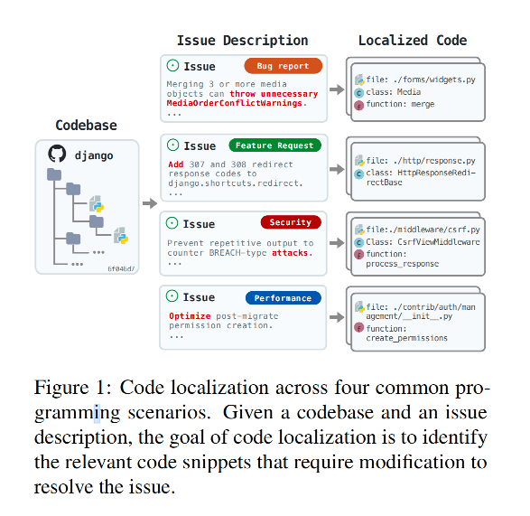
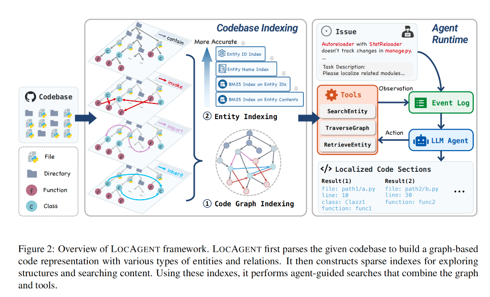
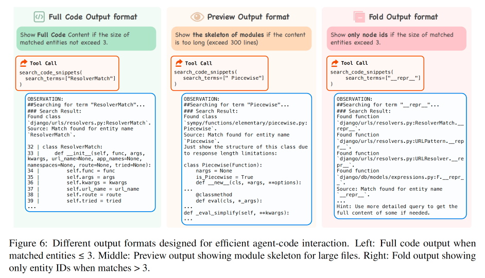
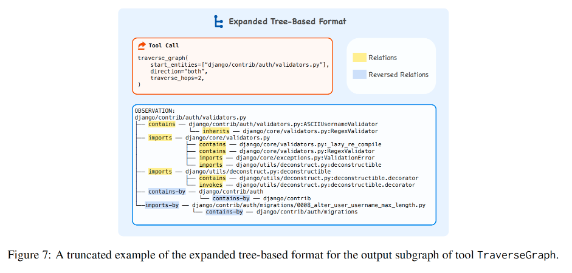
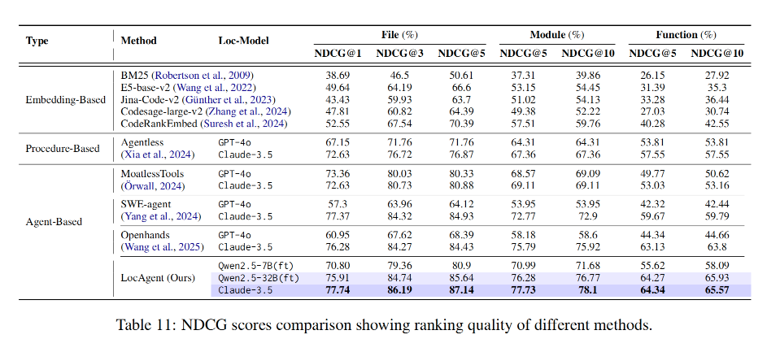

# LocAgent: Graph-Guided LLM Agents for Code Localization

**论文地址：** [https://arxiv.org/abs/2503.09089](https://arxiv.org/abs/2503.09089)

**项目地址：** [https://github.com/gersteinlab/LocAgent](https://github.com/gersteinlab/LocAgent)

---

## 📖 论文概述

本文介绍了 **LocAgent**，这是一个基于图表示的框架，旨在通过结合图结构和大型语言模型（LLM）代理来提高代码定位（code localization）的效率和准确性。

代码定位是指在代码库中精确定位需要修改的代码片段，这对于软件维护至关重要。LocAgent 通过将代码库解析为有向异构图，并利用图结构支持多跳推理，从而帮助 LLM 代理高效地搜索和定位相关代码实体。

<p align="center">
  
</p>

---

## 🔍 论文提出的问题

代码定位是一个复杂且具有挑战性的任务，尤其是在大型代码库中。现有的方法在处理复杂代码结构和依赖关系时存在局限性，主要问题包括：

### 主要挑战

1. **传统检索方法局限性**
   - 依赖于代码库的向量表示
   - 难以适应快速变化的代码库

2. **LLM 的上下文限制**
   - 无法一次性处理整个代码库
   - 需要策略性地导航到相关部分

3. **问题描述与代码的脱节**
   - 问题描述通常只提到症状而非根本原因
   - 传统检索方法难以追踪代码库中隐含的依赖关系

4. **多跳推理需求**
   - 现有方法在需要多跳推理以从问题描述追溯到受影响代码区域时表现不佳

---

## 💡 论文解决方案

LocAgent 提出了以下创新解决方案：

### 核心技术

1. **图表示的代码库索引**
   - 构建有向异构图来表示代码库
   - 捕捉代码结构（文件、类、函数）及其依赖关系（导入、调用、继承）
   - 支持多跳推理，使代理能够高效地导航复杂依赖关系

2. **统一的代码探索工具**
   - 设计了一套专门的工具：
     - `SearchEntity`：实体搜索
     - `TraverseGraph`：图遍历
     - `RetrieveEntity`：实体检索
   - 支持基于图的代码搜索和导航
   - 帮助 LLM 代理进行复杂推理

3. **开源模型的微调**
   - 通过微调开源模型（如 Qwen-2.5-Coder-Instruct）
   - 显著降低了代码定位的成本
   - 保持了与商业模型相当的性能

4. **Loc-Bench 基准测试**
   - 提出了新的基准测试集
   - 涵盖多种软件维护场景：
     - 错误修复
     - 功能请求
     - 安全性优化
     - 性能优化
   - 更全面地评估代码定位方法

<p align="center">
  
</p>

### 图表示的代码库索引

#### 稀疏分层实体索引（Sparse Hierarchical Entity Indexing）

为了让 LLM 代理能够快速找到代码库中的相关代码，作者需要建立一套高效的索引系统。就像图书馆需要目录系统来帮助读者快速找到想要的书籍一样，代码库也需要一套"目录系统"来帮助定位代码。

作者将代码图中的每个节点（如文件、类、函数等）都视为一个"实体"，并为这些实体建立了四层索引结构：

##### 1. 实体 ID 索引 - 给每个代码实体一个"身份证"

每个代码实体都有一个唯一的标识符，就像每个人都有身份证号一样。作者使用完全限定名称来构建这个标识符。

**举例说明：**
```
文件位置：src/utils.py
类名：MathUtils  
函数名：calculate_sum

完整的实体 ID：src/utils.py:MathUtils.calculate_sum
```

这样，即使在不同文件中有同名的函数，作者也能通过完整路径来区分它们。

##### 2. 全局名称字典 - 处理同名实体

在大型代码库中，经常会有多个同名的函数或类。作者建立了一个全局字典，将实体名称映射到所有具有相同名称的节点。

**举例说明：**
```
实体名称：calculate_sum
对应的所有实体：
- src/utils.py:MathUtils.calculate_sum
- src/math/calculator.py:Calculator.calculate_sum  
- tests/test_utils.py:TestMath.calculate_sum
```

这样当用户搜索 "calculate_sum" 时，系统能找到所有相关的函数。

##### 3. 关键词倒排索引 - 模糊搜索支持

有时用户的搜索关键词可能不完全匹配实体的 ID 或名称。作者使用 BM25 算法建立倒排索引，支持模糊搜索。

**举例说明：**
```
用户搜索："计算总和"
系统能找到：calculate_sum, sum_calculator, total_calculation 等相关实体
```

##### 4. 代码内容倒排索引 - 覆盖所有可能匹配

当搜索关键词不在实体 ID 中时（比如搜索全局变量名），作者为每个实体建立代码块的倒排索引，确保不遗漏任何可能的匹配。

**举例说明：**
```
用户搜索："MAX_RETRY_COUNT"（一个全局变量）
系统会在所有使用了这个变量的函数和类中找到相关实体
```

#### 为什么这种方法更有效？

**传统方法的局限性：**
- 只依赖文件夹结构导航
- 距离很远的文件夹中的代码看起来毫无关联

**作者方法的优势：**
想象一下，在传统的文件夹结构中，模块 A 在 `/frontend/components/` 目录下，模块 B 在 `/backend/services/` 目录下。从文件夹结构看，它们似乎毫无关系。

但是，如果模块 A 调用了模块 B 的函数，或者它们继承自同一个基类，那么在作者的图表示中，它们就是"邻居"关系。

**实际意义：**
- 当代码出现问题时，通常是通过函数调用关系传播的，而不是通过文件夹结构
- 作者的方法能够快速识别出功能相关的组件，即使它们在物理位置上相距很远
- 这种"语法邻近性"对于代码定位至关重要，因为问题往往通过调用关系而非目录结构显现

**简单类比：**
就像社交网络中，两个人可能住在不同城市（物理距离远），但如果他们是好朋友（功能关系近），在社交图中他们就是直接相连的。作者的代码图也是同样的道理。

### Agent工具设计

为了让 LLM 代理能够高效地在代码库中导航和定位问题，作者设计了三个专门的工具，就像给侦探配备了专业的调查工具一样。

#### 核心工具介绍

##### 1. SearchEntity - 智能搜索工具 🔍

这个工具就像一个智能的代码搜索引擎，能够根据关键词在代码库中找到相关的实体。

**工作原理：**
- 首先在高层索引中寻找精确匹配
- 如果找不到精确匹配，就在低层索引中进行模糊搜索
- 为每个找到的实体提供三种详细程度的代码片段：
  - **折叠视图**：只显示函数/类的签名
  - **预览视图**：显示关键代码行
  - **完整视图**：显示全部代码

**实际效果：**
```
搜索关键词："用户登录"
可能找到：
- login_user() 函数 [折叠视图]
- authenticate_user() 函数 [预览视图] 
- UserLoginController 类 [完整视图]
```

<p align="center">
  
</p>


**智能输出格式选择：**
- **完整代码格式**（左图）：当匹配的实体数量 ≤ 3 个时，显示完整的代码内容
- **预览格式**（中图）：当文件较大时，显示模块的骨架结构，突出关键部分
- **折叠格式**（右图）：当匹配数量 > 3 个时，只显示实体ID，避免信息过载

这样设计的好处是避免了冗长的代码上下文，减少了噪音信息。

##### 2. TraverseGraph - 图遍历工具 🗺️

这个工具就像一个智能导航系统，能够在代码图中进行有目的的探索。

**核心特性：**
- **类型感知的广度优先搜索**：从指定实体开始，按照设定的方向和跳数进行搜索
- **一次操作完成多跳导航**：相比现有系统需要多次操作，作者的工具一次就能完成复杂的导航
- **智能路径选择**：代理可以选择实体类型和关系类型来生成合适的搜索路径

**举例说明：**
```
起始点：UserController.login() 函数
搜索设置：
- 实体类型：{类, 函数}
- 关系类型：{包含, 继承}
- 跳数：2

结果：生成类似 UML 图的结构，显示所有相关的类和函数关系
```

**输出格式优化：**
作者将图结构转换为树状格式，通过空间距离来编码拓扑关系，这样 LLM 更容易理解和推理。

#### 为什么图的输出格式如此重要？

TraverseGraph 工具会遍历代码图并为每个输入实体返回一个局部子图。代理需要通过分析这些子图来理解每个实体的复杂依赖关系。

但是，让 LLM 理解图结构并不容易。就像给盲人描述一幅画一样，如何用文字准确地表达图的结构关系是一个挑战。研究表明，LLM 的性能会因为图的文本编码方式不同而有显著差异。

#### 创新的树状格式设计

<p align="center">
  
</p>

作者开发了一种新的树状格式（如图7所示），具有以下特点：

##### 1. 树状结构表示 🌳
将子图表示为树，让 LLM 可以通过缩进来判断节点与根节点的距离关系。

**直观理解：**
```
根节点
├── 子节点1
│   ├── 孙节点1
│   └── 孙节点2
└── 子节点2
    └── 孙节点3
```

##### 2. 完整实体ID显示 🏷️
为每个节点显示完整的实体ID（如 `django/core/validators.py:RegexValidator`），帮助 LLM 轻松定位节点。

##### 3. 明确的关系类型标注 🔗
为每条边明确指定关系类型，包括反向关系，让依赖关系一目了然。

#### 格式对比实验验证

为了验证不同图格式对代码定位性能的影响，作者进行了一个有趣的对比实验：

**实验设置：**
- 使用 SWE-Bench-Lite 中的 37 个挑战性样本
- 这些样本被认为是"困难的"，因为现有的基线代理方法都无法解决
- 使用 Claude-3.5 作为定位模型
- 对比多种输出格式

**测试的格式包括：**

##### 1. 行格式（Row）
每行列出邻接矩阵的一行：
```
函数 "fileA.py:funcA" 调用函数 "fileA.py:funcB", "fileA.py:funcC"
```

##### 2. 行格式+实体属性（Row with Entity Attributes）
在行格式基础上增加实体属性信息。

##### 3. 事件格式（Incident）
使用整数代替实体ID来表示节点：
```
将函数 "fileA.py:funcA" 映射到索引 0
将函数 "fileA.py:funcB" 映射到索引 1  
将函数 "fileA.py:funcC" 映射到索引 2
函数 0 调用函数 1,2
```

##### 4. Graphviz DOT格式
使用 Graphviz DOT 语言表示图。

##### 5. JSON格式
将子图展开为树，并转换为 JSON 格式。

#### 实验结果揭示

**关键发现：**

1. **树状格式显著优于其他格式** 🏆
   - JSON 和树状格式都能显著提高性能
   - 作者的树状格式在不同级别的定位任务中都取得了最佳整体性能

2. **属性信息可能带来噪音** ⚠️
   - 带实体属性的行格式始终表现不如普通行格式
   - 说明所有节点的属性信息可能很嘈杂，反而干扰了理解

3. **简化不一定更好** 🤔
   - 虽然事件格式可以简化输出，在文件级定位上有改进
   - 但在模块级和函数级定位上性能下降

**实际意义：**
这个实验证明了格式设计的重要性。就像同样的信息用不同的方式表达，理解难度会大不相同。作者的树状格式通过巧妙的设计，让 LLM 能够更好地理解代码的结构关系，从而提高定位准确性。

##### 3. RetrieveEntity - 实体检索工具 📋

这个工具就像一个详细的档案查询系统，能够获取实体的完整信息。

**提供的信息包括：**
- 文件路径
- 行号位置  
- 完整代码内容
- 其他重要属性

#### Agent 的工作流程 - 链式思维规划

作者的代理采用链式思维（Chain-of-Thought）方法，就像一个经验丰富的程序员分析问题一样，按步骤进行：

##### 步骤 1：分类并提取关键问题信息 🎯
```
问题描述："用户登录后页面显示空白"

代理分析过程：
1. 问题分类：
   - 问题描述：用户登录后页面显示空白
   - 错误追踪：可能涉及前端渲染失败
   - 复现代码：登录流程相关代码
   - 附加上下文：用户权限、数据获取

2. 识别相关模块：
   - 在 '{{package_name}}' 包中提取关键词
   - 搜索相关代码引用获取额外上下文
   
3. 关键词提取：
   - "login", "authentication", "render", "page", "user_data"
```

##### 步骤 2：定位引用的模块 🔗
```
使用 SearchEntity 工具精确定位：

1. 探索代码库结构：
   - 熟悉项目的整体架构
   - 分析描述的执行流程

2. 识别具体模块：
   - "login" → 找到 auth/login.py:LoginController.authenticate
   - "render" → 找到 frontend/renderer.py:PageRenderer.render_user_page
   - "user_data" → 找到 services/user.py:UserService.get_user_data

3. 输出格式（完全限定名称）：
   - auth/login.py:LoginController.authenticate
   - frontend/renderer.py:PageRenderer.render_user_page
   - services/user.py:UserService.get_user_data
   - models/user.py:User.get_profile
```

##### 步骤 3：分析并重现问题 🔄
```
代理的深度分析过程：

1. 明确问题目的：
   - 这是意外行为问题，需要定位包含潜在bug的模块
   - 重点关注数据流和渲染逻辑

2. 重构执行流程：
   使用 TraverseGraph 追踪完整调用链：
   
   入口点：用户点击登录按钮
   ↓
   LoginController.authenticate() 
   ↓
   UserService.get_user_data()
   ↓
   Database.query_user_info()
   ↓
   PageRenderer.render_user_page()
   ↓
   问题点：页面显示空白

3. 识别潜在断点：
   - UserService.get_user_data() 可能返回 null
   - PageRenderer.render_user_page() 可能未处理空数据
   - 权限验证可能阻止数据加载
```

##### 步骤 4：定位需要修改的区域 🎯
```
基于逻辑流程和依赖分析，代理识别关键位置：

1. 主要修改点：
   - services/user.py:UserService.get_user_data (line: 45)
   - frontend/renderer.py:PageRenderer.render_user_page (line: 128)
   - auth/login.py:LoginController.handle_success (line: 67)

2. 上下游依赖考虑：
   - models/user.py:User.get_profile (line: 23) - 数据源
   - utils/validation.py:validate_user_session (line: 156) - 会话验证

3. 多种解决方案考虑：
   - 方案A：在 UserService 中添加空值检查
   - 方案B：在 PageRenderer 中添加默认页面处理
   - 方案C：改进错误处理和用户反馈机制

最终输出格式：

```shell

services/user.py
line: 45
class: UserService
function: get_user_data

frontend/renderer.py
line: 128
class: PageRenderer
function: render_user_page

auth/login.py
line: 67
class: LoginController
function: handle_success

models/user.py
line: 23
class: User
function: get_profile

utils/validation.py
line: 156
function: validate_user_session

```

#### 一致性置信度评估 📊

为了提高结果的可靠性，作者采用了一致性检查机制：

**工作原理：**
1. **多次运行**：让代理多次执行相同的定位任务
2. **排名分析**：使用倒数排名作为初始置信度分数
3. **聚合评分**：汇总多次迭代的结果，计算最终置信度

**直观理解：**
```
如果一个代码位置在多次分析中都被排在前面，
那么它更可能是真正需要修改的地方。

第1次分析：A(第1位), B(第3位), C(第2位)
第2次分析：A(第1位), B(第2位), C(第4位)  
第3次分析：A(第2位), B(第1位), C(第3位)

最终排名：A > B > C (A 最一致地排在前面)
```

这种方法就像多个专家会诊，通过一致性来提高诊断的准确性。

### 微调模型

#### 为什么要微调开源模型？

虽然像 Claude-3.5 这样的商业模型表现优秀，但在实际应用中面临两个重要挑战：

1. **成本问题** 💰
   - 商业 API 调用费用昂贵，大规模使用成本高昂
   - 对于企业来说，长期使用成本难以承受

2. **数据安全问题** 🔒
   - 企业代码库包含敏感信息，不适合发送到外部 API
   - 本地部署是更安全的选择

因此，作者决定微调开源模型，既能降低成本，又能保证数据安全。

#### 高质量训练数据的收集策略

作者采用了一个巧妙的数据收集策略，就像培养一个优秀学生的过程：

##### 第一步：收集"老师"的成功案例 👨‍🏫
```
数据来源：Claude-3.5 生成的成功轨迹
数量：433 个成功案例
来源：SWE-bench 训练集中的任务
标准：代理成功完成代码定位任务
```

##### 第二步：学生的自我提升 🎓
```
由于预算限制，作者采用了创新的方法：
1. 用收集的数据初步微调 Qwen2.5-32B 模型
2. 让这个初步微调的模型生成更多成功案例
3. 额外收集了 335 个成功轨迹
4. 形成"自我改进循环"
```

**关键原则：只选择成功的轨迹**
- 确保训练数据都是正确的推理路径
- 避免错误模式被学习和强化
- 创建高质量的训练数据集

##### 第三步：知识蒸馏到小模型 📚
```
最终数据集组成：
- Claude-3.5 轨迹：433 个
- Qwen2.5-32B 成功样本：335 个
- 总计：768 个高质量训练样本

目标：将知识蒸馏到更小的 7B 模型
好处：更快的推理速度，更低的部署成本
```

#### 具体的微调设置

##### 基础模型选择 🏗️
```
选择的模型：Qwen-2.5-Coder-Instruct
版本：7B 和 32B 变体
优势：专门为代码任务优化的指令微调模型
```

##### 微调方法：LoRA 技术 ⚙️
```
技术选择：监督微调（SFT）+ LoRA
LoRA 的优势：
- 高效适应：只需要微调少量参数
- 内存友好：大幅减少训练时的内存需求
- 快速训练：相比全参数微调速度更快
```

##### 训练参数设置 📊
```
训练配置：
- 训练样本：768 个（来自 SWE-Bench 训练集）
- 训练轮数：5 epochs
- 最大 token 数：128k（支持长上下文）
- 学习率：2 × 10⁻⁴
- 数据分布：
  * Claude-3.5 生成：447 个样本
  * Qwen2.5-32B 迭代生成：321 个样本
```

#### 训练策略的创新点

##### 1. 渐进式改进策略 📈
```
传统方法：直接用大模型数据训练小模型
作者方法：
Step 1: Claude-3.5 → 训练 Qwen2.5-32B
Step 2: 微调后的 Qwen2.5-32B → 生成更多数据
Step 3: 所有数据 → 训练 Qwen2.5-7B
```

##### 2. 自我改进循环 🔄
```
这种方法的优势：
- 减少对昂贵商业模型的依赖
- 让模型在自己的成功案例上不断改进
- 形成正向反馈循环，提升效果
```

##### 3. 质量控制机制 ✅
```
严格的筛选标准：
- 只使用成功完成任务的轨迹
- 确保推理路径的正确性
- 避免错误模式的传播
```

#### 实验结果验证

通过这种微调方法，作者实现了：

- **性能提升**：开源模型达到接近商业模型的效果
- **成本降低**：相比商业 API，成本降低约 86%
- **部署灵活**：支持本地部署，保护数据安全
- **效率优化**：7B 模型在保持性能的同时大幅提升推理速度

这种微调策略为代码定位任务提供了一个既经济又实用的解决方案，特别适合企业级应用场景。最后效果如图

<p align="center">
  
</p>


---

## 📊 实验结果

实验部分主要验证了 LocAgent 的有效性、开源模型微调的性能提升以及在不同场景下的适用性。

### 关键实验结果

#### 1. 性能对比
- LocAgent 在多个代码定位任务中表现优于现有方法
- 特别是在需要多跳推理的任务中表现突出
- **文件级定位准确率**：使用微调后的 Qwen-2.5-32B 模型达到 **92.7%**

#### 2. 成本分析
- 通过微调开源模型，成本大幅降低
- 与商业模型相比，成本降低约 **86%**
- 更适合实际部署

#### 3. Loc-Bench 基准测试
- 在 Loc-Bench 数据集上表现优于其他方法
- 在以下场景中表现尤为突出：
  - 错误报告定位
  - 性能优化
  - 安全问题定位

#### 4. 下游任务影响
- 显著提高了 GitHub 问题解决的成功率
- 在多轮尝试中（Pass@10），成功率提高了 **12%**

---

## 🎯 总结

LocAgent 通过图表示和 LLM 代理的结合，显著提高了代码定位的效率和准确性。主要贡献包括：

### 核心优势

- ✅ **性能卓越**：达到与商业模型相当的水平
- ✅ **成本效益**：通过开源模型微调大幅降低成本
- ✅ **技术创新**：图表示方法为复杂代码结构提供有效推理支持
- ✅ **实用价值**：为软件维护和代码定位提供了新的解决思路


