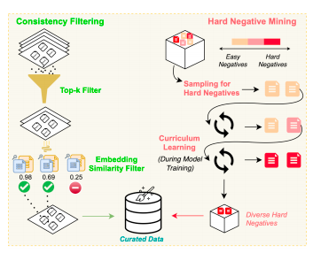
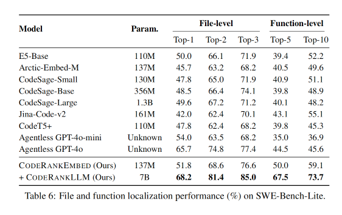
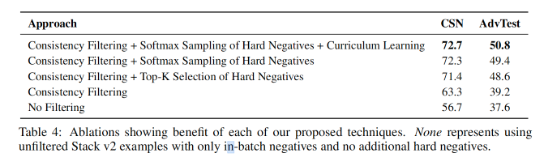

# CORNSTACK: HIGH-QUALITY CONTRASTIVE DATA FOR BETTER CODE RETRIEVAL AND RERANKING

论文地址：https://arxiv.org/abs/2412.01007
发表会议：ICRL 2025

## 论文大概
介绍了一个名为 CORNSTACK 的大规模、高质量对比学习数据集，旨在提升代码检索和重排序的性能。代码检索在代码生成、漏洞修复和软件维护中起着重要作用，但现有的代码嵌入模型在复杂任务中表现不佳。作者认为，这主要是因为这些模型依赖于噪声和不一致的数据集进行训练，导致其泛化能力受限。为此，作者提出了 CORNSTACK 数据集，通过一致性过滤和挖掘困难负样本，提升模型的对比学习效果，并在代码检索和重排序任务中验证了其有效性。

## 论文提出的问题
从GitHub等开放平台获取数据集。这些数据集通常缺乏整理和一致性过滤机制，导致大量噪声，包括无关或错误标注的代码对，这损害了模型学习稳健表示的能力。此外，现有方法往往无法处理这种具有挑战性的负样本，导致嵌入难以捕捉相似代码片段之间的细微差别。这一局限性使得当前模型无法有效处理微妙的语义差异，从而影响其在实际场景中的检索准确性。

## 论文解决办法
这篇论文提出了一个叫 CORNSTACK 的新数据集，专门用来提升代码检索和排序的效果。它的数据来自 The Stack V2（一个很大的开源代码库），但不是直接拿来用，而是经过了严格筛选和处理，保证数据质量很高。
具体怎么做的呢？主要有两步：
#### 双重一致性过滤
首先，论文用了一种“双重一致性过滤”的方法来挑选正样本（也就是正确的文本-代码配对）。只有那些在整个数据里排名靠前、而且文本和代码之间的相似度分数很高的配对，才会被留下来。这样可以把那些不相关或者有噪声的数据剔除掉。
#### 硬负例挖掘
其次，为了让模型学得更好，作者还专门挑选了一些“难搞”的负样本（就是那些和正样本很像、但其实不是正确答案的代码）。他们先在离线阶段用相似度矩阵筛掉那些其实和正样本太像的“假负例”，然后在训练过程中用一种“软max采样+课程学习”的方法，逐步让模型接触到越来越难的负样本。这样，模型就能学会区分那些很相似但其实不对的代码。
此外，论文还强调，除了提升代码嵌入的质量，还可以用更复杂的“重排序”技术进一步提升检索效果。虽然这种方法在文本检索和推荐系统里很常见，但在代码检索领域还很少有人用。作者用他们高质量的数据集，微调了大语言模型做代码重排序，结果效果非常好，甚至超过了传统的检索模型。

### 数据集怎么构建的？
他们的数据集是以“查询、正例、负例”三元组的形式组织的。要让对比学习有效，关键是：
正例要和查询高度相关，没有噪声；
负例要和正例在语义上很像，但又不是答案，这样才能真正考验模型的辨别能力。
### 硬负例怎么找的？
在训练模型的时候，光有“容易分辨”的负样本还不够，我们还需要那些“很难分辨”的负样本（也叫硬负例），这样模型才能学会真正的本领。论文里找硬负例的方法分为两步：
1. 离线筛选：先剔除“假负例”
首先，研究者会先用一个“相似度矩阵”来计算每个文本和代码之间的相似程度。对于每个正样本（正确的文本-代码配对），如果有些负样本和正样本太像（比如分数超过某个阈值），就把它们剔除掉，避免模型被这些“假负例”误导。
2. 在线采样：逐步增加难度（微调过程中温度参数的渐进退火处理）
接下来，在模型训练的过程中，采用一种叫“softmax采样+课程学习”的方法来挑选负样本。具体来说：
softmax采样：不是只选最难的负样本，而是给每个负样本一个“被选中的概率”，分数越高的负样本被选中的概率越大，但其他样本也有机会被选到。这样可以保证模型见到的负样本既有难的，也有容易的，训练更全面。
课程学习：一开始，模型先接触一些比较容易区分的负样本，等模型变强了，再慢慢增加难度，让它见到更多“以假乱真”的负样本。这样模型就能逐步提升辨别能力。
举个通俗的例子
就像在图书馆找书，刚开始我们让助手（模型）区分很不一样的书，等它学会了，再让它去分辨那些封面、内容都很像的书。我们不是每次都只给它最难的书，而是让它多见识各种类型的书，这样它才能变得更聪明。
总结
通过这两步，模型既能避免被“假负例”干扰，又能在训练中不断挑战自己，最终学会分辨那些“看起来很像但其实不对”的代码，大大提升了检索和排序的能力。

在线学习微调：这里主要是用了 infoNCE loss来做对比学习

### 重排模型数据构造
代码重排序（reranking）模型的训练数据并不是传统意义上的人工标注数据，而是利用了现有的大型语言模型（LLMs）作为“教师模型”来生成训练数据。

具体来说，代码重排序模型的训练数据生成过程如下：

1. 使用教师模型生成排名：• 作者使用了大型语言模型（如 Qwen-2.5-32B-Instruct）来为每个查询（text query）生成一个代码片段的排名顺序。这个排名顺序是基于模型对查询与代码片段相关性的判断。

2. 从 CORNSTACK 数据集中选取样本：• 从 CORNSTACK 数据集中选取包含正样本（positive）和困难负样本（hard negatives）的元组（tuples）作为训练实例。这些元组已经通过一致性过滤和困难负样本挖掘过程被精心挑选和组织。

3. 创建训练实例：• 对于每个查询，从其对应的正样本和困难负样本中，根据教师模型提供的排名顺序，创建一个训练实例。这个实例包括查询和一组代码片段（包括正样本和负样本），以及它们的排名顺序。

4. 训练代码重排序模型：• 使用上述创建的训练实例来训练代码重排序模型。模型的目标是学习如何根据查询和代码片段的相关性来预测正确的排名顺序。

5. 语言建模目标：• 代码重排序模型的训练使用语言建模目标，即最小化在生成序列中预测下一个正确排名的误差。这通常涉及到最大化给定前文（previous tokens）和指令提示（instruction prompt）的情况下，预测目标标记（target token）的条件概率。

通过这种方式，作者能够利用现有的大型语言模型来生成高质量的训练数据，而不需要人工标注。这种方法不仅节省了人工成本，而且能够利用大型语言模型的强大能力来生成更准确的排名监督信号，从而提高代码重排序模型的性能。

## 实验
RQ1：CORNSTACK是否可以用于训练高性能的代码检索器和重排序器？
RQ2：这样的代码检索器+重排序框架能否用于辅助实际软件开发？

按照论文中构造的数据集微调embedding模型和rerank模型后，在swe-bench-lite数据集上可以取得不错的效果。
文件级别索引top3准确率能到85，函数级别索引top10准确率能到73。

### 消融实验
作者对比了是否采用sofmax来优化以及是否采用课程学习来优化，结果如下：

## 总结
论文提出了一种新的数据集构造方法，通过一致性过滤和困难负样本挖掘，提升了代码检索和重排序的性能。实验结果表明，该方法在代码检索和重排序任务中表现出色，能够有效提升模型性能。最核心的点在于，如何筛选出高质量的正负样本，以及如何构造出困难样本。论文给出了一种比较新的解决方案，特别是softmax采样+课程学习，可以有效提升模型性能。值得借鉴。
