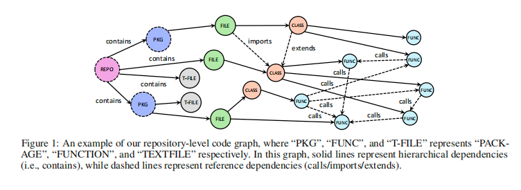
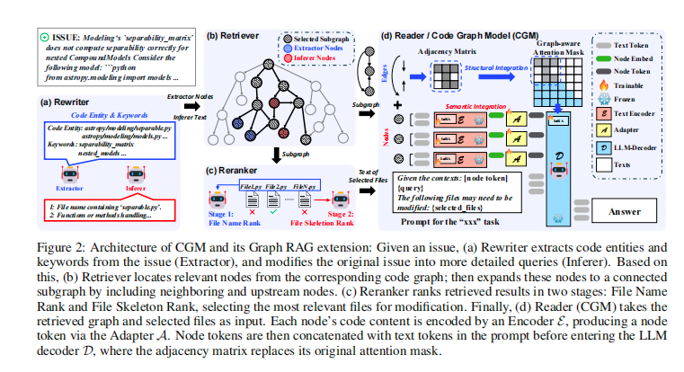

# CODE GRAPH MODEL (CGM): A GRAPH-INTEGRATED LARGE LANGUAGE MODEL FOR REPOSITORY-LEVEL SOFTWARE ENGINEERING TASKS

> **论文地址**: [https://arxiv.org/abs/2505.16901](https://arxiv.org/abs/2505.16901)  
> **项目地址**: [https://anonymous.4open.science/r/CGM-EF59](https://anonymous.4open.science/r/CGM-EF59)

---

## 📖 论文概述

想象一下，你是一个程序员，需要修复一个大型软件项目中的bug。这个项目有成千上万个文件，函数之间相互调用，关系错综复杂。传统的AI助手只能看懂单个文件或函数，就像"盲人摸象"一样，无法理解整个项目的全貌。

作者提出了一种叫做"代码图模型"（CGM）的新方法，它就像给AI装上了"透视眼"，能够同时理解代码的内容（语义信息）和代码之间的关系（结构信息）。CGM把整个代码库想象成一张巨大的关系网，其中每个文件、类、函数都是网络中的节点，它们之间的调用、继承等关系就是连接线。

通过这种方式，开源的AI模型也能像闭源的高级AI一样，理解复杂的软件项目，并完成仓库级别的编程任务。

---

## 🎯 论文提出的问题

目前的AI编程助手主要面临两个挑战：

### 挑战1：现有方法的局限性

- **闭源模型依赖**: 大部分强大的AI编程助手（如GPT-4、Claude）都是闭源的，普通开发者难以获取或定制
- **代理系统不稳定**: 这些闭源模型通常需要复杂的"代理"系统来处理大型项目，但这种方法不稳定，容易出错
- **开源模型性能差**: 开源模型虽然免费可用，但在处理复杂项目时表现较差

### 挑战2：性能差距巨大

- 在著名的SWE-bench测试中，闭源代理方法能解决55%的问题
- 而开源模型最好也只能解决30.67%的问题
- 这个差距让人怀疑：开源模型真的能胜任复杂的编程任务吗？

### 核心问题

> **开源AI能否不依赖复杂代理，直接完成大型项目的编程任务？**

乍一看这似乎不太可能，但作者认为答案是"可以的"！关键在于让开源AI真正"看懂"整个代码库——不仅要理解单个文件的内容，更要理解文件之间、函数之间的复杂关系。

就像人类程序员需要先熟悉整个项目架构才能有效工作一样，AI也需要这种"全局视野"。

---

## 💡 论文解决方案

为了解决上述问题，论文提出了 **Code Graph Models (CGMs)**，通过以下方式整合代码库的语义和结构信息：

1. **代码图构建**: 将代码库表示为一个有向图，包含七种类型的节点（如文件、类、函数等）和五种类型的边（如包含、调用、继承等）
2. **语义整合**: 通过预训练的文本编码器（如 CodeT5+）将节点文本编码为节点嵌入，然后通过适配器（adapter）映射到 LLM 的输入空间
3. **结构整合**: 通过修改 LLM 的注意力掩码，使其仅在代码图中的邻接节点之间传递信息，类似于图神经网络（GNN）的消息传递机制
4. **图检索增强生成（Graph RAG）框架**: 结合 Rewriter、Retriever、Reranker 和 Reader（CGM）四个模块，专注于与用户查询最相关的子图，进一步提升 CGM 的性能

---

## 🏗️ 技术架构详解

### 代码图构建

在深入了解CGM之前，我们需要先理解它所使用的代码图是什么，以及如何构建这样的图。代码图的主要目标是为复杂的代码库提供一个结构化的表示，同时包含结构信息和语义信息。

#### 什么是代码图？

简单来说，代码图就是把整个代码库变成一张"地图"。作者用数学符号表示为 `G = (V, E)`，其中：

- **V**: 代码库中所有不同实体的集合（比如文件、类、函数等）
- **E**: 这些实体之间连接关系的集合

具体来说，作者的代码图包含最多**7种类型的节点**和**5种类型的边**（详细信息见附录B）。节点类型的粒度从粗到细，从整个代码库（REPO）到具体的属性都有。边的类型包括两大类：

1. **层次依赖**（包含关系）
2. **引用依赖**（调用/导入/继承关系）

#### 两种关系的区别

如图1所示，层次依赖（实线）就像一棵倒立的树，从根部（整个项目）向下分支到叶子（具体函数）。这种结构反映了代码的组织方式，就像文件夹包含文件，文件包含类，类包含函数一样。

**构建树状结构的过程：**

1. 首先通过AST（抽象语法树）解析来识别代码实体
2. 从根节点（REPO）开始，递归地添加它的子节点（PKG包和T-FILE文件）
3. 一直处理到最底层的叶子节点（FUNC函数）
4. 每次递归都会添加从父节点到子节点的有向边

另一方面，引用依赖（虚线）捕获的是不同实体之间的交互关系，比如：

- 类的继承关系
- 函数的调用关系  
- 模块的导入关系

与垂直的层次关系不同，引用关系创建的是水平连接，甚至可能形成循环（比如递归调用）。这些关系通常不在AST中，需要通过轻量级的语义分析来识别符号引用，然后在代码图中添加相应的边。

#### 节点内容的处理

每个节点都保留了原始的代码内容和行号范围，这样可以：

- 支持明确的图遍历和检索
- 帮助训练具有更强语义理解能力的模型

在后处理阶段，作者会从父节点中移除子节点包含的文本内容，避免重复。最终得到的代码图是一个"富文本图"，每个节点都包含对应的代码片段。

  

### 代码图关系模型架构

如图2(d)所示，CGM的架构设计巧妙地将代码图作为输入，增强了大语言模型对图中语义信息和结构信息的理解能力。下面作者详细解释CGM如何将这两个方面整合到LLM中。

#### 语义整合：让AI理解代码内容

代码图是"富文本"的，语义信息主要存在于节点的文本内容中。如图2(d)所示，作者通过编码器E和适配器A将节点信息整合到LLM解码器D中，具体过程是将节点文本转换为节点令牌。

**编码器的选择和处理：**

- 作者使用CodeT5+的预训练编码器，因为它在处理源代码和文本（注释和文档）方面表现出色
- 对于包含大量文本的节点，作者将内容分割成每个512个令牌的块
- 这些块由编码器独立处理
- 为了保持图的一致性，作者为每个块复制源节点，保持与其他节点的相同连接
- 节点内的块完全连接，通过LLM解码器D中的位置嵌入维持它们的顺序
- 作者使用LoRA微调编码器以优化下游任务的性能

**适配器的作用：**

适配器A充当编码器和LLM之间的桥梁，将编码器输出投影到LLM的输入嵌入空间。借鉴视觉语言模型(VLMs)的成功实践，作者将适配器实现为带有GELU激活的两层MLP，从头开始训练。

与VLMs不同的是，CGM的编码器E和解码器D属于同一模态，这简化了对齐过程。此外，作者将每个512令牌块（图2(d)中的灰色令牌）压缩为LLM解码器的单个节点令牌（黑色令牌）。这种压缩有效地将LLM的上下文长度扩展了512倍，使其能够处理大量的代码库上下文。

#### 结构整合：让AI理解代码关系

除了节点信息，另一个挑战是将图结构整合到LLM解码器D中。虽然LLM擅长处理序列数据，但它们本身并不是为捕获图结构而设计的。传统方法试图通过简单地将代码片段线性化为序列来整合仓库级结构信息，但这种转换往往无法保持代码实体之间的明确关系。

**图感知注意力机制：**

为了更好地维护结构关系，作者引入了图感知注意力掩码，在LLM中仅在节点令牌之间替换因果注意力掩码。这个掩码来源于代码图的邻接矩阵，考虑了前面描述的节点复制过程。

然后作者使用LoRA微调LLM，使其适应新的注意力机制和来自适配器A的节点令牌。这种方法确保注意力仅在代码图中的相邻节点之间发生，模仿了空间图神经网络(GNNs)中频繁使用的消息传递机制。

#### 简单总结

- **语义整合**: 就像给AI装上"阅读理解"能力，让它能读懂每个代码片段的含义
- **结构整合**: 就像给AI装上"关系理解"能力，让它知道哪些代码之间有联系，应该重点关注

  

---

## 🎓 训练策略

有了预训练的编码器E和解码器D，CGM的训练包含两个主要阶段，就像培养一个程序员需要先学基础知识，再实战练习一样：

### 第一阶段：子图重构预训练

这个阶段的目标是训练CGM有效捕获代码图的语义和结构信息。作者引入了一个新颖的预训练任务，要求模型从代码图重构出代码内容，作者称之为"图到代码"（Graph-to-Code）任务。

#### 具体做法

- **输入**: 从大规模代码图中随机采样的子图，节点数量有限
- **限制**: 确保对应的输出代码保持在8,000个令牌以下，这样既保证计算效率，又保持训练时的上下文大小可管理
- **层次化方法**: 为了增强输出代码的意义，作者采用层次化方法，在将代码图转换为文本时保持固有的依赖关系

#### 转换过程

1. **高层节点处理**: 对于高层节点（如REPO和PACKAGE），作者将它们放在输出序列的开头或各自文件的开头，以保持层次一致性
2. **文件排序**: 使用DeepSeek-Coder的方法对所有文件节点进行拓扑排序，建立代码内容的结构化顺序
3. **文件内排序**: 文件内节点（如CLASS和FUNCTION）按行号排序并在各自文件内连接，最终形成准确表示采样子图的连贯文本序列

### 第二阶段：噪声微调

这个阶段在真实世界的问题-补丁对上微调CGM，使其适应实际的软件调试和代码编辑任务。如图2(d)所示，模型学习基于两个输入生成代码补丁：

#### 输入内容

1. **子图**: 结合了oracle文件（根据真实补丁需要修改的文件）、它们的下游节点和来自仓库级代码图的一跳邻居构建的子图
2. **文本提示**: 指示"oracle"文件的文本提示

#### 提高鲁棒性的噪声策略

为了提高模型的鲁棒性，作者故意在提示中引入噪声：

- **10%的提示**包含一个不需要修改的无关文件
- **另外10%的提示**遗漏至少一个oracle文件

这种受控的噪声暴露帮助模型更好地泛化到真实世界场景，因为在实际应用中，输入可能不完整或包含无关信息。

### 训练策略的核心思想

- **第一阶段**: 让AI学会"看图说话"，从代码图理解并生成代码
- **第二阶段**: 让AI学会"实战修复"，在有噪声的真实环境中解决问题

这种两阶段训练确保了CGM既有扎实的基础理解能力，又有应对复杂实际问题的鲁棒性。

---

## 📊 训练数据构建

本节详细介绍如何训练CGM-Multi（多语言版本）、CGM-SWE-PY（专门针对Python问题修复）和CGM 7B系列（基于不同7B基础模型）。

### 数据构建的核心思路

> 就像为AI准备不同类型的"教材"

为了让CGM在不同任务上都表现出色，作者需要准备三种类型的训练数据，就像为学生准备基础教材、实战练习和专项训练一样：

### 1. 子图重建预训练数据：基础理解能力训练

- **数据规模**: 从20,000个高星GitHub仓库中提取500,000个Python子图和360,000个Java子图
- **数据质量控制**: 每个子图最大长度为8,000个token，确保计算效率
- **构建方法**:
  - 通过层级化方式保留代码图中的依赖关系
  - 使用深度优先排序（参考DeepSeek-Coder方法）处理文件节点
  - 按行号对类和函数等节点进行排序，生成连贯的文本序列
- **目标**: 让AI学会从代码图理解并重构代码，建立基础的"看图说话"能力

### 2. 问题修复数据：实战能力训练

- **数据规模**: 从GitHub的pull-request中收集200,000对问题-补丁对（Python和Java各100,000对）
- **特殊数据**: 14,000对Python数据来自SWEBench训练集，专门针对基准测试优化
- **构建方法**:
  - 输入包括问题相关的子图和提示文本
  - 提示文本标注需要修改的"oracle"文件
  - **鲁棒性增强**: 故意引入噪声
    - 10%的提示包含无关文件（干扰项）
    - 10%的提示遗漏至少一个oracle文件（不完整信息）
- **目标**: 让AI学会在真实、有噪声的环境中解决实际问题

### 3. 代码补全数据：精细操作训练

- **数据规模**: 从上述仓库中自动生成250,000个Python样本和250,000个Java样本
- **任务特点**: 在复杂开发场景下（如ComplexCodeEval基准测试），要求模型根据上下文信息完成函数的中间部分
- **与传统方法的区别**: 不是简单地完成函数的后半部分，而是需要理解复杂的上下文关系
- **目标**: 让AI具备精细的代码补全能力

### 4. 多语言平衡策略

- 在CGM-Multi模型训练中，为确保Python和Java之间的平衡，两种语言分别使用360,000个子图重建数据
- 避免某种语言占主导地位，确保模型的多语言能力

### 不同模型版本的训练策略

#### CGM-Multi（旗舰版本）

- **基础模型**: Qwen2.5-72B-Instruct
- **训练数据**: 使用所有类型的数据（子图重建+问题修复+代码补全）
- **训练配置**:
  - 4-bit QLoRA在64个A100上训练
  - 批次大小=32，学习率=1e-4，训练轮数=2
  - 编码器结合CodeT5+和LoRA（rank=64, alpha=32）
  - 适配器使用两层MLP，第一层256→8192，第二层保持8192维度

#### CGM-SWE-PY（专业版本）

- **专门用途**: 针对SWE-bench Lite基准测试优化
- **训练数据**:
  - 预训练：完整的500k Python子图重建数据
  - 微调：14k来自SWEBench训练集的Python问题修复数据
- **其他设置**: 与CGM-Multi相同

#### CGM 7B系列（轻量版本）

- **基础模型**: CodeLlama-7B、StarCoder-7B、DeepSeek-Coder-7B、Qwen2.5-Coder-7B-Instruct
- **目标**: 在小规模模型上验证CGM方法的有效性
- **训练调整**: LoRA参数调整为rank=32, alpha=16，其他设置与CGM-Multi一致

### 数据质量保证

- **避免数据泄露**: 过滤掉测试集中涉及的仓库
- **数据平衡**: 确保不同语言和任务类型的数据平衡
- **质量控制**: 使用高星仓库确保代码质量

### 成本分析

- **代码图构建**: 通常需要3分钟或更长时间，但可以离线进行
- **各模块成本**:
  - 重写器：需要两次顺序LLM调用
  - 检索器：锚点匹配和子图生成需要3-7秒，轻量级CPU操作
  - 重排器：需要两次顺序LLM调用
  - 阅读器：内存消耗和推理延迟详见表8

这种全面的数据构建策略确保了CGM在不同规模、不同语言、不同任务上都能表现出色。

---

## 🔍 RAG框架

本节介绍作者的图检索增强生成（Graph RAG）框架，这是CGM的一个精简扩展，专门用于自动解决真实世界的仓库任务。该框架包含四个核心模块：重写器（Rewriter）、检索器（Retriever）、重排器（Reranker）和阅读器（Reader，即作者提出的CGM）。这种紧凑的架构与最先进的无代理方法形成鲜明对比，后者需要十个不同的步骤。

### 整体工作流程

> 就像一个智能助手解决问题的过程

如图2所示，框架按顺序运行，就像一个经验丰富的程序员解决bug的思路：

1. **重写器**: 首先增强原始问题描述，帮助检索器在代码图中识别相关节点
2. **检索器**: 使用词汇和语义搜索技术构建连接的子图
3. **重排器**: 分析子图以识别最可能需要修改的Top K文件
4. **阅读器**: 使用检索器的子图和重排器选择的文件生成代码补丁

#### 技术实现

- 重写器和重排器通过提示开源的Qwen2.5-72B-instruct模型实现
- 检索器中的语义搜索使用开源的CGE-Large模型
- 在附录D中提供了CGM从头解决特定问题的案例研究
- 在附录C.4中报告了框架的计算成本，包括代码图构建的成本

### 模块详细解释

#### 1. 重写器（Rewriter）：问题理解专家

重写器包含两个子组件：提取器（Extractor）和推理器（Inferer），如图2(a)所示。

- **提取器**: 从用户查询中识别关键代码元素，包括文件名、函数名和相关关键词
- **推理器**: 通过提供更详细的功能描述来丰富查询的语义

就像一个经验丰富的程序员在看到bug报告时，会先提取关键信息，然后推理可能的原因。

#### 2. 检索器（Retriever）：信息收集专家

检索器从代码图中生成连接的子图供后续模块使用。如图2(b)所示，工作过程如下：

1. **锚点定位**:
   - 通过字符串匹配识别提取器节点（蓝色节点）
   - 通过语义搜索定位推理器节点（红色节点），比较推理器输出与每个节点的文本信息

2. **邻域扩展**: 将这些锚点节点扩展到包括它们的一跳邻居，捕获局部编程依赖关系

3. **连通性保证**: 将扩展的节点连接到根节点（图1中的REPO），确保连通性并整合上游信息

4. **文件级完整性**: 子图中的每个FILE节点都扩展到包括其所有内部节点，与重排器的文件级输出保持一致

最终结果是一个代表用户查询的仓库增强上下文子图，如图2(b)中的阴影节点所示。

#### 3. 重排器（Reranker）：优先级判断专家

重排器进一步细化检索器生成的子图，只选择最可能需要修订的Top K文件。这种细化是必要的，因为检索器的输出包括可能只被引用而不被修改的文件。

**两步操作：**

1. **初步筛选**: 基于原始用户查询和文件名选择K=10个文件
2. **精细排序**: 通过单独评分每个文件的文件骨架与用户查询的相关性，将选择范围缩小到K=5个文件

#### 4. 阅读器（Reader）：最终决策专家

阅读器接收两个输入：

- 来自检索器的子图作为节点令牌（黑色令牌）
- 选定文件的完整内容作为文本令牌（灰色令牌）

如图2(d)所示，这些输入使用图左侧白框中的提示模板组合。图令牌和文本令牌通过提供与用户查询相关的全局和局部信息来相互补充。使用这些综合信息，阅读器（即CGM）生成最终响应。

### 框架的核心优势

- **简洁高效**: 只需4个模块，而不是传统方法的10个步骤
- **信息互补**: 全局图信息+局部文件信息
- **逐步精化**: 从粗粒度到细粒度，逐步聚焦问题核心

---

## 🧪 实验结果

论文在多个基准数据集上评估了CGM的性能，包括Python和Java的仓库级问题修复和代码补全任务。

### 仓库级问题修复

#### 数据集
- **SWE-bench Lite**: 300个Python问题
- **SWE-bench Verified**: 500个Python问题  
- **SWE-bench-java Verified**: 91个Java问题

#### 评估指标
- **问题解决率（%R）**: 成功修复问题的比例

#### 主要结果

- **CGM-SWE-PY**在SWE-bench Lite上达到了43.00%的解决率，排名第一（在使用开源模型的方法中），并且超过了之前最佳开源模型方法（Moatless+DeepSeek-V3）12.33%
- 在SWE-bench-java Verified上，**CGM-Multi**达到了14.29%的解决率，显著优于其他基于开源模型的方法

### 代码补全

#### 数据集
- **CrossCodeEval**: 跨文件代码补全
- **ComplexCodeEval**: 复杂代码任务，包括API推荐和测试用例生成

#### 评估指标
- **编辑匹配（EM）**: 精确匹配率
- **编辑相似度（ES）**: 相似度评分

#### 主要结果

- **CGM-Multi**在CrossCodeEval上的表现与基线模型相当，在ComplexCodeEval上显著优于基线模型
- 在不同基础模型（如CodeLlama-7B、StarCoder-7B等）上，CGM通常优于其他RAG方法

### 消融研究

此外，论文还进行了消融研究，验证了Graph RAG框架中各个模块（Rewriter、Retriever、Reranker）以及训练策略（如子图重构预训练任务）的有效性。

---

## 📝 总结

论文提出了一种新型的图增强型大语言模型（CGM），通过整合代码库的语义和结构信息，显著提升了开源模型在仓库级软件工程任务中的表现。

### 主要贡献

1. **创新架构**: 首次将代码图结构直接整合到大语言模型中
2. **优异性能**: CGM在多个基准测试中展现了强大的性能，尤其是在问题修复任务中，其表现接近甚至超越了一些基于闭源模型的代理方法
3. **良好扩展性**: CGM的模块化设计和灵活的训练策略使其具有良好的可扩展性和适应性
4. **开源友好**: 为开源模型在复杂软件工程任务中的应用开辟了新的道路

### 技术亮点

- **双重整合**: 同时整合语义信息和结构信息
- **图感知注意力**: 创新的注意力机制设计
- **两阶段训练**: 基础预训练+实战微调的训练策略
- **精简RAG框架**: 4个模块的高效架构设计

CGM的成功证明了开源模型在配备适当的架构设计和训练策略后，完全有能力处理复杂的仓库级软件工程任务，为AI辅助编程的发展提供了新的思路和方向。