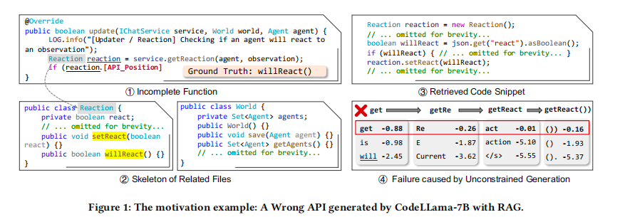
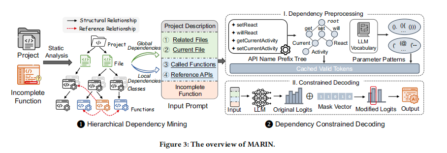
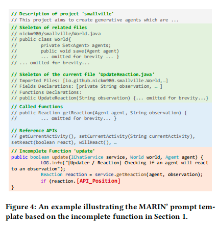
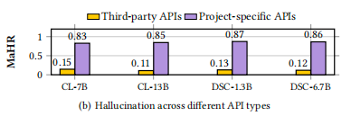
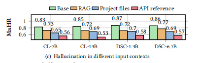

# Towards Mitigating API Hallucination in Code Generated by LLMs with Hierarchical Dependency Aware

论文地址：https://arxiv.org/abs/2505.05057

## 论文大概
让模型去生成代码的时候，更多是基于预训练的数据，根据模型的直觉来生成代码，而不是基于项目中的实际依赖关系来生成代码。所以需要一个方法来让模型去生成代码的时候，更多是基于项目中的实际依赖关系来生成代码。这篇论文就提出了一个方法，让模型在生成代码的时候，更多是基于项目中的实际依赖关系来生成代码。

然而，现有的方法未能考虑这些关键依赖关系，而是提供孤立的代码片段作为大语言模型的参考。如图所示，不完整的函数试图判断代理是否会作出反应，正确的API是will react。然而，检索到的代码片段（3）未能从相关文件（2）中提供足够的上下文，而will react方法正是在这些文件中定义的。此外，维护一个包含更新索引的检索语料库会增加额外的资源成本，限制了此类方法的可扩展性。

## 论文提出的问题
大语言模型（LLMs）虽然能够自动生成代码，但在实际开发场景中，常常出现API幻觉（API hallucination）问题，主要表现为：
调用不存在的API（虚构API）。
错误使用已有API（用法不当）。
现有的缓解方法多采用RAG（检索增强生成）技术，但这些方法存在以下不足：
忽略了实际项目中的结构性依赖关系，无法充分理解和利用项目的上下文结构。
没有真正验证生成的API是否在项目中可用，导致幻觉问题依然严重。
因此，论文关注的核心问题是：如何有效缓解大语言模型生成代码时的API幻觉，尤其是在复杂项目结构和真实开发环境下，确保生成的API真实可用且用法正确。

## 论文解决办法
论文提出了 MARIN，这是一种减轻 LLM 生成的代码中的 API 幻觉的框架，具有分层依赖感知。Marin包括两个阶段如图所示:

### 层次依赖挖掘。
此阶段使用静态分析来解析当前函数的局部和全局依赖关系，如方法调用关系和文件依赖，形成项目的结构表示，以丰富大语言模型的输入提示。
提示词包括项目描述。简要概述项目的目的，为LLM提供必要的背景。全局依赖。简化相关和当前文件的骨架，包括类定义、成员字段和函数签名，以表示更广泛的项目结构。局部依赖。直接相关的调用函数和引用API。不完整的函数。部分实现的目标函数，[API_Position]标记了应该生成API调用的位置。

### 依赖约束解码。
此阶段通过构建 API 名称前缀树和参数模式识别，Dependency Constrained Decoding 在解码过程中动态地约束生成的分词，确保生成的 API 符合项目的实际依赖关系，从而有效减少 API 幻觉现象。

通过这两个阶段，MARIN在提供输入和指导生成过程中利用了项目的结构依赖关系，消除了构建检索语料库的需求，从而在大语言模型的代码生成过程中有效缓解API幻觉问题。

## 实验

### 对于项目本身自己写的API方法幻觉会更高
论文实验结果表明，对于项目本身自己写的API方法幻觉会更高，这样很合理，因为模型生成代码的时候如果没有带上项目本身的依赖关系，那么生成的代码就会有很多幻觉。而第三方API方法基本上在模型预训练的时候就已经见过了，所以生成的代码幻觉会少很多。

### 输入内容对模型幻觉的影响
论文通过实验发现，单纯输入代码片段模型幻觉会更高，即使基于RAG相关片段辅助模型效果也并非更好，如果基于项目文件信息效果会增加，但是上下文长度会变长，基于API文档信息效果会更好，但是这种文档信息需要人工标注，成本很高。

### 基准APIHulBench
为了便于评估API幻觉程度，论文引入了一个新的基准APIHulBench和两个新的指标，论文介绍了APIHulBench，一个新颖的基准，包括来自GitHub上98个最近的Java存储库的416个高质量样本。

### 实验验证
论文通过一系列实验验证了MARIN框架在减少API幻觉（API hallucination）方面的有效性。以下是实验的主要内容和结果总结：

1.实验设计

研究问题（Research Questions）

• RQ1：MARIN在APIHulBench基准测试中减少API幻觉的效果如何？

• RQ2：MARIN的两个主要组件（层次化依赖挖掘和依赖约束解码）对性能的影响是什么？

• RQ3：MARIN与基线方法相比的效率如何？

• RQ4：MARIN在工业场景中的表现如何？

基准测试（Benchmarks）

• APIHulBench：一个新的基准测试，包含416个来自98个Java项目的高质量样本，分为APIHulBench-F（221个样本，API调用出现在函数前50%）和APIHulBench-M（195个样本，API调用出现在函数后50%）。

• 工业场景基准：包含109个来自华为内部Java项目的样本。

评估的LLMs

• CodeLlama：7B、13B、34B版本。

• DeepSeekCoder：1.3B、6.7B、33B版本。

• PanguCoder：11B、34B版本（仅用于工业场景实验）。

基线方法

• Base Generation：仅使用不完整的函数作为输入提示。

• RAG：检索项目中与不完整函数相似的代码片段，并将其包含在输入提示中。

• De-Hallucinator：先生成代码，然后检索与初始输出相关的API，将其添加到输入提示中，并迭代细化生成。

评估指标

• 准确性指标：

• Exact Match(EM)：输出与真实值完全匹配的百分比。

• Edit Similarity(ES)：输出与真实值之间的编辑距离，归一化为相似度分数。

• Identifier Match(IM)：输出中正确API标识符的百分比。

• 幻觉指标：

• Micro Hallucination Number(MiHN)：生成API中幻觉元素的平均数量。

• Macro Hallucination Rate(MaHR)：包含任何幻觉元素的生成API的比例。

2.实验结果

RQ1：MARIN在APIHulBench上的有效性

• APIHulBench-F：

• MARIN在所有评估的LLMs上均显著优于基线方法。

• 例如，在CodeLlama-7B上，MARIN将EM提高了175.39%，将MaHR降低了80.15%。

• APIHulBench-M：

• MARIN同样表现出色，例如在CodeLlama-7B上，EM提高了83.98%，MaHR降低了79.62%。

• 平均性能提升：

• 与RAG方法相比，MARIN在APIHulBench上平均提高了107.32%的EM，降低了67.31%的MaHR。

RQ2：MARIN组件的影响

• 层次化依赖挖掘和依赖约束解码：

• 两者均对MARIN的性能至关重要。

• 全局依赖（Global Dependency）：对幻觉缓解的影响最大。移除全局依赖会导致EM大幅下降，MaHR显著上升。

• 依赖约束解码（Dependency Constrained Decoding）：即使在有限的依赖设置中，也能显著降低幻觉率。

RQ3：MARIN的效率

• 计算时间：

• MARIN的平均额外开销仅为0.022秒，与基线方法相比效率相当。

• 在不同模型大小和开发场景下，MARIN均展现出优越的可扩展性。

RQ4：工业场景中的表现

• 华为内部项目基准测试：

• MARIN在工业场景中同样表现出色，例如在PanguCoder-11B上，EM提高了71.79%，MaHR降低了58.21%。

• MARIN在工业场景中保持了高效的推理效率，仅增加了0.030秒的额外开销。

3.实验总结

• MARIN在减少API幻觉方面表现出色，在APIHulBench和工业场景中均显著优于基线方法。

• 层次化依赖挖掘和依赖约束解码是MARIN成功的关键，两者结合实现了最佳性能。

• MARIN具有高效的推理能力，在不同模型大小和开发场景下均展现出优越的效率。

• MARIN适用于多种LLMs和开发场景，具有广泛的适用性和推广价值。

## 总结
其实这篇论文的思路还是基于RAG的思路，只不过是多了一层基于项目本身的依赖关系来生成代码，然后通过构建 API 名称前缀树和参数模式识别，Dependency Constrained Decoding 在解码过程中动态地约束生成的分词，确保生成的 API 符合项目的实际依赖关系，从而有效减少 API 幻觉现象。
