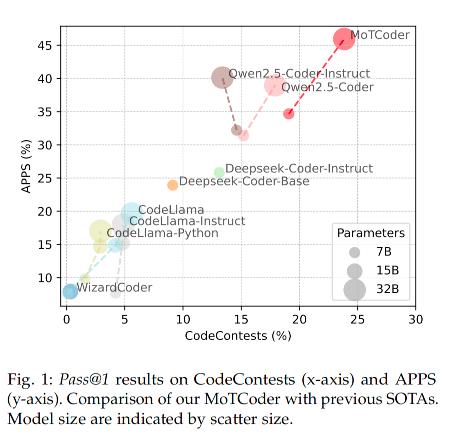
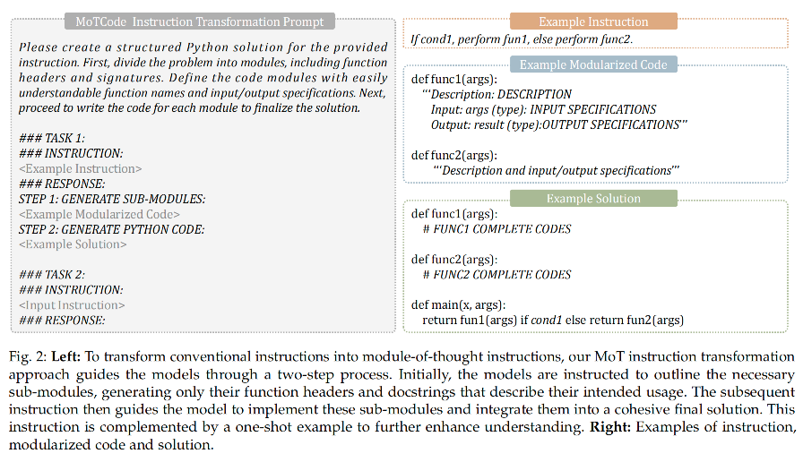
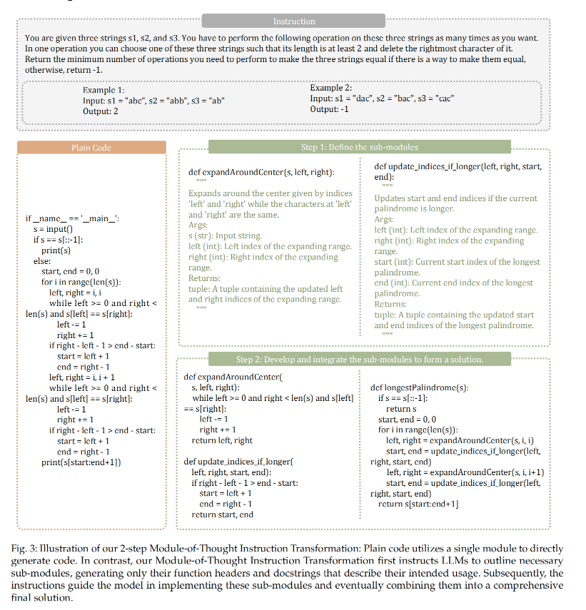
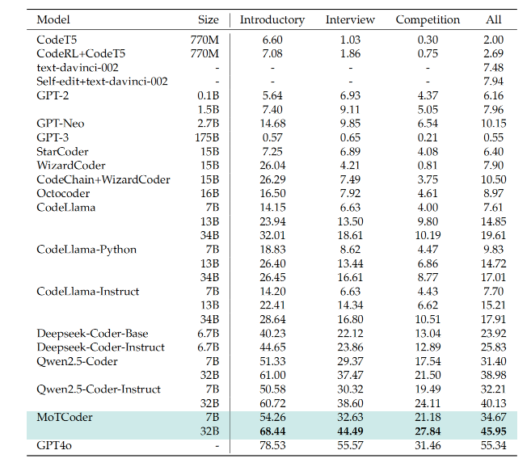

# MoTCoder: Elevating Large Language Models with Module-of-Thought

> **论文地址**：[https://arxiv.org/abs/2312.15960](https://arxiv.org/abs/2312.15960)  
> **项目地址**：[https://github.com/dvlab-research/MoTCoder](https://github.com/dvlab-research/MoTCoder)

---

## 📖 概述

本文介绍了一种名为 **Module-of-Thought Coder (MoTCoder)** 的框架，旨在提升大型语言模型（LLMs）在复杂编程任务中的表现。

作者指出，传统的 LLMs 在处理复杂编程问题时，由于其生成代码的方式过于单一和整体化，导致在解决复杂问题时效果不佳。MoTCoder 通过引入**模块化思维（Module-of-Thought）**，将复杂问题分解为多个逻辑子任务和子模块，从而显著提高了代码生成的模块化和正确性。

  

---

## 🔍 问题背景

大型语言模型（LLMs）在处理简单编程任务时表现出色，但在面对复杂的编程问题（如 APPS 和 CodeContests）时，性能明显下降。

### 主要问题

- **单一化代码生成**：模型倾向于一次性生成单一的、整体化的代码块
- **效率低下**：这种方法在处理复杂任务时效率低下且容易出错
- **缺乏模块化思维**：与经验丰富的开发者将问题分解为多个模块的方法形成对比

---

## 💡 解决方案

  

为了解决这一问题，作者提出了 **MoTCoder**，其核心思想是通过**模块化指令微调（Module-of-Thought Instruction Tuning）**，引导 LLMs 将复杂问题分解为多个逻辑子模块，并分别实现这些模块，最后将它们组合成完整的解决方案。

### 核心方法

1. **模块化指令转换（Module-of-Thought Instruction Transformation）**
   - 将传统的指令转换为模块化指令
   - 引导模型首先生成子模块的函数头和文档字符串
   - 描述其功能和用途

2. **模块化指令微调（Module-of-Thought Instruction Tuning）**
   - 使用转换后的模块化指令数据对 LLMs 进行微调
   - 使其能够更好地理解和生成模块化代码

3. **自校正能力（Self-Correction）**
   - 通过多轮对话任务，让模型在失败时自我反思
   - 重新生成解决方案，进一步提升代码的准确性

---

### 🔧 模块化指令转换

编程不仅需要具体的编码能力，还需要更广泛的逻辑思维和策略规划能力。为了同时提升这两方面的能力，研究者提出了一个转换流程：

#### 设计目标

1. **针对具体编码能力**：提升代码的清晰度和结构化程度
2. **针对策略规划能力**：融入基于自然语言的描述来帮助整体规划

#### 设计理念

> 💡 **核心思想**：根据以往的研究，**简单明确、详细的指令能让模型更有效、更精确地完成任务**。就像我们教小朋友做复杂的事情一样，把大任务分解成小步骤，效果会更好。

因此，研究者的方法是：**把普通的编程指令转换成一个分步骤的代码生成过程**，让模型按照两个步骤来工作：

#### 两步法详解

##### 第一步：设计子模块

- 首先让模型列出需要哪些子模块（就像搭积木前先准备好各种积木块）
- 只生成函数的"框架"（函数名和说明文档），不写具体代码
- **数学表示**：`Ŝᵢ ∼ pθ(.|Ŝ₁:ᵢ₋₁, I)`
  - **简单理解**：第i个子模块的设计基于前面已设计的模块和原始指令

##### 第二步：实现完整解决方案

- 然后指导模型实现这些子模块的具体代码
- 最后把所有子模块组合成完整的解决方案
- **数学表示**：`ôₜ ∼ pθ(.|ô₁:ₜ₋₁, {Ŝᵢ}, I)`
  - **简单理解**：每一步的输出都基于前面的输出、设计好的子模块和原始指令

#### 实际应用

为了让模型更好地理解这种方法，研究者还提供了一个示例（就像给学生看样板作业），引导模型按照这种"模块化思维"来生成代码。

> 🎯 **这种方法的核心思想**：模仿有经验的程序员解决复杂问题的方式——先整体规划，分解成小模块，再逐个实现，最后组装。这样既提高了代码质量，也让解决问题的过程更加清晰有序。

  

---

### 🎯 模块化指令微调

有了前面的模块化指令转换方法，接下来就需要用这种方法来训练模型。这个过程分为两个主要步骤：先构建训练数据集，再进行模型微调。

#### 📊 MoT数据集构建

##### 数据来源

研究者从两个著名的编程竞赛数据集中收集问题：

- **APPS数据集**：包含各种编程问题
- **CodeContests数据集**：编程竞赛题目

> ⚠️ **质量保证**：为了避免"作弊"（防止测试数据泄露到训练数据中），研究者仔细去除了重复的题目。

##### 数据生成过程

研究者使用 **GPT-4o** 这个强大的AI模型来生成两种类型的训练数据：

###### 1. Clean数据（干净数据）

- 优化变量名，让变量名更能体现其用途（比如把 `a` 改成 `student_count`）
- 添加注释，让代码更容易理解
- 保持原始代码的功能不变，只是让代码更规范

###### 2. MoT数据（模块化思维数据）

- 在Clean数据的基础上，进一步将代码分解成函数模块
- 把功能清晰、可重复使用的代码段封装成独立的函数
- 体现模块化编程的思想

##### 质量控制

所有生成的代码都要通过严格的测试：

- ✅ 使用原始训练集中的输入输出样例进行验证
- ❌ 如果代码运行结果不正确，就丢弃这份数据
- 🎯 确保最终数据集的质量

##### 最终数据规模

经过筛选后，研究者获得了：

| 数据类型 | 数量 |
|---------|------|
| Clean数据 | 183K条 |
| MoT数据 | 174K条 |
| **总计** | **约35.7万条高质量训练数据** |

#### 🚀 MoT指令微调

##### 基础模型选择

研究者选择了当时最先进的编程模型 **Qwen2.5-Coder-7B-Instruct** 作为基础，这就像选择一个已经很聪明的学生来进一步培养。

##### 训练配置

| 配置项 | 设置 | 说明 |
|--------|------|------|
| **训练轮数** | 1个epoch | 完整过一遍数据集，避免过度训练 |
| **输入长度** | 最多2048个token | 大约1500-2000个单词 |
| **批次大小** | 训练16个样本，验证4个样本 | 平衡训练效率和内存使用 |

##### 学习策略

| 策略 | 设置 | 说明 |
|------|------|------|
| **学习率** | 2×10⁻⁶ | 很小的数值，让模型慢慢学习 |
| **预热机制** | 前3%的训练步骤 | 逐渐提高学习率，就像运动前的热身 |
| **学习率调度** | 余弦调度器 | 让学习率平滑变化 |

##### 优化技术

为了提高训练效率和节省资源，研究者使用了多种优化技术：

- **AdamW优化器**：一种高效的参数更新方法
- **梯度累积**：每4步累积一次梯度，提高训练稳定性
- **零冗余优化**：减少内存使用，让训练更高效
- **通信重叠**：并行处理多个任务，加快训练速度

##### 模型选择

在训练过程中，研究者会持续评估模型性能，最终选择表现最好的那个版本作为最终的MoTCoder模型。

> 🎓 **培养过程类比**：这整个过程就像培养一个程序员：先给他看大量高质量的代码示例（数据集），然后通过系统性的训练（微调）让他学会模块化编程的思维方式。

---

## 📈 实验结果

作者在多个基准测试中验证了 MoTCoder 的性能，包括 APPS 和 CodeContests。

### 主要性能提升

| 数据集 | 指标 | 性能提升 |
|--------|------|----------|
| **APPS** | pass@1 | **+5.8%** |
| **CodeContests** | pass@1 | **+5.9%** |
| **自校正能力** | 综合表现 | **+3.3%** |

### 详细分析

- **复杂度关系**：作者分析了问题复杂度与模块分解的关系，发现对于复杂问题，更细粒度的模块分解能够显著提升模型性能

- **代码质量**：MoTCoder 生成的代码在**可维护性指数（Maintainability Index）**上也表现更好，表明其生成的代码更容易理解和修改

  

---

## 🎉 总结

**MoTCoder** 通过模块化指令微调，显著提升了 LLMs 在复杂编程任务中的表现：

### 主要贡献

- ✅ **提高代码生成的准确性和模块化程度**
- ✅ **增强模型的自校正能力**
- ✅ **提升代码的可维护性**

就是构建了模块化思维数据集，然后通过模块化指令微调，提升模型在复杂编程任务中的表现。
